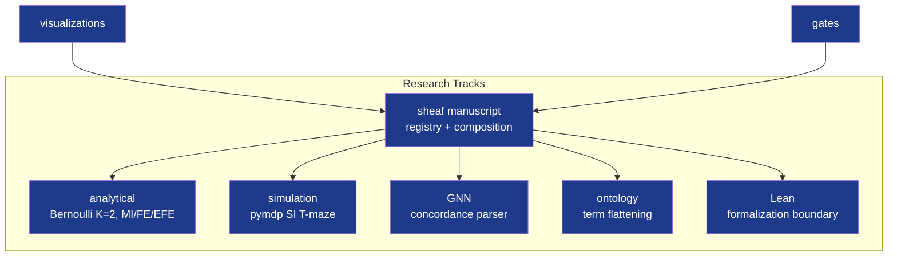

# Architecture — Active Inference Exemplar

## Track Architecture

## Key source of truth files

- `tracks.yaml`: Pipeline track gates
- `manuscript/sheaf/tracks.yaml`: Manuscript sheaf registry
- `manuscript/sheaf/manifest.yaml`: IMRAD section matrix
- `figures.yaml`: Figure registry, captions, alt text
