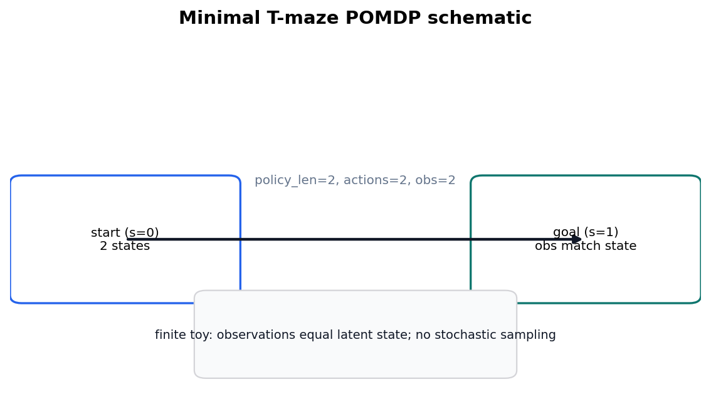

# pymdp simulation harness {#sec:methods_pymdp}

<!-- sheaf-track:prose -->

**Sophisticated inference (planning horizon).** The pymdp method is a deterministic state-inference harness on a minimal T-maze ([@fig:tmaze_schematic]) with planning horizon `policy_len = {{si_tmaze_policy_len}}`. The discrete-state framing follows finite POMDP active-inference treatments and sophisticated-inference analyses [@dacosta2020discrete; @smith2022tutorial; @friston2021sophisticated; @dacosta2023reward], and the implementation anchor is the pymdp software paper [@pymdp2024]. The default `{{pymdp_mode}}` rollout writes the summary/trace artifacts used in [@sec:results_si_tmaze]; mean belief entropy is {{si_tmaze_mean_belief_entropy_formatted}}.

The method keeps runtime, posterior, and extension evidence separate. `output/data/si_policy_comparison.json` compares `state_inference` and `policy_inference` over declared toy horizons and seeds without replacing the default rollout ({{si_policy_comparison_run_count}} rows; complete-grid flag {{si_policy_comparison_complete_grid}}). Agent construction and backend warnings live in `output/reports/pymdp_runtime_diagnostics.json` ({{pymdp_runtime_construction_count}} constructions, {{pymdp_runtime_known_warning_count}} known third-party warnings, {{pymdp_runtime_unexpected_warning_count}} unexpected warnings). Posterior rows live in `output/data/pymdp_policy_posterior_grid.json` and must remain normalized (`{{pymdp_policy_posteriors_normalized}}`).

Graph-world artifacts are deterministic extension outputs declared in `tracks.yaml` rather than new empirical claims. `simulate_si_graph_world.py` writes summary and trace artifacts for the finite graph path; the regenerated summary reports {{si_graph_world_node_count}} nodes, {{si_graph_world_steps}} steps, and goal-reached flag {{si_graph_world_goal_reached}}. The topology-trace extension records {{si_graph_world_topology_trace_count}} toy topology traces with agreement flag {{si_graph_world_topology_traces_agree}}.

<!-- sheaf-track:formalism -->

Given generative matrices $A,B,C,D$, pymdp computes state beliefs $q(s)$ via variational inference (`infer_states`). The Agent is configured with planning horizon $H =$ {{si_tmaze_policy_len}}, which defines the **policy depth** used when constructing candidate policies (logged as `num_policies` in the SI summary artifact; see [@sec:results_si_tmaze]).

The default harness records belief entropy per step; extending to full expected-free-energy policy selection (`infer_policies`) is documented as a follow-on track in [@sec:discussion_outlook].

<!-- sheaf-track:pymdp -->

SI artifacts (summary, trace, optional JSONL log) record step count, actions, observations, and belief entropy for [@sec:results_si_tmaze]. Steps recorded: {{si_tmaze_steps}}.

<!-- sheaf-track:interop -->

The `interop` fragment treats the GNN files, JSON views, and ontology bindings as a round-trip contract rather than parallel documentation. `output/data/interop_roundtrip_report.json` records {{interop_check_count}} deterministic checks; the manuscript only claims losslessness when `{{interop_all_lossless}}` is true.

The stricter lint artifacts are adjacent evidence, not new model claims: `output/data/gnn_roundtrip_report.json`, `output/reports/gnn_lint_report.json`, `output/data/ontology_alias_index.json`, and `output/data/ontology_profile_matrix.json` must agree before the interop row passes. A missing GNN variable, duplicate ontology alias, dropped JSON field, shape diff, or dtype diff is therefore a validation failure before rendering.

<!-- sheaf-track:visualization -->

{#fig:tmaze_schematic width=85% fig-alt="Schematic of the minimal T-maze POMDP with start and goal states, discrete actions and observations, and planning horizon policy_len = {{si_tmaze_policy_len}}."}

<!-- sheaf-track:gnn -->

See `gnn/si_tmaze.gnn.md` for a GNN view of the T-maze hidden state, observation, and policy variables with ontology bindings.

<!-- sheaf-track:ontology -->

### Ontology bindings

- `belief_entropy` → **BeliefEntropy**
- `loc` → **HiddenState**
- `obs` → **ObservationLikelihood**
- `pi` → **PolicyPosterior**

