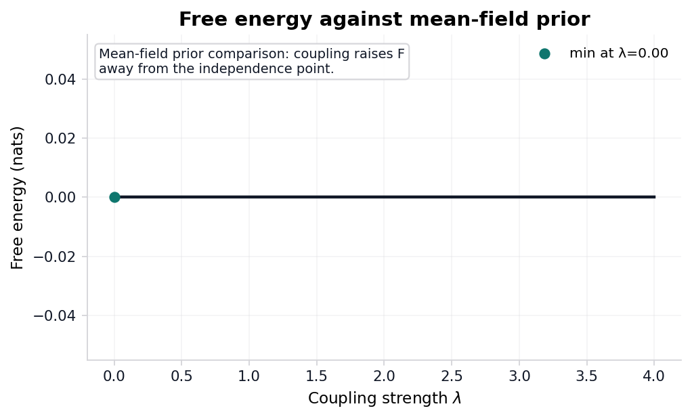

# Free-energy decomposition {#sec:results_free_energy}

<!-- sheaf-track:prose -->

Free energy against the entangled prior is evaluated along the same $\lambda$ grid used for the MI sweep ([@fig:free_energy_curve]). Against the *entangled* prior the entangled posterior is the exact variational minimizer, so its free energy is identically zero; the Theorem-5.1 decomposition then splits that zero into per-stream marginal free energies, a coupling-cost term, a coupling-prior term, and a total-correlation gain. For the symmetric toy with uniform marginals the coupling-prior term equals $-I(\lambda)$ and exactly cancels the total-correlation gain $+I(\lambda)$ — an exact cancellation the merged invariant suite checks ({{invariants_passed}}/{{invariants_total}} pass). The curve in [@fig:free_energy_curve] instead reports free energy against the *mean-field* prior: its minimum at $\lambda={{free_energy_argmin_lambda}}$ is where the entangled posterior coincides with the factorized mean-field product, and any $\lambda>0$ raises the free energy as coupling pulls the posterior away from that independent prior.

Saturation MI (grid maximum on the measured $\lambda$ sweep): {{ising_mi_saturation}} nats.

<!-- sheaf-track:visualization -->

{#fig:free_energy_curve width=90% fig-alt="Line plot of free energy in nats versus coupling strength lambda for the entangled posterior relative to a mean-field prior. The entangled-prior free energy is identically zero, so this plotted comparison isolates mean-field prior mismatch. A single dark curve traces free energy across the sweep; the minimum is marked with a teal scatter point and labeled with the argmin lambda value."}
