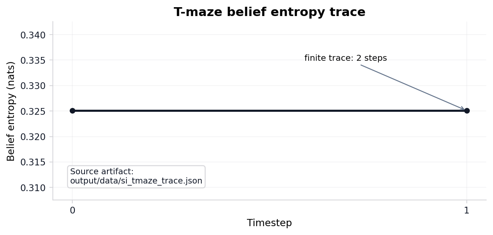

# T-maze active-inference rollout {#sec:results_si_tmaze}

<!-- sheaf-track:prose -->

The pymdp harness rolls out a T-maze active-inference agent in `{{pymdp_mode}}` mode with planning horizon {{si_tmaze_policy_len}}. The default `state_inference` mode is belief filtering with a goal-seeking action rule; sophisticated policy inference (an expected-free-energy policy posterior) is selectable via `mode: policy_inference` ([@sec:methods_pymdp]). Summary metrics land in `output/data/si_tmaze_summary.json`.

Steps recorded: {{si_tmaze_steps}}. Mean belief entropy: {{si_tmaze_mean_belief_entropy}}. Belief entropy over the rollout is traced in [@fig:si_belief_entropy_curve]; the paired observation and action indices are in [@fig:si_obs_action_trace]. `output/data/analysis_statistics.json` now records the trace as a small statistical object rather than a caption-only trace: action switches {{si_action_switch_count}} times (rate {{si_action_switch_rate_formatted}} over adjacent steps), observation diversity is {{si_observation_diversity}}, entropy drop is {{si_entropy_drop_formatted}} nats from first to terminal step, and the saved trace/summary step counts agree: `{{si_trace_steps_match}}` with finite entropy values `{{si_trace_finite}}`. The default `state_inference` mode runs pymdp `infer_states` and **reports** the resulting posterior (belief entropy and the state-1 marginal), but the action is chosen by an open-loop scripted rule on the observation index — not by the posterior — so the inferred belief here is observed, not acted on. Under the toy transition model, expected-free-energy policy inference reaches the goal in {{si_policy_comparison_policy_goal_count}} of its rows versus {{si_policy_comparison_state_goal_count}} for the scripted state-inference rule: no behavioral advantage on this two-state, horizon-{{si_tmaze_policy_len}} maze, which is the measured content of the deliberately-too-small claim.

Policy-comparison rows: {{si_policy_comparison_run_count}} across state-inference and policy-inference modes; goal-reaching rows: {{si_policy_comparison_goal_reached_count}}. These rows are internal toy consistency checks under finite-horizon discrete active-inference assumptions [@friston2021sophisticated; @dacosta2023reward], not comparisons against external behavioral datasets. Graph-world extension rows: {{si_graph_world_steps}} over {{si_graph_world_node_count}} nodes, with goal-reached flag {{si_graph_world_goal_reached}}.

The expected free energy that scores those policies decomposes in closed form ([@fig:efe_decomposition]). Across the {{efe_policy_count}} length-{{si_tmaze_policy_len}} policies on the T-maze generative model, the expected-free-energy-minimising policy is `{{efe_minimizing_policy}}` with $G$ = {{efe_minimizing_total_formatted}} nats, splitting into risk {{efe_risk_at_min_formatted}} (the pragmatic deviation of predicted outcomes from preferences) and ambiguity {{efe_ambiguity_at_min_formatted}} (the expected likelihood entropy) nats. The same $G$ splits equivalently into pragmatic value {{efe_pragmatic_at_min_formatted}} (expected log-preference) and epistemic value {{efe_epistemic_at_min_formatted}} (state-outcome mutual information) nats — the term that drives information-seeking. The two forms are exactly equal: risk + ambiguity + pragmatic + epistemic vanishes to within {{efe_max_identity_residual_formatted}} across every policy, the action-selection twin of the analytical free-energy decomposition identity ([@sec:results_free_energy]).

Precision controls how sharply that expected free energy is acted on: the policy posterior is the softmax-weighted $q(\pi) \propto \exp(-\gamma\,G(\pi))$, and sweeping the inverse temperature $\gamma$ across {{precision_gamma_grid_points}} grid points up to {{precision_gamma_max}} sharpens it monotonically ([@fig:precision_sweep]). Posterior entropy falls from $\ln 4$ at $\gamma$=0 to {{precision_entropy_at_gamma_one_formatted}} nats at $\gamma$=1, then saturates at the floor {{precision_entropy_floor_formatted}} nats rather than reaching zero: the absorbing goal makes the second action irrelevant once reached, so {{precision_optimal_set_size}} policies tie at the expected-free-energy minimum and precision concentrates mass on that optimal *set*, not a single policy. By that honest criterion selection becomes effectively deterministic — optimal-set mass exceeding {{precision_selection_threshold}} — at $\gamma$={{precision_gamma_deterministic}}.

The minimal two-state maze above is, by construction, too small for information-seeking to matter: the reward location is observable from the start, so a greedy pragmatic rule and an expected-free-energy rule reach the goal equally often. The cue-then-reward variant ([@fig:cue_tmaze_advantage]) removes that degeneracy. Across {{cue_num_states}} joint position-by-context states the reward location is an uninformative latent (50/50 at the start) that is hidden until the agent visits a CUE location, at which point a single sample resolves it: the cue carries {{cue_information_gain_formatted}} nats of information ($= \ln 2$, the entropy of the unknown context). An agent that samples the cue and then takes the contingent arm reaches reward with expected log-preference {{cue_epistemic_reward_formatted}} nats, against {{cue_greedy_reward_formatted}} nats for a greedy agent that commits to an arm before sampling — a measured behavioural advantage of {{cue_behavioral_advantage_formatted}} nats that vanishes only if epistemic value is removed from the objective. The advantage is sophisticated, not flat: the closed-form flat decomposition of [@sec:results_si_tmaze] scores the cue-first and greedy policies as {{cue_flat_efe_indistinguishable}} because it propagates beliefs through the transition model without conditioning them on the cue observation. Resolving the latent therefore requires an observation-conditioned (sophisticated-inference) evaluation, and under that evaluation cue-sampling is strictly necessary rather than merely available.

Planning is only half of the generative loop: the agent must also *learn* its likelihood. Placing a Dirichlet prior over each column of $A$ and accumulating observation-state counts $c$ gives the conjugate update $pA \leftarrow pA + c$ with expected likelihood $E[A] = pA / \sum_o pA$ ([@fig:dirichlet_convergence]). Driven by a fixed, sampling-free expected-count stream, $\mathrm{KL}(A_{\text{true}} \,\|\, A_{\text{learned}})$ falls monotonically from {{dirichlet_initial_kl_formatted}} nats at the uniform prior to {{dirichlet_final_kl_formatted}} nats, reaching the convergence tolerance at update step {{dirichlet_steps_to_converge}}. The learned likelihood converges to the true generative model in closed form, the inference-side twin of the EFE planning decomposition above.

<!-- sheaf-track:pymdp -->

Rollout trace: `output/data/si_tmaze_trace.json`. JSONL run log: `output/logs/pymdp_runs.jsonl`.

<!-- sheaf-track:visualization -->

![Cue-then-reward T-maze where epistemic value is strictly necessary. Left: the cue carries {{cue_information_gain_formatted}} nats of information and the cue-sampling agent reaches reward with a measured advantage of {{cue_behavioral_advantage_formatted}} nats over a greedy agent. Right: flat Expected Free Energy scores the cue-first and greedy policies identically ({{cue_flat_efe_indistinguishable}}), so the sophisticated observation- conditioned evaluator is what makes information-seeking required. Closed form (no sampling).](../output/figures/cue_tmaze_advantage.png){#fig:cue_tmaze_advantage width=95% fig-alt="Two-panel bar chart for the cue-then-reward T-maze. The left panel shows the cue information gain I(context; observation) in nats and the expected reward log-preference for an epistemic agent that samples the cue versus a greedy agent that commits to an arm, demonstrating a positive behavioural advantage for cue-sampling. The right panel shows the flat Expected Free Energy of the cue-first and greedy policies, which are identical, illustrating that flat EFE propagation cannot reward cue-sampling and the sophisticated observation- conditioned evaluator is required."}

{#fig:efe_decomposition width=95% fig-alt="Two-panel bar chart of the Expected Free Energy term decomposition across the four length-two T-maze policies (action sequences 00, 01, 10, 11). The left panel stacks risk (pragmatic deviation, the KL of policy-predicted outcomes from preferences) below ambiguity (epistemic, the expected likelihood entropy) so each bar's height is the Expected Free Energy G(pi); the goal-seeking policy with minimum G is marked. The right panel shows the equal-and-opposite pragmatic value (expected log-preference) and epistemic value (state-outcome mutual information) per policy, with a zero reference line, illustrating the exact identity G(pi) = -(pragmatic + epistemic)."}

![Precision sweep over the closed-form T-maze policy posterior $q(\pi)\propto\exp(-\gamma G)$ across {{precision_gamma_grid_points}} grid points up to $\gamma$={{precision_gamma_max}}. Entropy falls from $\ln 4$ to the $\ln|\Pi^\star|$ floor ({{precision_optimal_set_size}} tied optima, second action irrelevant under the absorbing goal); the optimal-set mass crosses {{precision_selection_threshold}} at $\gamma$={{precision_gamma_deterministic}}. Entropy at $\gamma$=1 is {{precision_entropy_at_gamma_one_formatted}} nats. Computed in closed form (no sampling).](../output/figures/precision_sweep.png){#fig:precision_sweep width=90% fig-alt="Dual-axis line plot of how the T-maze policy posterior q(pi) = softmax(-gamma G) sharpens as the precision gamma increases from 0 to 16. The left axis plots the Shannon entropy of the posterior in nats, decreasing from ln 4 at gamma=0 and saturating at the ln(|optimal set|) floor (a dashed reference line) because two policies tie at the expected-free-energy minimum. The right axis plots the probability mass placed on the expected-free-energy optimal policy set, rising from 0.5 toward 1 and crossing the selection threshold; the precision at which it crosses is marked."}

![Dirichlet model learning: KL$(A_{\text{true}} \,\|\, A_{\text{learned}})$ versus concentration-update step. The expected likelihood $E[A] = pA / \sum_o pA$ converges monotonically to the true generative likelihood; the run reaches the convergence tolerance at step {{dirichlet_steps_to_converge}} with final KL {{dirichlet_final_kl_formatted}} nats. Deterministic (no sampling), so the curve is byte-reproducible.](../output/figures/dirichlet_convergence.png){#fig:dirichlet_convergence width=85% fig-alt="Single-panel semilog line chart of the Kullback-Leibler divergence from the true T-maze likelihood matrix A to the Dirichlet-learned expected likelihood, plotted against the update step. The divergence starts large at the uniform prior and falls monotonically toward zero as deterministic observation-state counts accumulate, crossing a dashed convergence-tolerance reference line; the first step below tolerance is marked. The curve is computed in closed form from a fixed expected-count stream (no sampling)."}

{#fig:si_belief_entropy_curve width=90% fig-alt="Line plot of belief entropy in nats versus timestep for the pymdp T-maze rollout. Entropy ranges from {{si_entropy_min}} to {{si_entropy_max}} nats across {{si_tmaze_steps}} steps in {{pymdp_mode}} mode."}

{#fig:si_obs_action_trace width=90% fig-alt="Dual-panel plot of observation index and action index versus timestep for the pymdp T-maze rollout. The upper panel shows discrete observations; the lower panel shows actions. Goal reached flag is {{si_goal_reached}}."}

{#fig:si_tmaze_actions width=90% fig-alt="Step plot of discrete action index versus timestep for the pymdp T-maze rollout in {{pymdp_mode}} mode. Actions change at each timestep with light fill under the step trace; policy depth is {{si_tmaze_policy_len}} steps."}
