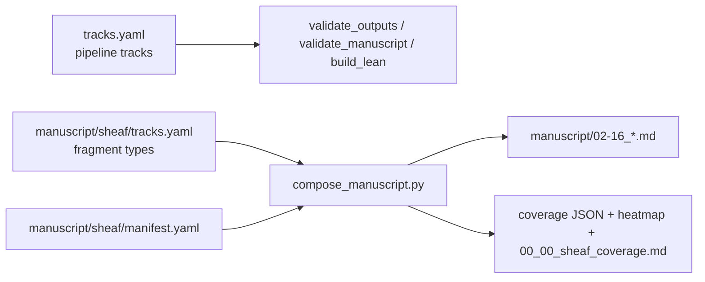

# Sheaf composition config

YAML registries for fragment-level manuscript assembly. Distinct from pipeline track gates in [`../../tracks.yaml`](../../tracks.yaml).

## Dual registry



| Registry | Path | Role |
| --- | --- | --- |
| Pipeline | [`tracks.yaml`](../../tracks.yaml) | Analysis gates, artifact contracts |
| Sheaf fragments | [`tracks.yaml`](tracks.yaml) | Compose order, renderer suffixes, per-section bindings |

Pipeline track `manuscript` points here; sheaf fragment ids (e.g. `prose`, `pymdp`) are **not** the same namespace as pipeline track ids.

## Files

- [`tracks.yaml`](tracks.yaml) — fragment registry: `order`, `renderer`, `optional`, `renderers:` suffix metadata (callables live in [`src/manuscript/sheaf/renderers.py`](../../src/manuscript/sheaf/renderers.py))
- [`manifest.yaml`](manifest.yaml) — IMRAD sections, `tracks:` path map, `kind`, `imrad`, `depth`, `compose`
- [`coverage.yaml`](coverage.yaml) — heatmap styling and report toggles
- [`../sections/imrad/`](../sections/imrad/) — fragment sources (edit only here)

`discussion_outlook` binds `prose`, `simulation` (measured SI + sweep tokens), and `ontology` (scope/limitation terms) — expect +2 bound cells on the discussion row after promotion.

`methods_sheaf` binds `prose`, `formalism`, `visualization`, and `layers` with explicit `track_order` (figure before tables). The `layers` track uses renderer `layers_report` (`layers_report.py`). The `visualization` track uses renderer `section_figures` for Figure 6 (`sheaf_layers_overview` from `figures.yaml` `section_figures.methods_sheaf`).

Generated table markers in composed output: `<!-- sheaf-layers:registry -->`, `<!-- sheaf-layers:binding-matrix -->`, `<!-- sheaf-layers:legend -->`.

## Coverage page

[`write_coverage_page()`](../../src/manuscript/sheaf/report.py) regenerates [`../00_00_sheaf_coverage.md`](../00_00_sheaf_coverage.md) with measured totals, IMRAD outline, and heatmap markdown from [`figures.yaml`](../../figures.yaml) `section_figures.coverage_page` (caption prefix **Coverage overview.** — no duplicate figure number; appendix reuses the same PNG as **Figure 4**).

## Validation

```bash
uv run python scripts/compose_manuscript.py --validate-only --strict
```

`--strict` fails on manifest errors and gray coverage cells. Pipeline gate `validate_manuscript` uses the same strict coverage checks plus JSON schema validation (zero gray on clean tree).

## Package implementation

[`src/manuscript/sheaf/`](../../src/manuscript/sheaf/) — see project [`AGENTS.md`](../../AGENTS.md) for compose and variable hydration commands.
