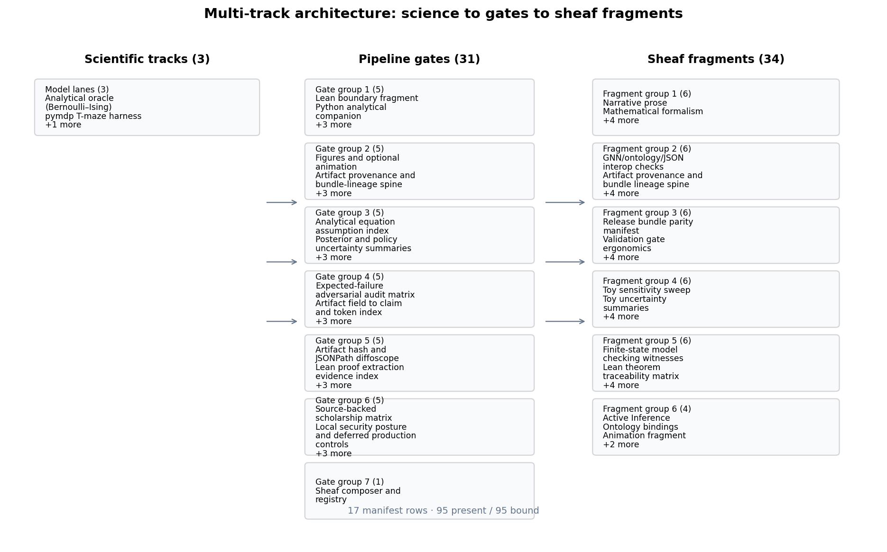

# Contributions {#sec:intro_contributions}

<!-- sheaf-track:prose -->

## Scientific contributions

1. **Analytical oracle** ([@sec:methods_analytical]): closed-form mutual information and free-energy decomposition on a symmetric Bernoulli–Ising toy with an independent exact-recomputation cross-check ([@sec:results_mi_sweep], [@sec:results_free_energy]).
2. **Active-inference harness** ([@sec:methods_pymdp]): deterministic pymdp T-maze rollout — default `state_inference` belief filtering, with sophisticated expected-free-energy policy inference selectable via `mode: policy_inference` — with logged beliefs, actions, and merged invariant gates ([@sec:results_si_tmaze], [@sec:results_invariants]).
3. **Sheaf-indexed composition** ([@sec:methods_sheaf]): 34 optional fragment types bind to 17 manifest rows under [@eq:coverage_cell], with a 33-track appendix composability proof ([@sec:appendix_full_sheaf]).

[@fig:multi_track_architecture] maps the three scientific tracks to 31 pipeline gates and 34 composable fragment renderers. Measured invariant checks: 12 / 12 passed.

Ontology-facing symbols are checked per model: the Bernoulli toy binds `pi1`, `pi2`, `J`, `gamma`, and `q_joint`, while the SI T-maze binds `location`, `observation`, `policy`, and `belief_entropy` to **HiddenState**, **ObservationLikelihood**, **PolicyPosterior**, and **BeliefEntropy** ([@fig:gnn_ontology_concordance], [@sec:methods_pymdp]).

<!-- sheaf-track:visualization -->

{#fig:multi_track_architecture width=95% fig-alt="Process diagram linking three scientific tracks to 31 pipeline gates and 34 sheaf fragment types across 17 manifest rows."}

<!-- sheaf-track:ontology -->

### Ontology bindings

- `expected_free_energy` → **ExpectedFreeEnergy**
- `location` → **HiddenState**
- `observation` → **ObservationLikelihood**
- `policy` → **PolicyPosterior**

