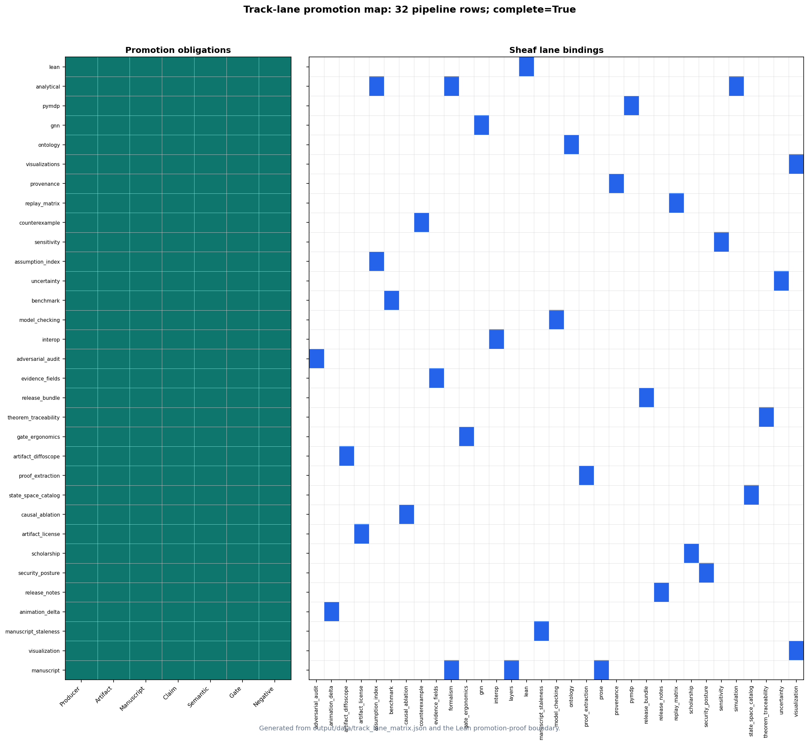
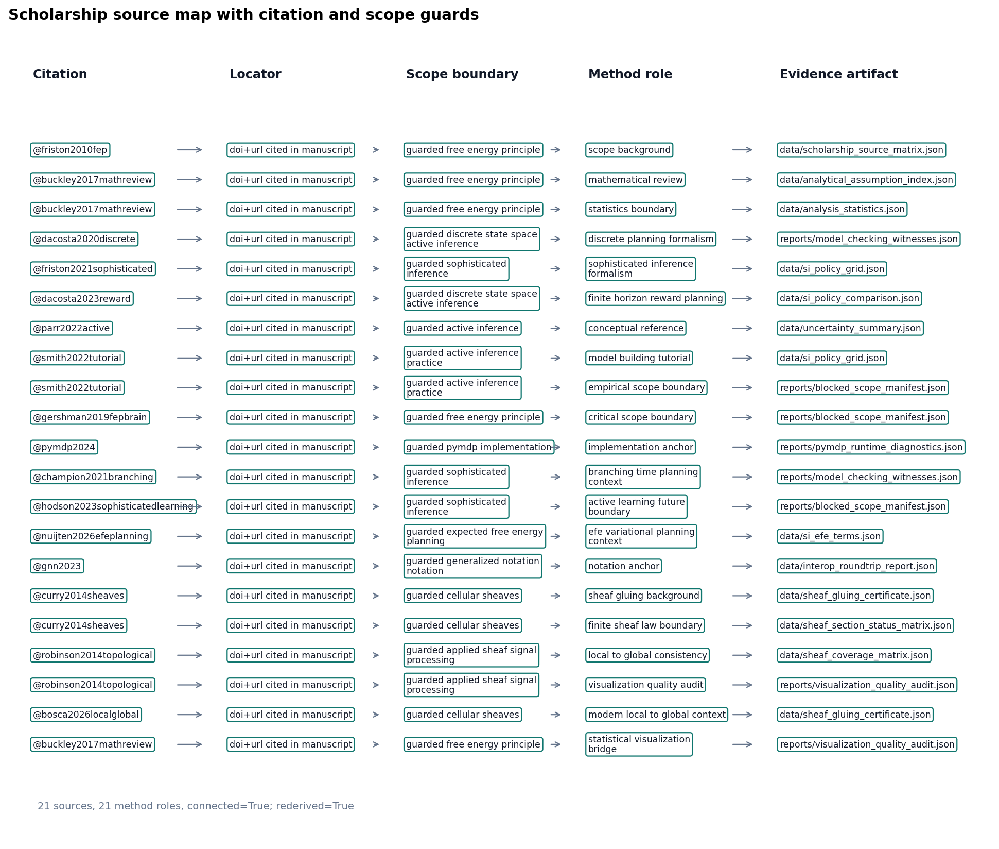
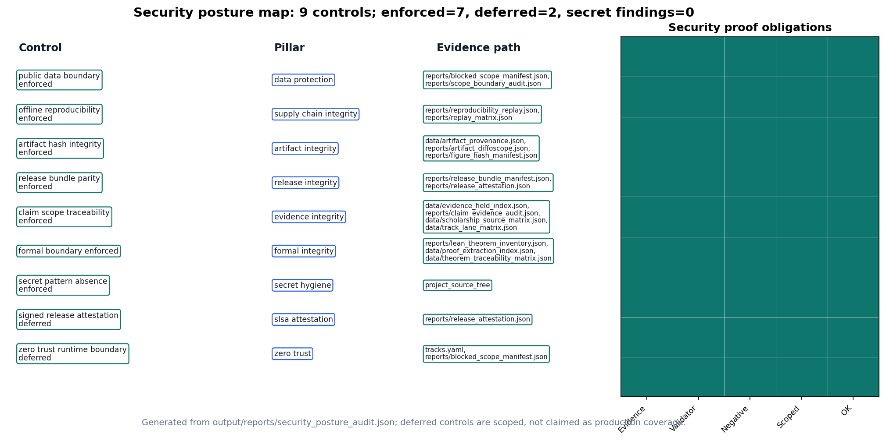

# Sheaf composition {#sec:methods_sheaf}

<!-- sheaf-track:prose -->

## Compose contract

Each manifest row in `manuscript/sheaf/manifest.yaml` binds fragment tracks from `manuscript/sheaf/tracks.yaml`. A track supplies a renderer, compose order, label, optional flag, general paper role, and paper-specific use statement; the composer then flattens the binding set into one Markdown section for PDF and web output.

The operational claim is auditable binding. Analytical, simulation, pymdp, visualization, Lean, GNN, ontology, scholarship, and optional media fragments attach to IMRAD rows under [@eq:coverage_cell] (**P** present, **—** unbound, **M** missing). This is an applied local-to-global consistency contract in the spirit of cellular sheaf and sheaf-signal-processing work [@curry2014sheaves; @robinson2014topological], instantiated here as a finite artifact gate rather than a cohomology claim.

## Coverage and figures

[@fig:sheaf_layers_overview] summarizes 34 fragment types and their IMRAD bindings. Generated tables below list every track definition and section×track binding at compose time. The visualization track is gated by `output/reports/visualization_quality_audit.json`: 23 / 23 registered figures render, 23 are source-mapped, and 23 have sufficient alt/caption metadata; the all-quality flag is `true`.

The visualization gate is deliberately row-level. It requires declared visual/evidence roles (`true`), artifact-backed paper claims (`true`), section bindings (`true`), RGB nonblank image renders, hashes, and source-map agreement. The statistical bridge then expands 7 statistically backed figures into 7 figure-source-scholarship rows with connected status `true`, manuscript-reference status `true`, and visualization-bound reference status `true`.

The claim ledger is also checked at row level rather than as prose metadata. `claim_evidence_audit.json` resolves 97 claim rows to live artifacts (`true`) and replays their typed predicates (`true`), yielding the promoted completeness flag `true`.

## Compose commands

```bash
uv run python scripts/compose_manuscript.py
uv run python scripts/compose_manuscript.py --validate-only --strict
```

Each run emits `output/data/sheaf_coverage_matrix.json` and regenerates coverage artifacts. Partial compose (`--section`) is draft-only; the matrix always reflects the full manifest. Coverage totals appear on [@sec:sheaf_coverage]; discussion scope is in [@sec:discussion_outlook].

## Law verification

`--validate-only --strict` runs the structural gate before any fragment is glued. Beyond per-cell coverage, it invokes the sheaf-law oracle (`verify_sheaf_laws`, `src/manuscript/sheaf/laws.py`), which checks 6 axioms — poset, presheaf functoriality, separation, gluing, typing, and compositionality — and reports 6/6 satisfied for the current manifest. A violation is raised as an error-level issue and aborts the build, so a malformed manifest (a section colliding on an output file, an off-chain block, a mistyped fragment, a fragment shared between sections) can never compose. The formal statements are in the formalism block below; the negative-control suite (`tests/test_sheaf_laws.py`) proves each check is falsifiable.

The semantic layer is separate from those structural laws. `output/data/sheaf_gluing_certificate.json` records cross-track symbols, typed claim evidence, artifact sources, and manuscript-variable restrictions; validation fails when the analytical, pymdp, GNN, ontology, Lean, visualization, or manuscript tracks disagree about a shared symbol or measured claim. The visualization-quality audit is one of those restrictions, so a missing source map, missing statistical bridge source, missing hash, blank render, non-RGB render, undersized figure, or unbound section breaks the same semantic contract that checks statistics and theorem witnesses. [@fig:semantic_gluing_graph] renders the configured producers, generated evidence artifacts, and validation consumers that read each shared symbol.

<!-- sheaf-track:formalism -->

### Base poset and presheaf

The manuscript is modelled as a coverage sheaf over a finite base poset. Let the
**base** $P$ be the IMRAD blocks ordered as a chain,

$$
\mathsf{Introduction} \prec \mathsf{Methods} \prec \mathsf{Results} \prec \mathsf{Discussion} \prec \mathsf{Appendix},
$$ {#eq:imrad_chain}

with, in each block, a *group* node above its *section* nodes (written $G \sqsupseteq s$). $P$ is therefore a finite poset (equivalently a finite Alexandrov space). Let $\mathcal{T}$ be the registered fragment-track set from `manuscript/sheaf/tracks.yaml`; each track $t \in \mathcal{T}$ carries a renderer $R(t)$, label $L(t)$, optional flag $O(t)$, a general paper role $U(t)$, a section-use statement $V(t)$, and a strict compose-order index $\pi(t)$.

The **presheaf** $\mathcal{F}$ is a contravariant functor on $P$ — $\mathcal{F}\colon P \to \mathbf{Set}$ with restriction maps along $\sqsupseteq$ — assigning to each composing section $s$ its bound fragment set $\mathcal{F}(s) = \{\,(t, F_s(t)) : t \text{ bound in } s\,\}$, where $F_s : \mathcal{T} \rightharpoonup \mathbf{Path}$ is the section's partial binding map. Restriction along $G \sqsupseteq s$ is projection onto a section's own bindings; group nodes carry the empty assignment and do not compose.

The coverage cell is

$$
B(s,t) \in \{\mathrm{P}, \mathrm{—}, \mathrm{M}\}
$$ {#eq:coverage_cell}

derived from $F_s(t)$ and filesystem existence at compose time: **P** when a bound fragment exists, **—** when the track is unbound for that row, and **M** when a bound path is missing. The current regenerated matrix reports 95 present / 95 bound / 0 missing cells. Registry size: $|\mathcal{T}| = 34$ types across 17 IMRAD manifest rows (5 group rows, 12 composing sections).

### Verified sheaf laws

What makes this presheaf a *sheaf* — rather than a bare incidence table — is that the composer's structural axioms are machine-checked. The oracle `verify_sheaf_laws` (`src/manuscript/sheaf/laws.py`) verifies 6 laws, and the regenerated build reports 6/6 satisfied:

1. **Poset.** The IMRAD blocks form the chain of [@eq:imrad_chain]; compose order is monotone in block rank and every composing section's block carries a group row.
2. **Presheaf (functoriality).** Every bound track lies in $\mathcal{T}$; $\pi$ is a strict total order; and each section's resolved track order is the monotone restriction of $\pi$ (an explicit `track_order` override must be a permutation of the section's bound tracks).
3. **Separation (locality).** The map $s \mapsto \mathrm{output\_name}(s)$ is injective over composing sections: distinct locals glue to distinct global positions, so the global section is unique.
4. **Gluing.** Compose order is a linear extension of $P$ — each block's rows are contiguous and strictly increasing in order — so the local fragments glue to a unique global manuscript in which every composing section appears exactly once.
5. **Typing.** Each binding $(t, F_s(t))$ is well-typed: $R(t)$ is a registered renderer and the fragment suffix lies in $R(t)$'s accepted suffix set. Generated renderers (`section_figures`, `layers_report`) synthesize their body and are explicitly type-exempt.
6. **Compositionality.** Every fragment file is private to one section (no path is bound twice), so global composition is the coproduct of the per-section bodies and is independent of inclusion order.

Each law is paired with a negative control in `tests/test_sheaf_laws.py` — a single mutation that breaks the law and is proven to be caught — so the gate binds the laws' *content*, not merely their shape. Under `--strict`, any violation is surfaced as an error-level manifest issue and aborts composition.

### Scope (what is and is not claimed)

These laws verify the sheaf *axioms* on a finite base poset. They do **not** compute sheaf *cohomology* ($H^0$/$H^1$, Čech complexes, derived functors); "sheaf" here names the verified separation-and-gluing structure of a multi-track coverage assignment, not a cohomological invariant. Formal track definitions and section×track bindings appear in the generated tables below.

Semantic gluing then checks agreement of the glued content: coverage counts, manuscript variables, typed claim predicates, pymdp mode/hash, Bernoulli GNN ontology, and SI T-maze GNN ontology. This certificate is a content-level audit over the same base, not an additional topological law.

<!-- sheaf-track:visualization -->

{#fig:sheaf_layers_overview width=98% fig-alt="Two-panel overview of sheaf fragment layers. Left panel shows 34 composable track types in registry compose order with labels and renderer ids. Right panel shows the IMRAD section binding heatmap with black present, white absent, and gray missing cells across 17 manifest rows and 34 tracks."}

{#fig:semantic_gluing_graph width=95% fig-alt="Dependency diagram linking configured analysis scripts to generated evidence artifacts, manuscript consumers, and validation gates for the semantic sheaf gluing certificate."}

{#fig:track_lane_promotion_map width=98% fig-alt="Two-panel matrix generated from track_lane_matrix.json. The left panel lists pipeline tracks against producer, artifact, manuscript consumer, typed claim, semantic restriction, validation gate, and negative control obligations. The right panel shows the sheaf fragment lanes bound to each pipeline track."}

{#fig:artifact_contract_map width=98% fig-alt="Matrix generated from artifact_contract_index.json. Rows are generated artifacts; columns show producer configured, source present, claim bound or exempt, validation gate, negative control, freshness hash, copied-output parity, and complete contract status."}

{#fig:scholarship_source_map width=95% fig-alt="Five-column source map generated from the scholarship source matrix. Each row links a bibliography key to a DOI or URL locator, manuscript citation status, guarded scope boundary, method role, and generated evidence artifact; green borders mark rows rederived from bibliography entries, manuscript citations, registered tracks, bound manuscript sections, and existing artifacts."}

{#fig:security_posture_map width=96% fig-alt="Matrix generated from security_posture_audit.json. Rows are defensive controls such as public data boundary, offline reproducibility, hash integrity, release parity, claim traceability, formal boundary, secret scan, signed attestation, and zero-trust runtime boundary; columns show evidence, validator, negative-control, scoping, and overall status."}

<!-- sheaf-track:provenance -->

The `provenance` fragment makes artifact lineage a live canonical sheaf track. The configured producer `generate_sheaf_tracks.py` writes `output/data/artifact_provenance.json`, which hashes 85 required toy artifacts and records producer scripts, source commit, deterministic seed fields, config digests, and 5 artifact bundles. Publication claims that depend on generated files must be traceable to this lineage table or to a narrower artifact-specific certificate.

The provenance claim is intentionally limited: every listed artifact exists, has a SHA-256 digest or an explicit cycle exclusion, is produced by a configured analysis script, and carries seed/config provenance (`85` seeded rows; all seeded flag `true`; bundle-complete flag `true`). A changed file, missing producer, or stale saved digest is a validation failure, not a prose warning.

<!-- sheaf-track:counterexample -->

The `counterexample` fragment records expected-failure fixtures as first-class evidence. `output/reports/counterexample_matrix.json` lists 25 negative controls that intentionally mutate ontology mappings, semantic certificates, graph-world trace agreement, typed claim evidence, replay rows, release parity, and provenance hashes.

The matrix is not an empirical result. It is a falsifiability ledger: each row names the gate that must fail and the test that proves the failure path remains live.

<!-- sheaf-track:adversarial_audit -->

The `adversarial_audit` fragment makes expected failures part of the sheaf rather than an informal test note. `output/reports/adversarial_audit.json` records 25 known-bad rows and 0 known-bad rows passing; publication proceeds only when every row is documented as an expected failure and mapped to a gate.

The audit rows target the same failure modes as the semantic certificate: incomplete sweep cells, unnormalized uncertainty rows, interop field loss, stale certificate state, and empirical-scope leakage. The scope boundary remains toy-only: `toy_only_pass`.

<!-- sheaf-track:evidence_fields -->

The `evidence_fields` fragment indexes the exact artifact fields that support typed claims and hydrated manuscript tokens. `output/data/evidence_field_index.json` records 97 field rows, and the track passes only when every referenced JSONPath or dotted field is present (`true`).

<!-- sheaf-track:release_bundle -->

The `release_bundle` fragment records whether the canonical deliverables exist before copying and whether copied root outputs match or are explicitly deferred until the copy stage. `output/reports/release_bundle_manifest.json` tracks 38 required deliverables with source-present flag `true`.

The bundle contract is now indexed artifact-by-artifact rather than inferred from isolated reports. `output/data/artifact_contract_index.json` contains 85 generated artifact rows; each row binds its producer, configured script, pipeline/sheaf lanes, manuscript consumers, claim predicates, validators, negative control, freshness status, and copied-output parity. The aggregate row-complete flag is `true`, and copied-root parity completeness is `true`.

<!-- sheaf-track:gate_ergonomics -->

The `gate_ergonomics` fragment turns validation commands into evidence rows. `output/data/validation_gate_index.json` records 26 gate rows, each naming required inputs and the negative-control surface that should fail closed.

`output/data/track_lane_matrix.json` is the cross-track audit table for the same gate surface: 32 pipeline rows map to sheaf fragments, producer scripts, primary artifacts, validation gates, and manuscript consumers, with completion flag `true`.

<!-- sheaf-track:artifact_diffoscope -->

### Artifact diffoscope track

The `artifact_diffoscope` track compares saved provenance hashes against live
artifact hashes at the artifact root JSONPath. Its proof artifact is
`output/reports/artifact_diffoscope.json`: it currently records
41 comparison rows, with equality status
`true`.

<!-- sheaf-track:artifact_license -->

### Artifact license track

The `artifact_license` track classifies generated and project-source artifacts
under the public project license boundary. Its audit artifact is
`output/reports/artifact_license_audit.json`: it currently records
85 rows, with license-safe status
`true`.

<!-- sheaf-track:scholarship -->

The `scholarship` fragment turns citations into an audited method surface rather
than decorative bibliography. `output/data/scholarship_source_matrix.json`
records 21 source rows across
21 method roles and
10 source families, including
3 quantitative/statistical or
visualization-quality method roles; [@fig:scholarship_source_map] renders the
resulting source-to-artifact map with 1
locator kinds. The row set connects foundational
free-energy and active-inference references [@friston2010fep; @buckley2017mathreview;
@dacosta2020discrete; @parr2022active; @smith2022tutorial], planning context
[@champion2021branching; @nuijten2026efeplanning], implementation and notation
anchors [@pymdp2024; @gnn2023], and applied sheaf/local-to-global sources
[@curry2014sheaves; @robinson2014topological; @bosca2026localglobal] to the
exact artifact or method role they support.

The validation claim is deliberately narrow: every row must have a bibliography
entry with a DOI or URL, a manuscript citation, registered sheaf tracks, bound
manifest consumer sections, an existing evidence artifact, and a scope-guarded
claim-boundary statement. The saved matrix is then
rederived from live bibliography, manuscript, registry, manifest, and artifact
evidence before validation accepts it (`true`), so a
forged row-level boolean cannot launder a disconnected source. The added
statistics and visualization rows point to `analysis_statistics.json` and
`visualization_quality_audit.json`, including a statistical-visualization bridge
row, so the scholarship track now distinguishes method lineage from the generated
numerical, figure-quality, and figure-provenance evidence. The hydrated flags
`true`,
`true`, and
`true` are therefore
source-traceability and scope-control claims, not claims that the toy results
inherit empirical support from the cited literature.

The newer arXiv rows are intentionally constrained. They situate the toy EFE and
planning artifacts against branching-time and variational-planning work, and
they situate the finite manuscript sheaf against modern local-to-global
computation framing, but none of those citations promotes empirical, neural
network, or scalable-agent performance claims for this exemplar.

<!-- sheaf-track:security_posture -->

The security-posture track treats the public exemplar itself as the defended asset.
`output/reports/security_posture_audit.json` records 9
controls: 7 enforced local controls and
2 production-security obligations that are explicitly
deferred rather than claimed. The enforced rows cover public-data boundaries,
offline reproducibility, artifact hashes, copied-output parity, claim/scope
traceability, the Lean boundary, and a source/config secret-pattern scan.

The audit is intentionally not a production certification. It records
0 high-risk local gaps and
0 high-risk secret-pattern findings; the
all-controls flag is `true`, and all listed
evidence is present: `true`. Deferred rows
cover signed provenance/SBOM release attestation and zero-trust runtime controls,
which require deployment-specific identity, device posture, logging, and signing
infrastructure outside this toy-only manuscript.

<!-- sheaf-track:manuscript_staleness -->

The `manuscript_staleness` fragment closes the hydration loop. `output/reports/manuscript_staleness_report.json` checks 322 manuscript token bindings against the current generated variables after resolved markdown is written; the pass flag is `true`.

This is a publication-systems claim, not a domain result. A stale hydrated value, unresolved token, or missing resolved section becomes a validation failure before PDF or web outputs are accepted.

<!-- sheaf-track:layers -->

<!-- sheaf-layers:registry -->
## Sheaf fragment track registry

Compose order and renderer bindings from `manuscript/sheaf/tracks.yaml`.

| Order | Track id | Label | Renderer | Paper role | Paper use | Optional |
| ---: | --- | --- | --- | --- | --- | --- |
| 10 | `prose` | Narrative prose | `markdown` | Narrative framing and argument flow | Supports the narrative spine for each composed paper section. | No |
| 20 | `formalism` | Mathematical formalism | `markdown` | Mathematical definitions and equations | States the finite equations, laws, and boundary assumptions used by prose claims. | No |
| 30 | `simulation` | Analytical simulation notes | `markdown` | Deterministic toy analysis evidence | Connects analytical sweeps and toy simulations to results claims. | No |
| 32 | `assumption_index` | Analytical assumption index | `markdown` | Assumption boundary ledger | Lists finite-model assumptions so analytical claims stay scoped. | No |
| 35 | `layers` | Sheaf layers tables | `layers_report` | Registry and binding disclosure | Generates the track registry, binding matrix, and evidence crosswalk tables. | Yes |
| 40 | `pymdp` | pymdp harness artifacts | `markdown` | Active-inference implementation evidence | Binds pymdp traces, runtime diagnostics, and policy comparisons to methods and results. | No |
| 41 | `interop` | GNN/ontology/JSON interop checks | `markdown` | Cross-format compatibility evidence | Shows that GNN, ontology, and JSON artifacts preserve model meaning. | No |
| 42 | `provenance` | Artifact provenance and bundle lineage spine | `markdown` | Artifact lineage evidence | Documents producers, hashes, seeds, and bundle lineage for generated claims. | No |
| 45 | `replay_matrix` | Deterministic replay matrix | `markdown` | Reproducibility replay evidence | Shows configured producers replay and match their expected artifacts. | No |
| 48 | `counterexample` | Expected-failure counterexamples | `markdown` | Falsifiability negative controls | Records known-bad fixtures that must fail validation gates. | No |
| 50 | `adversarial_audit` | Adversarial audit matrix | `markdown` | Adversarial robustness evidence | Documents stress cases and expected failures for sheaf-track claims. | No |
| 52 | `evidence_fields` | Evidence field index | `markdown` | Claim field traceability | Maps evidence fields to sections and artifacts for claim hydration. | No |
| 53 | `release_bundle` | Release bundle parity manifest | `markdown` | Release artifact parity evidence | Checks that required deliverables exist and copied outputs match or defer explicitly. | No |
| 54 | `gate_ergonomics` | Validation gate ergonomics | `markdown` | Validation workflow index | Explains the gates a reader or maintainer can rerun locally. | No |
| 55 | `artifact_diffoscope` | Artifact diffoscope | `markdown` | Artifact equality evidence | Compares generated and copied artifacts to surface publication drift. | No |
| 56 | `artifact_license` | Artifact license audit | `markdown` | License safety evidence | Records license status for artifacts included in release surfaces. | No |
| 57 | `scholarship` | Source-backed scholarship matrix | `markdown` | Scholarship and method-source lineage | Connects cited sources to method roles, sections, and generated evidence. | No |
| 58 | `security_posture` | Security posture audit | `markdown` | Public release security boundary evidence | Separates enforced local controls from deferred production-security obligations. | No |
| 60 | `sensitivity` | Toy sensitivity sweep | `markdown` | Parameter sensitivity evidence | Summarizes deterministic toy perturbations behind robustness claims. | No |
| 62 | `uncertainty` | Toy uncertainty summaries | `markdown` | Uncertainty summary evidence | Reports normalized uncertainty bins and summaries for finite toy analyses. | No |
| 65 | `benchmark` | Compact toy benchmark matrix | `markdown` | Toy benchmark comparison evidence | Shows compact model comparisons used to bound toy-only claims. | No |
| 66 | `manuscript_staleness` | Hydrated manuscript staleness report | `markdown` | Manuscript freshness evidence | Checks hydrated sections against current generated artifacts and variables. | No |
| 67 | `visualization` | Figure references | `section_figures` | Figure evidence and communication | Injects registry figures into section-specific evidence blocks. | No |
| 70 | `lean` | Lean boundary fragment | `markdown` | Formal proof boundary evidence | Separates proved Lean witnesses from intentionally scoped formal boundaries. | No |
| 75 | `model_checking` | Finite-state model checking witnesses | `markdown` | Exhaustive finite-model evidence | Lists model-checking witnesses for finite state-space claims. | No |
| 76 | `theorem_traceability` | Lean theorem traceability matrix | `markdown` | Theorem dependency traceability | Links theorem rows to proof dependencies and finite model witnesses. | No |
| 77 | `proof_extraction` | Lean proof extraction index | `markdown` | Constructive proof extraction evidence | Shows extracted theorem artifacts remain constructive and available. | No |
| 78 | `state_space_catalog` | Finite state-space catalog | `markdown` | Finite model catalog evidence | Enumerates reachable states so toy models remain explicitly finite. | No |
| 79 | `causal_ablation` | Deterministic causal ablation matrix | `markdown` | Causal ablation evidence | Summarizes deterministic perturbation effects across toy topologies. | No |
| 80 | `gnn` | GNN notation fragment | `markdown` | GNN notation evidence | Documents notation and round-trip status for the analytical model. | No |
| 90 | `ontology` | Active Inference Ontology bindings | `ontology_yaml` | Ontology binding evidence | Maps local variables to ontology terms for semantic consistency. | No |
| 100 | `animation` | Animation fragment | `markdown` | Dynamic trace visualization | Provides a deterministic GIF trace as optional appendix evidence. | Yes |
| 102 | `animation_delta` | Animation frame-delta manifest | `markdown` | Animation integrity evidence | Confirms animation frames change and support the visual trace. | No |
| 110 | `release_notes` | Release notes evidence | `markdown` | Release narrative evidence | Binds release-note statements to source-backed artifacts. | No |

**Track count:** 34 registered fragment types.

<!-- sheaf-layers:binding-matrix -->
## IMRAD binding matrix

Section rows versus fragment track columns. **P** = present (bound and file exists); **—** = absent (not bound); **M** = missing (bound, file absent).

| Section | prose | formalism | simulation | assumption_index | layers | pymdp | interop | provenance | replay_matrix | counterexample | adversarial_audit | evidence_fields | release_bundle | gate_ergonomics | artifact_diffoscope | artifact_license | scholarship | security_posture | sensitivity | uncertainty | benchmark | manuscript_staleness | visualization | lean | model_checking | theorem_traceability | proof_extraction | state_space_catalog | causal_ablation | gnn | ontology | animation | animation_delta | release_notes |
| --- | --- | --- | --- | --- | --- | --- | --- | --- | --- | --- | --- | --- | --- | --- | --- | --- | --- | --- | --- | --- | --- | --- | --- | --- | --- | --- | --- | --- | --- | --- | --- | --- | --- | --- |
| Introduction (group) | — | — | — | — | — | — | — | — | — | — | — | — | — | — | — | — | — | — | — | — | — | — | — | — | — | — | — | — | — | — | — | — | — | — |
|   Motivation and scope | P | — | — | — | — | — | — | — | — | — | — | — | — | — | — | — | — | — | — | — | — | — | — | — | — | — | — | — | — | — | — | — | — | — |
|   Contributions | P | — | — | — | — | — | — | — | — | — | — | — | — | — | — | — | — | — | — | — | — | — | P | — | — | — | — | — | — | — | P | — | — | — |
| Methods (group) | — | — | — | — | — | — | — | — | — | — | — | — | — | — | — | — | — | — | — | — | — | — | — | — | — | — | — | — | — | — | — | — | — | — |
|   Bernoulli–Ising analytical model | P | P | P | P | — | — | — | — | — | — | — | — | — | — | — | — | — | — | — | — | — | — | P | — | — | — | — | — | — | P | P | — | — | — |
|   pymdp simulation harness | P | P | — | — | — | P | P | — | — | — | — | — | — | — | — | — | — | — | — | — | — | — | P | — | — | — | — | — | — | P | P | — | — | — |
|   Lean formalization boundary | P | — | — | — | — | — | — | — | — | — | — | — | — | — | — | — | — | — | — | — | — | — | P | P | P | P | P | — | — | — | — | — | — | — |
|   Sheaf composition | P | P | — | — | P | — | — | P | — | P | P | P | P | P | P | P | P | P | — | — | — | P | P | — | — | — | — | — | — | — | — | — | — | — |
| Results (group) | — | — | — | — | — | — | — | — | — | — | — | — | — | — | — | — | — | — | — | — | — | — | — | — | — | — | — | — | — | — | — | — | — | — |
|   Mutual-information parameter sweep | P | P | P | — | — | — | — | — | — | — | — | — | — | — | — | — | — | — | — | — | — | — | P | — | — | — | — | — | — | — | — | — | — | — |
|   Free-energy decomposition | P | — | — | — | — | — | — | — | — | — | — | — | — | — | — | — | — | — | — | — | — | — | P | — | — | — | — | — | — | — | — | — | — | — |
|   T-maze active-inference rollout | P | — | — | — | — | P | — | — | — | — | — | — | — | — | — | — | — | — | — | — | — | — | P | — | — | — | — | — | — | — | — | — | — | — |
|   Validation invariants | P | — | P | — | — | — | — | — | P | — | — | — | — | — | — | — | — | — | P | P | P | — | P | — | — | — | — | P | P | — | — | — | — | — |
| Discussion (group) | — | — | — | — | — | — | — | — | — | — | — | — | — | — | — | — | — | — | — | — | — | — | — | — | — | — | — | — | — | — | — | — | — | — |
|   Limitations and outlook | P | — | P | — | — | — | — | — | — | — | — | — | — | — | — | — | P | — | — | — | — | — | — | — | — | — | — | — | — | — | P | — | — | P |
| Appendix (group) | — | — | — | — | — | — | — | — | — | — | — | — | — | — | — | — | — | — | — | — | — | — | — | — | — | — | — | — | — | — | — | — | — | — |
|   Appendix: full track coverage | P | P | P | P | — | P | P | P | P | P | P | P | P | P | P | P | P | P | P | P | P | P | P | P | P | P | P | P | P | P | P | P | P | P |

**Totals:** 95 present / 95 bound / 0 missing.

<!-- sheaf-layers:legend -->
| Symbol | Coverage color | Meaning |
| --- | --- | --- |
| P | Black | Track **present** (bound and fragment exists) |
| — | White | **Absent** (not bound for this section) |
| M | Gray | **Missing** (bound but fragment file absent) |

<!-- sheaf-layers:section-status -->
## Section-track status

Generated status for the current manuscript sheaf, summarized per composable section.

| Section | IMRAD | Bound | Present | Missing | Status |
| --- | --- | ---: | ---: | ---: | --- |
| Motivation and scope | introduction | 1 | 1 | 0 | `fully_sheafed` |
| Contributions | introduction | 3 | 3 | 0 | `fully_sheafed` |
| Bernoulli–Ising analytical model | methods | 7 | 7 | 0 | `fully_sheafed` |
| pymdp simulation harness | methods | 7 | 7 | 0 | `fully_sheafed` |
| Lean formalization boundary | methods | 6 | 6 | 0 | `fully_sheafed` |
| Sheaf composition | methods | 15 | 15 | 0 | `fully_sheafed` |
| Mutual-information parameter sweep | results | 4 | 4 | 0 | `fully_sheafed` |
| Free-energy decomposition | results | 2 | 2 | 0 | `fully_sheafed` |
| T-maze active-inference rollout | results | 3 | 3 | 0 | `fully_sheafed` |
| Validation invariants | results | 9 | 9 | 0 | `fully_sheafed` |
| Limitations and outlook | discussion | 5 | 5 | 0 | `fully_sheafed` |
| Appendix: full track coverage | appendix | 33 | 33 | 0 | `fully_sheafed` |

**Section status:** 12 / 12 composable sections fully sheafed; 0 required bound fragments missing.

<!-- sheaf-layers:track-status -->
## Track status

| Track | Renderer | Bound sections | Present | Missing | Claims | Status |
| --- | --- | ---: | ---: | ---: | ---: | --- |
| `prose` | `markdown` | 12 | 12 | 0 | 0 | `complete` |
| `formalism` | `markdown` | 5 | 5 | 0 | 0 | `complete` |
| `simulation` | `markdown` | 5 | 5 | 0 | 11 | `complete` |
| `assumption_index` | `markdown` | 2 | 2 | 0 | 1 | `complete` |
| `layers` | `layers_report` | 1 | 1 | 0 | 1 | `complete` |
| `pymdp` | `markdown` | 3 | 3 | 0 | 15 | `complete` |
| `interop` | `markdown` | 2 | 2 | 0 | 3 | `complete` |
| `provenance` | `markdown` | 2 | 2 | 0 | 15 | `complete` |
| `replay_matrix` | `markdown` | 2 | 2 | 0 | 3 | `complete` |
| `counterexample` | `markdown` | 2 | 2 | 0 | 2 | `complete` |
| `adversarial_audit` | `markdown` | 2 | 2 | 0 | 9 | `complete` |
| `evidence_fields` | `markdown` | 2 | 2 | 0 | 1 | `complete` |
| `release_bundle` | `markdown` | 2 | 2 | 0 | 9 | `complete` |
| `gate_ergonomics` | `markdown` | 2 | 2 | 0 | 8 | `complete` |
| `artifact_diffoscope` | `markdown` | 2 | 2 | 0 | 2 | `complete` |
| `artifact_license` | `markdown` | 2 | 2 | 0 | 1 | `complete` |
| `scholarship` | `markdown` | 3 | 3 | 0 | 4 | `complete` |
| `security_posture` | `markdown` | 2 | 2 | 0 | 2 | `complete` |
| `sensitivity` | `markdown` | 2 | 2 | 0 | 9 | `complete` |
| `uncertainty` | `markdown` | 2 | 2 | 0 | 4 | `complete` |
| `benchmark` | `markdown` | 2 | 2 | 0 | 3 | `complete` |
| `manuscript_staleness` | `markdown` | 2 | 2 | 0 | 1 | `complete` |
| `visualization` | `section_figures` | 10 | 10 | 0 | 17 | `complete` |
| `lean` | `markdown` | 2 | 2 | 0 | 9 | `complete` |
| `model_checking` | `markdown` | 2 | 2 | 0 | 7 | `complete` |
| `theorem_traceability` | `markdown` | 2 | 2 | 0 | 3 | `complete` |
| `proof_extraction` | `markdown` | 2 | 2 | 0 | 2 | `complete` |
| `state_space_catalog` | `markdown` | 2 | 2 | 0 | 2 | `complete` |
| `causal_ablation` | `markdown` | 2 | 2 | 0 | 2 | `complete` |
| `gnn` | `markdown` | 3 | 3 | 0 | 4 | `complete` |
| `ontology` | `ontology_yaml` | 5 | 5 | 0 | 5 | `complete` |
| `animation` | `markdown` | 1 | 1 | 0 | 2 | `complete` |
| `animation_delta` | `markdown` | 1 | 1 | 0 | 1 | `complete` |
| `release_notes` | `markdown` | 2 | 2 | 0 | 2 | `complete` |

**Status cells:** 578 section-track cells.

<!-- sheaf-layers:render-log -->
## Render and logging summary

| Event | Component | Output | Status | Detail |
| --- | --- | --- | --- | --- |
| `registry_loaded` | `sheaf.registry` | `registered_tracks` | `ok` | 34 tracks |
| `manifest_loaded` | `sheaf.manifest` | `manifest_sections` | `ok` | 17 sections |
| `coverage_matrix_built` | `sheaf.coverage` | `output/data/sheaf_coverage_matrix.json` | `ok` | 95 present cells |
| `section_status_matrix_built` | `sheaf.status` | `output/data/sheaf_section_status_matrix.json` | `ok` | 578 section-track cells |
| `layers_renderer_bound` | `sheaf.layers_report` | `manuscript/08_methods_sheaf.md` | `ok` | methods sheaf layer tables |
| `semantic_artifacts_indexed` | `sheaf.semantic` | `output/data/validation_dependency_graph.json` | `ok` | 85 artifact producer rows |
| `validation_gates_indexed` | `gates` | `output/data/validation_gate_index.json` | `ok` | 3 gate groups |
| `manuscript_sections_composed` | `sheaf.compose` | `manuscript/*.md` | `ok` | 16 composed markdown files |

**Render events:** 8.

<!-- sheaf-layers:evidence-crosswalk -->
## Evidence crosswalk

| Claim | Artifact | Producer | Gates |
| --- | --- | --- | --- |
| `sheaf_registry` | `manuscript/sheaf/tracks.yaml` | `manual` | validate_outputs |
| `sheaf_manifest` | `manuscript/sheaf/manifest.yaml` | `manual` | validate_outputs |
| `sheaf_coverage_config` | `manuscript/sheaf/coverage.yaml` | `manual` | validate_outputs |
| `sheaf_coverage_matrix` | `output/data/sheaf_coverage_matrix.json` | `generate_figures.py` | validate_outputs, validate_manuscript |
| `sheaf_gluing_certificate` | `output/data/sheaf_gluing_certificate.json` | `generate_sheaf_tracks.py` | validate_manuscript, validate_outputs |
| `sheaf_evidence_crosswalk` | `output/data/sheaf_evidence_crosswalk.json` | `generate_sheaf_tracks.py` | validate_manuscript, validate_outputs |
| `validation_dependency_graph` | `output/data/validation_dependency_graph.json` | `generate_sheaf_tracks.py` | validate_manuscript, validate_outputs |
| `semantic_gluing_graph_figure` | `output/figures/semantic_gluing_graph.png` | `generate_figures.py` | validate_outputs, figure_registry |

**Claim rows:** 97 typed evidence claims.

<!-- sheaf-layers:artifact-producers -->
## Artifact producer graph

| Artifact | Producer | Configured | Consumers |
| --- | --- | --- | --- |
| `output/data/analysis_statistics.json` | `compute_statistics.py` | Yes | results_si_tmaze, results_invariants |
| `output/data/analytical_assumption_index.json` | `generate_toy_sweep_tracks.py` | Yes | methods_analytical, appendix_full_sheaf |
| `output/data/analytical_observable_sweep.json` | `generate_toy_sweep_tracks.py` | Yes | results_invariants, appendix_full_sheaf |
| `output/data/animation_frame_deltas.json` | `render_animation.py` | Yes | appendix_full_sheaf |
| `output/data/artifact_contract_index.json` | `generate_sheaf_tracks.py` | Yes | methods_sheaf, appendix_full_sheaf |
| `output/data/artifact_provenance.json` | `generate_sheaf_tracks.py` | Yes | methods_sheaf |
| `output/data/causal_ablation_matrix.json` | `generate_toy_sweep_tracks.py` | Yes | results_invariants, appendix_full_sheaf |
| `output/data/cross_track_symbol_table.json` | `generate_integration_audit.py` | Yes | methods_sheaf, appendix_full_sheaf |
| `output/data/evidence_field_index.json` | `generate_sheaf_tracks.py` | Yes | methods_sheaf, appendix_full_sheaf |
| `output/data/figure_source_map.json` | `generate_integration_audit.py` | Yes | methods_sheaf, appendix_full_sheaf |
| `output/data/gnn_roundtrip_report.json` | `generate_formal_interop_tracks.py` | Yes | methods_pymdp, appendix_full_sheaf |
| `output/data/interop_roundtrip_report.json` | `generate_formal_interop_tracks.py` | Yes | methods_pymdp, appendix_full_sheaf |
| `output/data/manuscript_evidence_tables.json` | `generate_integration_audit.py` | Yes | methods_sheaf, appendix_full_sheaf |
| `output/data/manuscript_token_provenance.json` | `generate_integration_audit.py` | Yes | methods_sheaf, appendix_full_sheaf |
| `output/data/manuscript_variables.json` | `z_generate_manuscript_variables.py` | Yes | methods_sheaf, appendix_full_sheaf |
| `output/data/ontology_alias_index.json` | `generate_formal_interop_tracks.py` | Yes | methods_pymdp, appendix_full_sheaf |
| `output/data/ontology_profile_matrix.json` | `generate_formal_interop_tracks.py` | Yes | methods_pymdp, appendix_full_sheaf |
| `output/data/parameter_sweep.csv` | `run_analytical_sweep.py` | Yes | methods_analytical, results_mi_sweep |
| `output/data/proof_dependency_graph.json` | `generate_sheaf_tracks.py` | Yes | methods_lean, appendix_full_sheaf |
| `output/data/proof_extraction_index.json` | `generate_formal_interop_tracks.py` | Yes | methods_lean, appendix_full_sheaf |
| `output/data/pymdp_policy_posterior_grid.json` | `simulate_si_tmaze.py` | Yes | methods_pymdp, appendix_full_sheaf |
| `output/data/scholarship_source_matrix.json` | `generate_sheaf_tracks.py` | Yes | methods_sheaf, appendix_full_sheaf |
| `output/data/sensitivity_sweep.json` | `generate_sheaf_tracks.py` | Yes | results_invariants, appendix_full_sheaf |
| `output/data/sheaf_coverage_matrix.json` | `generate_figures.py` | Yes | methods_sheaf, appendix_full_sheaf |
| `output/data/sheaf_evidence_crosswalk.json` | `generate_sheaf_tracks.py` | Yes | methods_sheaf |
| `output/data/sheaf_gluing_certificate.json` | `generate_sheaf_tracks.py` | Yes | methods_sheaf, appendix_full_sheaf |
| `output/data/sheaf_section_status_matrix.json` | `generate_sheaf_tracks.py` | Yes | methods_sheaf, appendix_full_sheaf |
| `output/data/si_efe_terms.json` | `generate_toy_sweep_tracks.py` | Yes | results_invariants, appendix_full_sheaf |
| `output/data/si_graph_world_summary.json` | `simulate_si_graph_world.py` | Yes | methods_pymdp, results_si_tmaze |
| `output/data/si_graph_world_topology_sweep.json` | `generate_toy_sweep_tracks.py` | Yes | results_invariants, appendix_full_sheaf |
| `output/data/si_graph_world_topology_traces.json` | `generate_toy_sweep_tracks.py` | Yes | results_invariants, appendix_full_sheaf |
| `output/data/si_graph_world_trace.json` | `simulate_si_graph_world.py` | Yes | methods_pymdp, results_si_tmaze, appendix_full_sheaf |
| `output/data/si_policy_comparison.json` | `simulate_si_tmaze.py` | Yes | methods_pymdp, results_si_tmaze |
| `output/data/si_policy_grid.json` | `generate_toy_sweep_tracks.py` | Yes | results_invariants, appendix_full_sheaf |
| `output/data/si_tmaze_summary.json` | `simulate_si_tmaze.py` | Yes | methods_pymdp, results_si_tmaze |
| `output/data/si_tmaze_trace.json` | `simulate_si_tmaze.py` | Yes | methods_pymdp, results_si_tmaze |
| `output/data/state_space_catalog.json` | `generate_toy_sweep_tracks.py` | Yes | results_invariants, appendix_full_sheaf |
| `output/data/state_transition_table.json` | `generate_sheaf_tracks.py` | Yes | results_invariants, appendix_full_sheaf |
| `output/data/statistical_visualization_bridge.json` | `generate_integration_audit.py` | Yes | methods_sheaf, appendix_full_sheaf |
| `output/data/theorem_traceability_matrix.json` | `generate_sheaf_tracks.py` | Yes | methods_lean, appendix_full_sheaf |
| `output/data/toy_benchmark_matrix.json` | `generate_toy_sweep_tracks.py` | Yes | results_invariants, appendix_full_sheaf |
| `output/data/track_improvement_scope.json` | `generate_sheaf_tracks.py` | Yes | methods_sheaf, appendix_full_sheaf |
| `output/data/track_lane_matrix.json` | `generate_sheaf_tracks.py` | Yes | methods_sheaf, appendix_full_sheaf |
| `output/data/uncertainty_summary.json` | `generate_sheaf_tracks.py` | Yes | results_invariants, appendix_full_sheaf |
| `output/data/validation_dependency_graph.json` | `generate_sheaf_tracks.py` | Yes | methods_sheaf |
| `output/data/validation_gate_index.json` | `generate_integration_audit.py` | Yes | methods_sheaf, appendix_full_sheaf |
| `output/figures/si_belief_trajectory.gif` | `render_animation.py` | Yes | appendix_full_sheaf |
| `output/reports/ablation_sensitivity_report.json` | `generate_sheaf_tracks.py` | Yes | results_invariants, appendix_full_sheaf |
| `output/reports/adversarial_audit.json` | `generate_sheaf_tracks.py` | Yes | methods_sheaf, appendix_full_sheaf |
| `output/reports/artifact_diffoscope.json` | `generate_integration_audit.py` | Yes | methods_sheaf, appendix_full_sheaf |
| `output/reports/artifact_license_audit.json` | `generate_integration_audit.py` | Yes | methods_sheaf, appendix_full_sheaf |
| `output/reports/blocked_scope_manifest.json` | `generate_sheaf_tracks.py` | Yes | methods_sheaf, discussion_outlook, appendix_full_sheaf |
| `output/reports/claim_evidence_audit.json` | `generate_integration_audit.py` | Yes | methods_sheaf, appendix_full_sheaf |
| `output/reports/counterexample_matrix.json` | `generate_sheaf_tracks.py` | Yes | methods_sheaf |
| `output/reports/figure_hash_manifest.json` | `generate_integration_audit.py` | Yes | methods_sheaf, appendix_full_sheaf |
| `output/reports/gnn_lint_report.json` | `generate_formal_interop_tracks.py` | Yes | methods_pymdp, appendix_full_sheaf |
| `output/reports/graph_world_invariants.json` | `generate_toy_sweep_tracks.py` | Yes | results_invariants, appendix_full_sheaf |
| `output/reports/invariants.json` | `run_analytical_sweep.py` | Yes | results_invariants |
| `output/reports/lean_graph_world_inventory.json` | `generate_formal_interop_tracks.py` | Yes | methods_lean, appendix_full_sheaf |
| `output/reports/lean_theorem_inventory.json` | `generate_formal_interop_tracks.py` | Yes | methods_lean, appendix_full_sheaf |
| `output/reports/manuscript_staleness_report.json` | `z_generate_manuscript_variables.py` | Yes | methods_sheaf, appendix_full_sheaf |
| `output/reports/model_checking_witnesses.json` | `generate_sheaf_tracks.py` | Yes | methods_lean, appendix_full_sheaf |
| `output/reports/producer_completeness.json` | `generate_integration_audit.py` | Yes | methods_sheaf, appendix_full_sheaf |
| `output/reports/pymdp_runtime_diagnostics.json` | `simulate_si_tmaze.py` | Yes | methods_pymdp, appendix_full_sheaf |
| `output/reports/release_attestation.json` | `generate_sheaf_tracks.py` | Yes | discussion_outlook, appendix_full_sheaf |
| `output/reports/release_bundle_manifest.json` | `generate_sheaf_tracks.py` | Yes | methods_sheaf, appendix_full_sheaf |
| `output/reports/release_notes_evidence.json` | `generate_integration_audit.py` | Yes | discussion_outlook, appendix_full_sheaf |
| `output/reports/replay_matrix.json` | `generate_sheaf_tracks.py` | Yes | results_invariants, appendix_full_sheaf |
| `output/reports/reproducibility_replay.json` | `generate_validation_spine.py` | Yes | results_invariants |
| `output/reports/scope_boundary_audit.json` | `generate_integration_audit.py` | Yes | methods_sheaf, appendix_full_sheaf |
| `output/reports/security_posture_audit.json` | `generate_sheaf_tracks.py` | Yes | methods_sheaf, appendix_full_sheaf |
| `output/reports/sheaf_render_log.json` | `generate_sheaf_tracks.py` | Yes | methods_sheaf, appendix_full_sheaf |
| `output/reports/si_invariants.json` | `simulate_si_tmaze.py` | Yes | results_si_tmaze |
| `output/reports/si_tmaze_run_report.json` | `simulate_si_tmaze.py` | Yes | results_si_tmaze |
| `output/reports/stale_artifact_report.json` | `generate_integration_audit.py` | Yes | methods_sheaf, appendix_full_sheaf |
| `output/reports/visualization_quality_audit.json` | `generate_integration_audit.py` | Yes | methods_sheaf, appendix_full_sheaf |

**Producer issues:** 0.

<!-- sheaf-layers:semantic-restrictions -->
## Semantic gluing restrictions

| Restriction | Value |
| --- | --- |
| Coverage missing | `0` |
| Policy comparison rows | `4` |
| Policy grid complete | `True` |
| Policy posterior rows | `10` |
| Policy posterior normalized | `True` |
| Runtime unexpected warnings | `0` |
| Graph-world trace agrees | `True` |
| Animation frames | `4` |
| Lean all proved | `True` |
| GNN ontology ok | `True` |
| Configured producers ok | `True` |
| Semantic certificate ok | `None` |
| Dependency edges ok | `True` |
| Track scope complete | `True` |
| Empirical adapter blocked | `True` |
| Provenance bundles complete | `True` |
| Replay rows matched | `True` |
| Sensitivity complete | `True` |
| Uncertainty normalized | `True` |
| Evidence fields mapped | `True` |
| Release bundle sources present | `True` |
| Theorem traceability linked | `True` |
| Gate ergonomics indexed | `True` |
| Interop lossless | `True` |
| Scope toy-only | `True` |

<!-- sheaf-layers:track-lane-matrix -->
## Track-lane matrix

| Pipeline track | Sheaf fragments | Producer | Primary artifact | Claims | Semantic | Gates | Negative |
| --- | --- | --- | --- | --- | --- | --- | --- |
| `lean` | `lean` | `generate_formal_interop_tracks.py` | `output/reports/lean_theorem_inventory.json` | `lean_graph_world_policy_boundary`, `lean_graph_world_topologies_witnessed`, `lean_theorem_inventory_proved`, `model_checking_exhaustive`, `model_checking_witnesses_pass`, `proof_dependency_graph_resolved`, `proof_extraction_constructive`, `theorem_traceability_linked`, `track_lane_promotion_map_figure` | `track_lane_matrix_complete`, `track_lane_matrix_row_count` | `build_lean`, `validate_outputs` | `track_lane_matrix_row_only_forgery` |
| `analytical` | `formalism`, `simulation`, `assumption_index` | `run_analytical_sweep.py` | `output/data/parameter_sweep.csv` | `analytical_assumption_index`, `composed_methods_analytical`, `composed_results_mi` | `track_lane_matrix_complete`, `track_lane_matrix_row_count` | `validate_outputs` | `track_lane_matrix_row_only_forgery` |
| `pymdp` | `pymdp` | `simulate_si_tmaze.py` | `output/data/si_policy_comparison.json` | `graph_world_invariants_pass`, `graph_world_topology_traces_consistent`, `pymdp_policy_posterior_grid_normalized`, `pymdp_runtime_diagnostics_ok`, `sheaf_gluing_certificate`, `si_belief_entropy_figure`, `si_efe_rows_explained`, `si_graph_world_summary`, `si_graph_world_trace`, `si_graph_world_trace_consistency`, `si_policy_comparison`, `si_policy_comparison_modes`, `si_policy_grid_complete`, `si_tmaze_summary`, `si_tmaze_trace` | `track_lane_matrix_complete`, `track_lane_matrix_row_count` | `validate_outputs` | `track_lane_matrix_row_only_forgery` |
| `gnn` | `gnn` | `generate_formal_interop_tracks.py` | `output/reports/gnn_lint_report.json` | `cross_track_symbols_consistent`, `interop_lossless`, `interop_roundtrip_lossless`, `sheaf_gluing_certificate` | `track_lane_matrix_complete`, `track_lane_matrix_row_count` | `validate_outputs` | `track_lane_matrix_row_only_forgery` |
| `ontology` | `ontology` | `generate_formal_interop_tracks.py` | `output/data/ontology_profile_matrix.json` | `composed_discussion`, `cross_track_symbols_consistent`, `interop_lossless`, `interop_roundtrip_lossless`, `sheaf_gluing_certificate` | `track_lane_matrix_complete`, `track_lane_matrix_row_count` | `validate_manuscript`, `validate_outputs` | `track_lane_matrix_row_only_forgery` |
| `visualizations` | `visualization` | `generate_integration_audit.py` | `output/reports/visualization_quality_audit.json` | `visualization_quality_audit_complete`, `visualization_statistics_bridge_complete` | `track_lane_matrix_complete`, `track_lane_matrix_row_count` | `validate_manuscript`, `validate_outputs` | `track_lane_matrix_row_only_forgery` |
| `provenance` | `provenance` | `generate_sheaf_tracks.py` | `output/data/artifact_provenance.json` | `artifact_contract_index_complete`, `artifact_contract_map_figure`, `artifact_diffoscope_equal`, `artifact_license_safe`, `artifact_provenance_seed_config`, `artifact_provenance_spine`, `dependency_graph_edges`, `figure_hash_manifest_complete`, `figure_source_map_complete`, `producer_completeness`, `pymdp_runtime_diagnostics_ok`, `release_bundle_sources_present`, `stale_artifact_report_fresh`, `track_improvement_scope_complete`, `track_lane_matrix_complete` | `track_lane_matrix_complete`, `track_lane_matrix_row_count` | `validate_manuscript`, `validate_outputs` | `missing_sheaf_track_producer` |
| `replay_matrix` | `replay_matrix` | `generate_sheaf_tracks.py` | `output/reports/replay_matrix.json` | `replay_matrix_all_replayed`, `replay_matrix_spine`, `stale_artifact_report_fresh` | `track_lane_matrix_complete`, `track_lane_matrix_row_count` | `validate_manuscript`, `validate_outputs` | `replay_mismatch` |
| `counterexample` | `counterexample` | `generate_sheaf_tracks.py` | `output/reports/counterexample_matrix.json` | `counterexample_expected_failures`, `counterexample_matrix_spine` | `track_lane_matrix_complete`, `track_lane_matrix_row_count` | `validate_manuscript`, `validate_outputs` | `known_bad_counterexample_passed` |
| `sensitivity` | `sensitivity` | `generate_sheaf_tracks.py` | `output/data/sensitivity_sweep.json` | `ablation_sensitivity_source_backed`, `causal_ablation_complete`, `graph_world_invariants_pass`, `graph_world_topology_traces_consistent`, `lean_graph_world_topologies_witnessed`, `sensitivity_complete_grid`, `si_efe_rows_explained`, `si_policy_grid_complete`, `state_transition_table_complete` | `track_lane_matrix_complete`, `track_lane_matrix_row_count` | `validate_outputs` | `missing_sensitivity_cell` |
| `assumption_index` | `assumption_index` | `generate_toy_sweep_tracks.py` | `output/data/analytical_assumption_index.json` | `analytical_assumption_index` | `track_lane_matrix_complete`, `track_lane_matrix_row_count` | `validate_manuscript`, `validate_outputs` | `track_lane_matrix_row_only_forgery` |
| `uncertainty` | `uncertainty` | `generate_sheaf_tracks.py` | `output/data/uncertainty_summary.json` | `ablation_sensitivity_source_backed`, `pymdp_policy_posterior_grid_normalized`, `uncertainty_normalized`, `uncertainty_rows_normalized` | `track_lane_matrix_complete`, `track_lane_matrix_row_count` | `validate_outputs` | `unnormalized_uncertainty_row` |
| `benchmark` | `benchmark` | `generate_toy_sweep_tracks.py` | `output/data/toy_benchmark_matrix.json` | `benchmark_rows_complete`, `causal_ablation_complete`, `state_space_catalog_finite` | `track_lane_matrix_complete`, `track_lane_matrix_row_count` | `validate_outputs` | `track_lane_matrix_row_only_forgery` |
| `model_checking` | `model_checking` | `generate_sheaf_tracks.py` | `output/reports/model_checking_witnesses.json` | `lean_graph_world_topologies_witnessed`, `lean_theorem_inventory_proved`, `model_checking_exhaustive`, `model_checking_witnesses_pass`, `state_space_catalog_finite`, `state_transition_table_complete`, `theorem_traceability_linked` | `track_lane_matrix_complete`, `track_lane_matrix_row_count` | `validate_outputs` | `missed_model_checking_counterexample` |
| `interop` | `interop` | `generate_formal_interop_tracks.py` | `output/data/interop_roundtrip_report.json` | `interop_lossless`, `interop_roundtrip_lossless`, `pymdp_policy_posterior_grid_normalized` | `track_lane_matrix_complete`, `track_lane_matrix_row_count` | `validate_outputs` | `interop_shape_loss` |
| `adversarial_audit` | `adversarial_audit` | `generate_sheaf_tracks.py` | `output/reports/adversarial_audit.json` | `adversarial_audit_expected_failures`, `adversarial_audit_known_bad_blocked`, `claim_evidence_audit_typed`, `counterexample_expected_failures`, `empirical_adapter_blocked`, `producer_completeness`, `pymdp_runtime_diagnostics_ok`, `scope_boundary_toy_only`, `semantic_gluing_ok` | `track_lane_matrix_complete`, `track_lane_matrix_row_count` | `validate_manuscript`, `validate_outputs` | `adversarial_known_bad_passes` |
| `evidence_fields` | `evidence_fields` | `generate_sheaf_tracks.py` | `output/data/evidence_field_index.json` | `evidence_fields_mapped` | `track_lane_matrix_complete`, `track_lane_matrix_row_count` | `validate_manuscript`, `validate_outputs` | `missing_typed_claim` |
| `release_bundle` | `release_bundle` | `generate_sheaf_tracks.py` | `output/reports/release_bundle_manifest.json` | `artifact_contract_copied_parity_complete`, `artifact_contract_index_complete`, `artifact_contract_map_figure`, `artifact_diffoscope_equal`, `artifact_license_safe`, `release_attestation_complete`, `release_bundle_sources_present`, `release_notes_source_backed`, `security_posture_controls_ok` | `track_lane_matrix_complete`, `track_lane_matrix_row_count` | `validate_manuscript`, `validate_outputs` | `release_bundle_parity_failure` |
| `theorem_traceability` | `theorem_traceability` | `generate_sheaf_tracks.py` | `output/data/theorem_traceability_matrix.json` | `proof_dependency_graph_resolved`, `proof_extraction_constructive`, `theorem_traceability_linked` | `track_lane_matrix_complete`, `track_lane_matrix_row_count` | `validate_manuscript`, `validate_outputs` | `theorem_traceability_unlinked` |
| `gate_ergonomics` | `gate_ergonomics` | `generate_integration_audit.py` | `output/data/validation_gate_index.json` | `artifact_contract_index_complete`, `gate_ergonomics_indexed`, `release_attestation_complete`, `release_notes_source_backed`, `security_posture_controls_ok`, `sheaf_render_log_events_ok`, `track_lane_matrix_complete`, `validation_gate_index_complete` | `track_lane_matrix_complete`, `track_lane_matrix_row_count` | `validate_manuscript`, `validate_outputs` | `gate_ergonomics_unindexed` |
| `artifact_diffoscope` | `artifact_diffoscope` | `generate_integration_audit.py` | `output/reports/artifact_diffoscope.json` | `artifact_contract_copied_parity_complete`, `artifact_diffoscope_equal` | `track_lane_matrix_complete`, `track_lane_matrix_row_count` | `validate_manuscript`, `validate_outputs` | `artifact_diffoscope_missed_hash_drift` |
| `proof_extraction` | `proof_extraction` | `generate_formal_interop_tracks.py` | `output/data/proof_extraction_index.json` | `proof_dependency_graph_resolved`, `proof_extraction_constructive` | `track_lane_matrix_complete`, `track_lane_matrix_row_count` | `validate_manuscript`, `validate_outputs` | `proof_extraction_missing_statement` |
| `state_space_catalog` | `state_space_catalog` | `generate_toy_sweep_tracks.py` | `output/data/state_space_catalog.json` | `state_space_catalog_finite`, `state_transition_table_complete` | `track_lane_matrix_complete`, `track_lane_matrix_row_count` | `validate_manuscript`, `validate_outputs` | `state_space_catalog_missing_finite_space` |
| `causal_ablation` | `causal_ablation` | `generate_toy_sweep_tracks.py` | `output/data/causal_ablation_matrix.json` | `ablation_sensitivity_source_backed`, `causal_ablation_complete` | `track_lane_matrix_complete`, `track_lane_matrix_row_count` | `validate_manuscript`, `validate_outputs` | `causal_ablation_missing_cell` |
| `artifact_license` | `artifact_license` | `generate_integration_audit.py` | `output/reports/artifact_license_audit.json` | `artifact_license_safe` | `track_lane_matrix_complete`, `track_lane_matrix_row_count` | `validate_manuscript`, `validate_outputs` | `artifact_license_unsafe_artifact` |
| `scholarship` | `scholarship` | `generate_sheaf_tracks.py` | `output/data/scholarship_source_matrix.json` | `scholarship_source_map_figure`, `scholarship_source_matrix_connected`, `statistical_visualization_crosswalk_complete`, `visualization_statistics_bridge_complete` | `track_lane_matrix_complete`, `track_lane_matrix_row_count` | `validate_manuscript`, `validate_outputs` | `missing_scholarship_source_binding` |
| `security_posture` | `security_posture` | `generate_sheaf_tracks.py` | `output/reports/security_posture_audit.json` | `security_posture_controls_ok`, `security_posture_map_figure` | `track_lane_matrix_complete`, `track_lane_matrix_row_count` | `validate_manuscript`, `validate_outputs` | `security_posture_aggregate_forgery` |
| `release_notes` | `release_notes` | `generate_integration_audit.py` | `output/reports/release_notes_evidence.json` | `release_attestation_complete`, `release_notes_source_backed` | `track_lane_matrix_complete`, `track_lane_matrix_row_count` | `validate_manuscript`, `validate_outputs` | `release_notes_claim_failed_gate_passed` |
| `animation_delta` | `animation_delta` | `render_animation.py` | `output/data/animation_frame_deltas.json` | `animation_frame_deltas_nonzero` | `track_lane_matrix_complete`, `track_lane_matrix_row_count` | `validate_manuscript`, `validate_outputs` | `track_lane_matrix_row_only_forgery` |
| `manuscript_staleness` | `manuscript_staleness` | `z_generate_manuscript_variables.py` | `output/reports/manuscript_staleness_report.json` | `manuscript_staleness_fresh` | `track_lane_matrix_complete`, `track_lane_matrix_row_count` | `validate_manuscript`, `validate_outputs` | `track_lane_matrix_row_only_forgery` |
| `visualization` | `visualization` | `generate_integration_audit.py` | `output/reports/visualization_quality_audit.json` | `animation_frame_deltas_nonzero`, `artifact_contract_map_figure`, `figure_hash_manifest_complete`, `figure_source_map_complete`, `scholarship_source_map_figure`, `security_posture_map_figure`, `semantic_gluing_graph_figure`, `sheaf_coverage_config`, `sheaf_coverage_heatmap`, `sheaf_gluing_certificate`, `sheaf_layers_overview`, `si_belief_entropy_figure`, `si_belief_trajectory_gif`, `statistical_visualization_crosswalk_complete`, `track_lane_promotion_map_figure`, `visualization_quality_audit_complete`, `visualization_statistics_bridge_complete` | `track_lane_matrix_complete`, `track_lane_matrix_row_count` | `validate_manuscript`, `validate_outputs` | `track_lane_matrix_row_only_forgery` |
| `manuscript` | `prose`, `formalism`, `layers` | `compose_manuscript.py` | `manuscript/sheaf/manifest.yaml` | `adversarial_audit_expected_failures`, `analytical_assumption_index`, `artifact_provenance_seed_config`, `artifact_provenance_spine`, `benchmark_rows_complete`, `claim_evidence_audit_typed`, `composed_appendix_full_sheaf`, `composed_discussion`, `composed_intro_motivation`, `composed_methods_analytical`, `composed_methods_sheaf`, `composed_results_mi`, `counterexample_matrix_spine`, `coverage_no_gray`, `dependency_graph_edges`, `empirical_adapter_blocked`, `gate_ergonomics_indexed`, `lean_graph_world_policy_boundary`, `manuscript_evidence_tables_source_backed`, `manuscript_staleness_fresh`, `manuscript_token_provenance_mapped`, `replay_matrix_spine`, `scholarship_source_matrix_connected`, `scope_boundary_toy_only`, `semantic_gluing_graph_figure`, `semantic_gluing_ok`, `sensitivity_complete_grid`, `sheaf_coverage_config`, `sheaf_coverage_heatmap`, `sheaf_coverage_matrix`, `sheaf_evidence_crosswalk`, `sheaf_gluing_certificate`, `sheaf_manifest`, `sheaf_registry`, `sheaf_render_log_events_ok`, `sheaf_section_status_matrix_complete`, `si_graph_world_trace_consistency`, `track_improvement_scope_complete`, `track_lane_matrix_complete`, `track_lane_promotion_map_figure`, `uncertainty_rows_normalized`, `validation_dependency_graph`, `validation_gate_index_complete`, `visualization_quality_audit_complete` | `track_lane_matrix_complete`, `track_lane_matrix_row_count` | `validate_manuscript` | `track_lane_matrix_row_only_forgery` |

**Pipeline rows:** 32.

<!-- sheaf-layers:track-improvement-scope -->
## Track improvement scope

| Track | Status | Current proof | Next artifact | Gate | Negative control |
| --- | --- | --- | --- | --- | --- |
| `adversarial_audit` | live | `output/reports/adversarial_audit.json` | `output/reports/adversarial_audit.json` | `validate_outputs, validate_manuscript` | adversarial_known_bad_passes |
| `animation` | optional | `output/figures/si_belief_trajectory.gif` | `output/figures/si_belief_trajectory.gif` | `validate_outputs` | missing_fragment_coverage |
| `animation_delta` | live | `output/data/animation_frame_deltas.json` | `output/data/animation_frame_deltas.json` | `validate_outputs, validate_manuscript` | missing_fragment_coverage |
| `artifact_diffoscope` | live | `output/reports/artifact_diffoscope.json` | `output/reports/artifact_diffoscope.json` | `validate_outputs, validate_manuscript` | artifact_diffoscope_missed_hash_drift |
| `artifact_license` | live | `output/reports/artifact_license_audit.json` | `output/reports/artifact_license_audit.json` | `validate_outputs, validate_manuscript` | artifact_license_unsafe_artifact |
| `assumption_index` | live | `output/data/analytical_assumption_index.json` | `output/data/analytical_assumption_index.json` | `validate_outputs, validate_manuscript` | missing_fragment_coverage |
| `benchmark` | live | `output/data/toy_benchmark_matrix.json` | `output/data/toy_benchmark_matrix.json` | `validate_outputs` | missing_fragment_coverage |
| `causal_ablation` | live | `output/data/causal_ablation_matrix.json` | `output/data/causal_ablation_matrix.json` | `validate_outputs, validate_manuscript` | causal_ablation_missing_cell |
| `counterexample` | live | `output/reports/counterexample_matrix.json` | `output/reports/counterexample_matrix.json` | `validate_outputs, validate_manuscript` | known_bad_counterexample_passed |
| `evidence_fields` | live | `output/data/evidence_field_index.json` | `output/data/evidence_field_index.json` | `validate_outputs, validate_manuscript` | missing_typed_claim |
| `formalism` | live | `manuscript/sheaf/manifest.yaml` | `manuscript/sheaf/manifest.yaml` | `validate_manuscript` | missing_fragment_coverage |
| `gate_ergonomics` | live | `output/data/validation_gate_index.json` | `output/data/validation_gate_index.json` | `validate_outputs, validate_manuscript` | gate_ergonomics_unindexed |

**Improvement rows:** 39.

