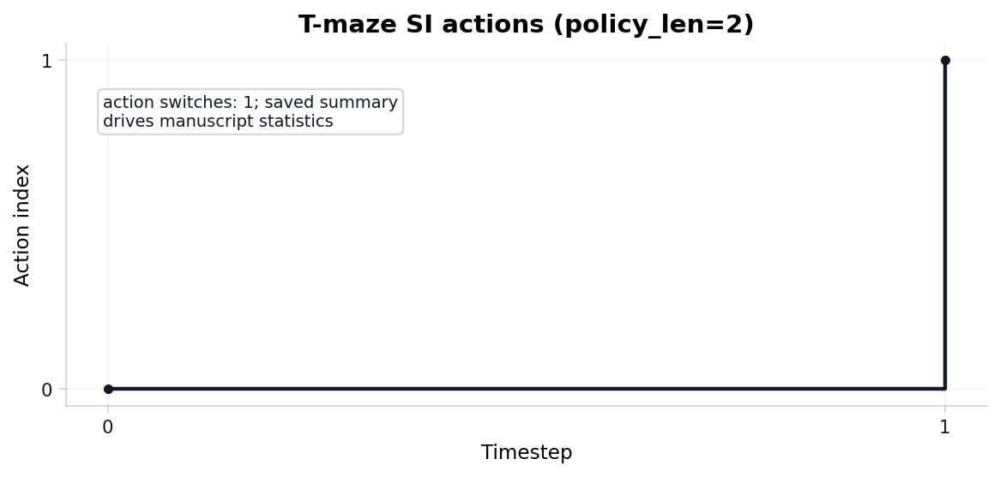
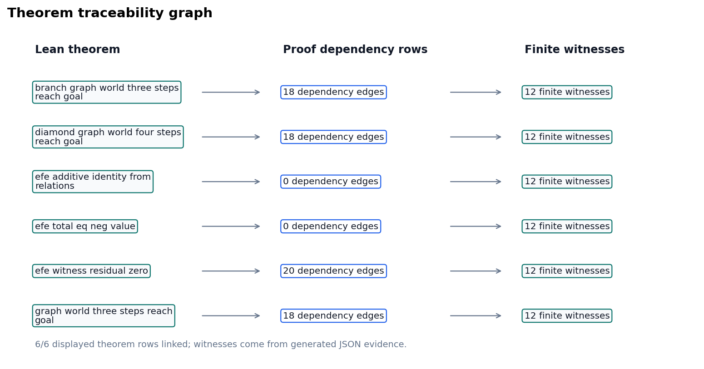
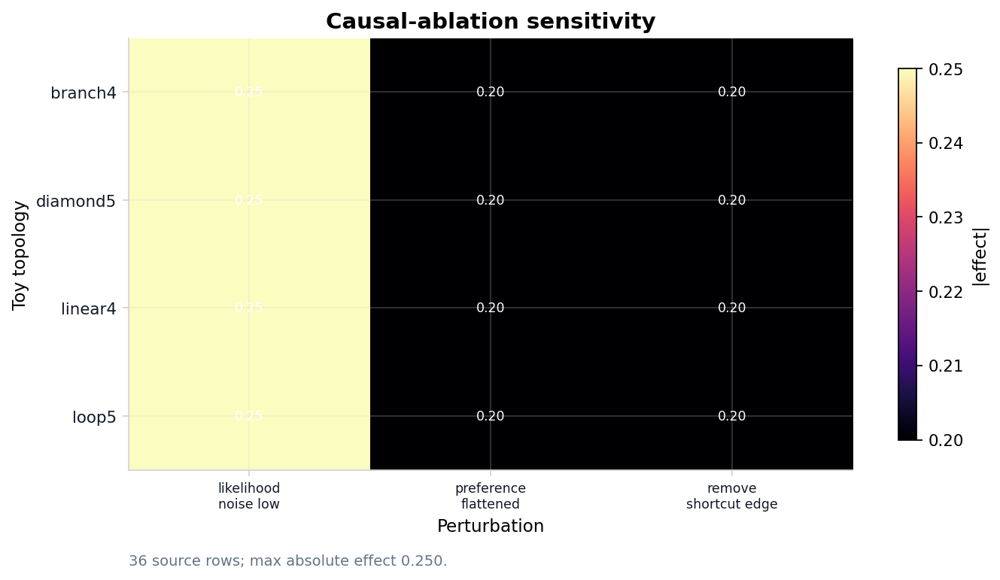
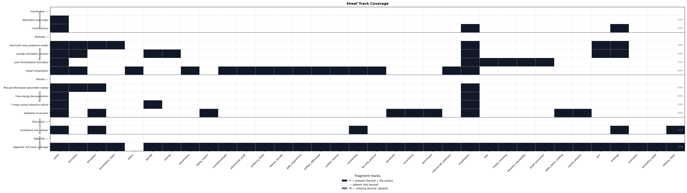

```{=latex}
\phantomsection
\addcontentsline{toc}{section}{Appendix}
\section*{Appendix}
```

# Appendix: full track coverage {#sec:appendix_full_sheaf}

<!-- sheaf-track:prose -->

This section is the **composability proof** for the manifest-indexed sheaf model: all 33 appendix-bound fragment tracks render into one flat manuscript section without section-specific compose branches. The registry defines 34 composable types; optional `layers` is methods-only and excluded from this row. The `animation` fragment is bound here as an optional registry type alongside the live proof, simulation, formal, notation, validation-spine, integration, audit, finite-catalog, ablation, license, release-evidence, scholarship, assumption-index, delta, and staleness tracks.

The proof is a publication-systems check ([@eq:appendix_track_count]). It demonstrates that heterogeneous fragments share one registry, manifest, renderer dispatch path, coverage matrix, and hydration boundary; it does not assert that every track carries equal scientific weight.

<!-- sheaf-track:formalism -->

For each track $t \in \mathcal{T}_{\mathrm{Full}}$, the appendix row binds a fragment path $f(t)$ and the composer emits `<!-- sheaf-track:t -->` before the rendered body. Generated renderers such as `section_figures` and markdown renderers pass through the same `resolve_track_body()` dispatch, so the appendix exercises the common compose interface rather than a bespoke appendix path.

$$
|\mathcal{T}_{\mathrm{Full}}| = 33
$$ {#eq:appendix_track_count}

The fragment registry defines 34 composable track types; optional `layers` is bound on the methods sheaf section only. Optional `animation` is bound in this appendix proof; the deterministic GIF artifact in `tracks.yaml` `extension_tracks` is produced by the core analysis DAG and remains separate from this fragment slot.

Because this appendix binds every non-optional appendix track plus optional `animation`, it is the maximal publication stalk of the coverage presheaf and exercises every publication renderer through the common `resolve_track_body()` dispatch. The same compose path is gated by the 6 sheaf laws verified in [@sec:methods_sheaf] (6/6 satisfied): the appendix section glues to a unique output (separation), occupies the terminal position of the linear extension under its own `appendix` group row (poset and gluing), binds only well-typed fragments (typing), and owns every fragment path it references (compositionality). No count in this appendix is hand-written; all are injected from the registry-backed oracle.

<!-- sheaf-track:simulation -->

Analytical sweep artifacts feed [@sec:results_mi_sweep] and [@sec:results_invariants]; simulation invariants merge after [@sec:results_si_tmaze]. No additional path listing is required beyond those Results sections.

<!-- sheaf-track:assumption_index -->

The appendix `assumption_index` row points to
`output/data/analytical_assumption_index.json`. It binds
7 finite Bernoulli-Ising assumption rows to
7 equation identifiers and generated artifacts, with
indexed status `true`.

The point is to make analytical signposting mechanical. If an equation is added
without an assumption row, or if a row loses its evidence artifact, the index
gate fails and the manuscript cannot present the equation as part of the
validated finite toy proof surface.

<!-- sheaf-track:pymdp -->

pymdp harness summary: `output/data/si_tmaze_summary.json` (mean belief entropy, action trace). Runtime diagnostics: `output/reports/pymdp_runtime_diagnostics.json` (known warnings 4, unexpected warnings 0). Policy posterior grid: `output/data/pymdp_policy_posterior_grid.json` (10 rows). Full log: `output/logs/pymdp_runs.jsonl`.

<!-- sheaf-track:interop -->

`sheaf-track:interop` binds `output/data/interop_roundtrip_report.json`, `output/data/gnn_roundtrip_report.json`, `output/reports/gnn_lint_report.json`, and ontology profile artifacts into the appendix proof row. The appendix claim is exactly 2 checks with lossless status `true`.

<!-- sheaf-track:provenance -->

The appendix provenance fragment points to `output/data/artifact_provenance.json`, the canonical artifact that records required toy artifact hashes, producer scripts, source commit, deterministic seeds, config digests, and 0 bundle rows.

<!-- sheaf-track:replay_matrix -->

`replay_matrix.json` provides the appendix proof for deterministic replay: 13 producer replay/fingerprint rows with matched status `true`.

<!-- sheaf-track:counterexample -->

The appendix counterexample fragment points to
`output/reports/counterexample_matrix.json`, the expected-failure matrix that
keeps promoted validation gates falsifiable. It currently records
11 known-bad fixtures, and the hydrated pass flag is
`1`, meaning those fixtures are expected to
fail rather than sneak through a positive-control gate.

This row is the negative-control ledger for the sheaf. Each counterexample names
a promoted track, target validation gate, mutation, and observed expected-failure
status. A new live track without a counterexample row is therefore visibly
incomplete in the track-improvement scope.

<!-- sheaf-track:adversarial_audit -->

`sheaf-track:adversarial_audit` binds `output/reports/adversarial_audit.json`, `output/reports/scope_boundary_audit.json`, and claim-audit outputs. The appendix claim is exactly 25 expected-failure rows with documented status `true` and known-bad-passing count 0.

<!-- sheaf-track:evidence_fields -->

`evidence_field_index.json` provides the appendix proof for field-level claim evidence: 97 mapped fields with status `true`.

<!-- sheaf-track:release_bundle -->

`release_bundle_manifest.json` provides the appendix proof for required deliverables: 38 artifacts with source-present status `true`.

`artifact_contract_index.json` is the appendix-level cross-artifact concordance proof. It rederives 85 rows from the live semantic producer map and release-bundle parity rows, with row-complete flag `true` and copied-parity flag `true`.

<!-- sheaf-track:gate_ergonomics -->

`validation_gate_index.json` provides the appendix proof for gate ergonomics: 26 indexed gates. `track_lane_matrix.json` adds 32 pipeline-to-sheaf rows with completion flag `true`.

<!-- sheaf-track:artifact_diffoscope -->

### Appendix track: artifact diffoscope

`artifact_diffoscope` binds `output/reports/artifact_diffoscope.json` into the
full sheaf appendix. Rows: 41. All equal:
`true`.

This diffoscope is deliberately narrow and reproducibility-facing. For each
non-cyclic generated artifact, it compares the saved provenance digest to the
live file digest at validation time. The validator re-derives equality from the
rows, so a stale `all_equal: true` summary cannot hide one changed artifact.

The row count is not a decoration; it is the number of artifact fingerprints
that survived cycle exclusion and therefore can be compared directly. This
keeps the release bundle honest about mutable files while avoiding
self-referential hashes for artifacts that necessarily include their own
provenance.

<!-- sheaf-track:artifact_license -->

### Appendix track: artifact license

`artifact_license` binds `output/reports/artifact_license_audit.json` into the
full sheaf appendix. Rows: 85. All safe:
`true`.

The license audit classifies each generated or source-backed artifact under the
public exemplar's configured license boundary. It is intentionally conservative:
generated local outputs and project-owned source files pass, while an artifact
outside those public source kinds would need an explicit provenance and license
row before it could support a manuscript claim.

This is also where the blocked empirical-adapter boundary matters. Private,
restricted, or network-derived data are not smuggled in as evidence; they remain
blocked until privacy, licensing, typed-claim, semantic, and negative-control
gates are implemented in the same artifact path.

<!-- sheaf-track:scholarship -->

`sheaf-track:scholarship` binds `output/data/scholarship_source_matrix.json` into
the appendix proof row. The appendix claim is exactly
21 connected source rows with connected status
`true`; each row names a bibliography key, locator,
manuscript citation status, declared consumer sections, method role, registered
track set, evidence artifact, and claim-boundary statement. The row set includes
3 quantitative/statistical or
visualization-quality method roles, including 7
statistically backed figures with bridge status
`true`. The explicit crosswalk has
7 rows and
9 statistical source links; every
row is referenced in the manuscript
(`true`), and every such
reference section is manifest-bound to sheaf tracks
(`true`) with a
visualization track present
(`true`). This
binds statistics and figure-quality claims to generated artifacts rather than
bibliography authority. The scholarship matrix itself also records manuscript
citation presence (`true`), declared-section
citation overlap count
(19), scope-guarded
boundaries (`true`), and live row
re-derivation (`true`), which makes forged aggregate
source-connectivity flags fail at the validation boundary.

The visualization registry is also now a paper-integration object: role metadata
complete `true`, paper claims complete
`true`, and section bindings complete
`true`. Those flags are read from the saved
visualization-quality audit and then rechecked through the semantic sheaf
restrictions.

<!-- sheaf-track:security_posture -->

The appendix includes the security posture as a release-boundary proof object.
Each row in `output/reports/security_posture_audit.json` has evidence artifacts,
validators, a scoped boundary statement, and a negative-control identifier. The
negative controls target the verifier failure modes a well-resourced adversary
would prefer: aggregate forgery, untracked credentials, network-derived evidence,
private-data leakage, unsigned production-release claims, and production
zero-trust claims without a runtime identity plane.

The posture is therefore defensive and local: it hardens this public template
against evidence laundering, artifact drift, secret exposure, and false release
claims while keeping production-only controls deferred until a real deployment
adds signed provenance, SBOMs, identity-aware access, telemetry, and incident
response evidence.

<!-- sheaf-track:sensitivity -->

`sheaf-track:sensitivity` binds `output/data/sensitivity_sweep.json`, measured `output/data/si_policy_grid.json`, compatibility-named EFE values artifact `output/data/si_efe_terms.json`, `output/data/analytical_observable_sweep.json`, and graph-world topology artifacts including `output/data/si_graph_world_topology_traces.json`. The appendix claim is exactly 96 complete canonical grid cells.

<!-- sheaf-track:uncertainty -->

`sheaf-track:uncertainty` binds `output/data/uncertainty_summary.json`. The appendix claim is exactly 12 normalized rows across 3 entropy bins with status `true`.

<!-- sheaf-track:benchmark -->

`sheaf-track:benchmark` binds `output/data/toy_benchmark_matrix.json`. The appendix claim is exactly 3 complete toy-model rows with status `true`.

<!-- sheaf-track:manuscript_staleness -->

The appendix `manuscript_staleness` row points to
`output/reports/manuscript_staleness_report.json`. It checks
322 token bindings after hydration, including late
audit variables, and the pass flag is `true`.

This is the rendered-output side of the sheaf contract. Source fragments may
contain hydration placeholders, but the public manuscript must not; the staleness report
compares each token's generated value against the resolved markdown so stale
counts are caught after composition, not only during source-file linting.

<!-- sheaf-track:visualization -->

{width=90%}

*Reproduced from [@fig:ising_mi_curve]. Closed-form $I(\lambda)$ and an independent exact recomputation via total correlation for the symmetric Bernoulli-Ising toy across 21 grid points up to $\lambda_{\max}$ = 4; grid maximum 0.6031 nats. Both estimators are deterministic (no sampling), so the right panel is a cross-implementation agreement check (max residual 0 nats), not a sampling residual.*

{width=90%}

*Reproduced from [@fig:si_tmaze_actions]. Discrete action index over time for the pymdp T-maze rollout (policy length 2).*

{#fig:theorem_traceability_graph width=95% fig-alt="Three-column graph generated from theorem traceability and proof dependency JSON. Each row links a Lean theorem to its proof-dependency edge count and finite model witness count; all theorem rows have resolved dependency edges: true."}

{#fig:causal_ablation_heatmap width=92% fig-alt="Heatmap generated from the causal ablation and sensitivity reports. Rows are toy graph topologies, columns are perturbation types, and each cell shows the maximum absolute deterministic effect sourced from generated JSON rows."}

{width=95%}

*Reproduced from [@fig:scholarship_source_map]. Scholarship source map: 21 source rows across 21 method roles and 10 source families. Connected status: true; row evidence rederived: true.*

{width=98%}

*Reproduced from [@fig:track_lane_promotion_map]. Track-lane promotion map: 32 pipeline-to-sheaf rows with complete promotion status true. Left: seven promotion-rule obligations; right: sheaf fragment bindings.*

{width=98%}

*Reproduced from [@fig:artifact_contract_map]. Artifact contract map: 85 generated artifact rows with complete contract status true and copied-output parity complete true. Cycle rows are explicit in `output/data/artifact_contract_index.json`.*

{width=96%}

*Reproduced from [@fig:security_posture_map]. Security posture map: 9 controls, 7 enforced and 2 scoped as deferred; secret findings: 0; high-risk gaps: 0.*

{width=95%}

*Reproduced from [@fig:sheaf_coverage_heatmap]. Sheaf track coverage matrix: 17 IMRAD rows × 34 fragment columns. Black = present (P), white = absent (—), gray = missing (M). Counts: 95 present / 95 bound / 0 missing. Generated from `output/data/sheaf_coverage_matrix.json`.*

<!-- sheaf-track:lean -->

Lean modules under `lean/TemplateActiveInference/` declare horizon and coupling witnesses. Build with `lake build` in `lean/`; [@fig:lean_boundary_status] summarizes proved versus deferred statements for this boundary fragment.

<!-- sheaf-track:model_checking -->

`sheaf-track:model_checking` binds `output/reports/model_checking_witnesses.json` and the Lean theorem inventories. The appendix claim is exactly 12 finite exhaustive witnesses with pass status `true`; Lean graph-world topology coverage is 4 generated topology ids with all-witnessed flag `true`.

<!-- sheaf-track:theorem_traceability -->

`theorem_traceability_matrix.json` provides the appendix proof for theorem traceability: 17 linked rows with status `true`.

<!-- sheaf-track:proof_extraction -->

### Appendix track: proof extraction

`proof_extraction` binds `output/data/proof_extraction_index.json` into the full
sheaf appendix. Extracted theorems: 12.
Constructive status: `true`.

The extraction index is intentionally modest: it records theorem names,
statements, source files, leading tactics, and forbidden proof-token checks.
That makes the Lean boundary inspectable without pretending that every proof
term has been translated into a proof object. A row with a missing statement or
forbidden token fails the formal interop gate and the canonical sheaf gate.

`output/data/proof_dependency_graph.json` adds the dependency view used by the
appendix figure. It contributes 207 theorem-source,
theorem-tactic, theorem-definition, and theorem-witness edges, with resolved
edge status `true`; this is the artifact that keeps
the theorem-traceability graph tied to generated Lean and model-checking rows.

<!-- sheaf-track:state_space_catalog -->

### Appendix track: state-space catalog

`state_space_catalog` binds `output/data/state_space_catalog.json` into the full
sheaf appendix. Rows: 6. All finite:
`true`.

The catalog is the finite-scope boundary for every toy claim in the exemplar.
Each row records a model id, state count, action count, policy count, source
artifact, and finite flag; the validator recomputes that counts are positive
and that every row remains finite. This prevents a manuscript sentence about
exhaustive checking from silently drifting into an unbounded or empirical
setting.

`output/data/state_transition_table.json` makes the boundary operational. It
contains 24 deterministic transition rows and covers
all reachable finite models with status `true`.
Readers can therefore audit not just the number of states, but the actual
state/action/next-state relation used by the model-checking witnesses.

<!-- sheaf-track:causal_ablation -->

### Appendix track: causal ablation

`causal_ablation` binds `output/data/causal_ablation_matrix.json` into the full
sheaf appendix. Cells: 36. Complete grid:
`true`.

The matrix is a finite teaching device: every row names a topology, a coupling
value, a perturbation, a scalar effect, and the generated source row that made
the effect admissible. It is not a claim about empirical interventions. It
shows how an intervention-shaped table can be made falsifiable inside the sheaf:
delete one perturbation cell or clear one deterministic flag and the grid gate
fails before the manuscript can reuse the result.

`output/reports/ablation_sensitivity_report.json` then joins those ablation
effects to the sensitivity and uncertainty artifacts. The report contributes
36 source-backed rows, with source-backed status
`true`, so the appendix heatmap is a rendered
view of validated JSON rather than a decorative restatement.

<!-- sheaf-track:gnn -->

GNN declarations: `gnn/bernoulli_toy.gnn.md` and `gnn/si_tmaze.gnn.md` [@gnn2023]. [@fig:gnn_ontology_concordance] and [@sec:methods_analytical] document ontology concordance for the Bernoulli toy; SI notation extends the same pattern under [@sec:methods_pymdp].

<!-- sheaf-track:ontology -->

### Ontology bindings

- `belief_entropy` → **BeliefEntropy**
- `expected_free_energy` → **ExpectedFreeEnergy**
- `location` → **HiddenState**
- `observation` → **ObservationLikelihood**
- `policy` → **PolicyPosterior**
- `sheaf_track` → **SheafFragment**


<!-- sheaf-track:animation -->

Animation is an **extension** sheaf track backed by a deterministic GIF from `scripts/render_animation.py`. This appendix row documents the track binding only; default publication still uses static SI figures ([@sec:results_si_tmaze], [@fig:si_tmaze_actions]) while the GIF remains an auditable generated artifact.

<!-- sheaf-track:animation_delta -->

The appendix `animation_delta` row points to `output/data/animation_frame_deltas.json`. The manifest records 3 adjacent-frame deltas, with `true` as the hydrated evidence that the GIF is trace-derived rather than a duplicated static frame.

<!-- sheaf-track:release_notes -->

### Appendix track: release notes evidence

`release_notes` binds `output/reports/release_notes_evidence.json` into the full
sheaf appendix. Rows: 3. Source-backed:
`true`.

Release notes are treated as claims, not as informal changelog prose. Each row
names a source artifact and a pass/deferred status, so the release note can say
only what validation, bundle, or semantic artifacts support. The validator
re-derives support from rows; flipping the summary bit without fixing a failed
row still fails.

`output/reports/release_attestation.json` is the compact final view over the
same boundary. It records 7 attestation rows for
validation, release bundle hash, license audit, semantic certificate, and
blocked-scope status, with all-attested flag `true`.
