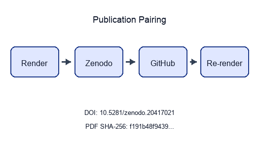

```{=latex}
\thispagestyle{empty}
\setlength{\parskip}{0pt}
\setlength{\itemsep}{0pt}
\begin{samepage}
\scriptsize
```

```{=latex}
\section*{BEGINNING OF TRANSMISSION}\label{beginning-of-transmission}
```

**State:** published

**Pairing:** complete (DOI, GitHub, SHA-256, Zenodo URL)

```{=latex}
\subsubsection*{Release metadata}
```

| Field | Value |
| --- | --- |
| Title | Active Inference Multi-Track Exemplar |
| Version | 0.3.2 |
| Concept DOI | 10.5281/zenodo.20417021 |
| Version DOI | 10.5281/zenodo.20931870 |
| GitHub | [https://github.com/docxology/template_active_inference/releases/tag/v0.3.2](https://github.com/docxology/template_active_inference/releases/tag/v0.3.2) |
| Zenodo | [https://zenodo.org/records/20417021](https://zenodo.org/records/20417021) |
| SHA-256 | `f191b48f94394cab…` |
| SHA-512 | pending |

```{=latex}
\subsubsection*{How to verify}
```

- Scan **Integrity** QR and compare the embedded SHA-256 prefix to the table above.
- Scan **Zenodo** / **GitHub** QR codes and confirm they resolve to this release pairing.
- Full hashes and structured fields: `../data/transmission_manifest.json`.

{width=98%}

Structured manifest: `../data/transmission_manifest.json`

{width=35%}

**Stego:** off | overlays text | barcodes on | XMP on | manifest on → `./secure_run.sh`

```{=latex}
\end{samepage}
\newpage
```


<!-- BEGINNING OF TRANSMISSION -->


---


# Sheaf Track Coverage {#sec:sheaf_coverage}

This page summarizes which **sheaf fragment tracks** are bound for each IMRAD row in `manuscript/sheaf/manifest.yaml`. The matrix is regenerated at compose time.

**Totals:** 95 present / 95 bound / 0 missing (gray).

| Color | Meaning |
| --- | --- |
| Black | Track **present** (bound and fragment exists) |
| White | **Absent** (not bound for this row) |
| Gray | **Missing** (bound but fragment file absent) |

## Introduction

- **Introduction** *(group)*
-   **Motivation and scope**
-   **Contributions**
## Methods

- **Methods** *(group)*
-   **Bernoulli–Ising analytical model**
-   **pymdp simulation harness**
-   **Lean formalization boundary**
-   **Sheaf composition**
## Results

- **Results** *(group)*
-   **Mutual-information parameter sweep**
-   **Free-energy decomposition**
-   **T-maze active-inference rollout**
-   **Validation invariants**
## Discussion

- **Discussion** *(group)*
-   **Limitations and outlook**
## Appendix

- **Appendix** *(group)*
-   **Appendix: full track coverage**

{#fig:sheaf_coverage_heatmap width=95% fig-alt="Heatmap matrix of IMRAD manuscript rows versus 34 sheaf fragment track columns. Black cells mean the track is bound and the fragment file exists; white cells mean the track is not bound; gray cells mean bound but missing. Rows are grouped by IMRAD block with indented subsection labels; column headers list track ids."}

Appendix row `16_appendix_full_sheaf.md` binds 33 fragment track types as a composability proof (registry defines 34 types; optional `layers` is methods-only).


---


# Abstract {#sec:abstract}

We study a minimal Active Inference stack on toy models: a Bernoulli–Ising analytical oracle, a pymdp T-maze rollout, and a sheaf-indexed compose contract that binds 34 fragment tracks into 12 flat IMRAD sections. The methodological contribution is a discipline rather than a domain finding: every reported number is hydrated from a generated artifact and every cross-track claim is machine-checked before rendering, so no figure or statistic can drift from the artifact that produced it — 6 sheaf axioms are verified before composition and 25 negative controls keep each failure path live. Claims are limited to those models and their generated artifacts.

[@sec:sheaf_coverage] reports a 17-row coverage matrix (5 IMRAD group headers) regenerated from the live manifest at compose time. [@sec:methods_pymdp] documents the T-maze harness aligned with [pymdp sophisticated_inference examples](https://github.com/infer-actively/pymdp/tree/main/examples/experimental/sophisticated_inference).

[@sec:results_invariants] records 12 / 12 invariant checks passed. SI planning horizon: 2 steps. Sweep RMSE 0 nats bounds analytical–empirical agreement on the coupling grid.


---


```{=latex}
\phantomsection
\addcontentsline{toc}{section}{Introduction}
\section*{Introduction}
```

# Motivation and scope {#sec:intro_motivation}

<!-- sheaf-track:prose -->

## Scientific scope

This manuscript couples three tracks on toy Active Inference models: a Bernoulli–Ising analytical oracle, a pymdp T-maze rollout, and a sheaf-indexed assembly contract that binds 34 optional fragment tracks under an IMRAD outline. The conceptual lineage is the free-energy and active-inference literature [@friston2010fep; @buckley2017mathreview; @parr2022active], with critical scope pressure from accounts that separate FEP's broad organizing role from direct empirical brain claims [@gershman2019fepbrain]. Here that distinction is operational: the scientific claims stay within these models and their generated artifacts, not biological agents.

## Manuscript structure

Three **scientific tracks** (analytical, pymdp, sheaf composition) map onto 34 **composable fragment types** and 31 pipeline gates ([@fig:multi_track_architecture]). [@sec:sheaf_coverage] summarizes which fragment tracks bind to each manifest row. [@sec:methods_sheaf] documents the compose pipeline, coverage semantics ([@eq:coverage_cell]), and strict validation gates.

The pymdp track follows the [pymdp sophisticated_inference examples](https://github.com/infer-actively/pymdp/tree/main/examples/experimental/sophisticated_inference) [@pymdp2024] with a minimal T-maze and planning horizon `policy_len = 2`. Other sections cite [@sec:methods_pymdp] instead of repeating that reference.


---


# Contributions {#sec:intro_contributions}

<!-- sheaf-track:prose -->

## Scientific contributions

1. **Analytical oracle** ([@sec:methods_analytical]): closed-form mutual information and free-energy decomposition on a symmetric Bernoulli–Ising toy with an independent exact-recomputation cross-check ([@sec:results_mi_sweep], [@sec:results_free_energy]).
2. **Active-inference harness** ([@sec:methods_pymdp]): deterministic pymdp T-maze rollout — default `state_inference` belief filtering, with sophisticated expected-free-energy policy inference selectable via `mode: policy_inference` — with logged beliefs, actions, and merged invariant gates ([@sec:results_si_tmaze], [@sec:results_invariants]).
3. **Sheaf-indexed composition** ([@sec:methods_sheaf]): 34 optional fragment types bind to 17 manifest rows under [@eq:coverage_cell], with a 33-track appendix composability proof ([@sec:appendix_full_sheaf]).

[@fig:multi_track_architecture] maps the three scientific tracks to 31 pipeline gates and 34 composable fragment renderers. Measured invariant checks: 12 / 12 passed.

Ontology-facing symbols are checked per model: the Bernoulli toy binds `pi1`, `pi2`, `J`, `gamma`, and `q_joint`, while the SI T-maze binds `location`, `observation`, `policy`, and `belief_entropy` to **HiddenState**, **ObservationLikelihood**, **PolicyPosterior**, and **BeliefEntropy** ([@fig:gnn_ontology_concordance], [@sec:methods_pymdp]).

<!-- sheaf-track:visualization -->

{#fig:multi_track_architecture width=95% fig-alt="Process diagram linking three scientific tracks to 31 pipeline gates and 34 sheaf fragment types across 17 manifest rows."}

<!-- sheaf-track:ontology -->

### Ontology bindings

- `expected_free_energy` → **ExpectedFreeEnergy**
- `location` → **HiddenState**
- `observation` → **ObservationLikelihood**
- `policy` → **PolicyPosterior**


---


```{=latex}
\phantomsection
\addcontentsline{toc}{section}{Methods}
\section*{Methods}
```

# Bernoulli–Ising analytical model {#sec:methods_analytical}

<!-- sheaf-track:prose -->

The analytical method is a finite **K=2 Bernoulli / Ising** oracle. The entangled joint [@eq:entangled_joint] gives closed-form mutual information $I(\lambda)$; `output/data/parameter_sweep.csv` then checks the same curve by an independent exact total-correlation recomputation before the value is used in [@sec:results_mi_sweep]. GNN and ontology rows share the same symbol surface ([@fig:gnn_ontology_concordance]), so the derivation, sweep, and model notation are one audited toy contract rather than parallel descriptions.

The scope is intentionally small: finite variational quantities only, no sampling, and no empirical generalization. "Free energy" here means exactly computed variational functionals on this tiny discrete state-space, aligned with mathematical FEP reviews [@buckley2017mathreview], not continuous-time or biological FEP dynamics [@gershman2019fepbrain]. The generated sweep contains 21 grid points, and the merged invariant report records 12 / 12 passing checks.

<!-- sheaf-track:formalism -->

The entangled joint over binary policies satisfies

$$
q_\lambda(\pi) \propto E(\pi)\,\exp(\lambda J(\pi)),
$$ {#eq:entangled_joint}

with symmetric Ising coupling $J$ and deformation parameter $\lambda$. Let $\sigma(\lambda)=q_\lambda(\pi_1=\pi_2)$ be the probability that the two streams agree (the diagonal mass of the $2\times2$ joint); by symmetry both marginals are uniform. With binary entropy $H_b(p)=-p\log p-(1-p)\log(1-p)$ in nats, the joint entropy is $H(q_\lambda)=\log 2 + H_b(\sigma(\lambda))$ while each marginal contributes $\log 2$, so the mutual information is

$$
I(\lambda)=\sum_k H(q_k)-H(q_\lambda)=\log 2 - H_b(\sigma(\lambda)),
$$

vanishing at $\lambda=0$ ($\sigma=\tfrac12$, independent streams) and saturating at $\log 2$ as $\lambda\to\infty$ ($\sigma\to1$, perfectly entangled). These symbols are the rows of `analytical_assumption_index.json`, so the derivation is auditable rather than asserted.

<!-- sheaf-track:simulation -->

The analytical track writes a parameter sweep comparing closed-form mutual information with an independent exact recomputation of it (via total correlation) across $\lambda \in [0, 4]$ on 21 grid points ([@sec:results_mi_sweep], [@fig:ising_mi_curve]).

<!-- sheaf-track:assumption_index -->

The `assumption_index` fragment makes the analytical equations inspectable as a generated artifact instead of relying on prose labels. `output/data/analytical_assumption_index.json` indexes 7 finite-model equation identifiers and 7 rows; the hydrated pass flag is `true`.

The index is deliberately narrow. It covers the Bernoulli-Ising toy equations, their finite binary state assumptions, and the generated artifacts that test the same symbols. Any missing equation identifier or empty assumption list fails the toy-sweep validation gate.

<!-- sheaf-track:visualization -->

{#fig:ising_mi_curve width=90% fig-alt="Two-panel plot of mutual information versus coupling strength lambda for the symmetric Bernoulli-Ising toy. Left panel shows the closed-form curve (solid dark line) and an independent exact recomputation via total correlation (dashed blue line) with lambda on the x-axis and mutual information in nats on the y-axis. Right panel shows the recompute-minus-closed-form residual versus lambda with a zero reference line; the two deterministic estimators agree to machine precision."}

{#fig:gnn_ontology_concordance width=90% fig-alt="Layered concordance diagram linking analytical symbols, GNN variables from bernoulli_toy.gnn.md (GNN v1.1), and Active Inference Ontology terms."}

<!-- sheaf-track:gnn -->

The Bernoulli toy is declared in `gnn/bernoulli_toy.gnn.md` (GNN v1.1), following the GNN notation role described by Smekal and Friedman [@gnn2023]. [@fig:gnn_ontology_concordance] links GNN variables to Active Inference Ontology terms bound in the analytical ontology fragment; round-trip parity is checked before render.

Measured MI and sweep artifacts in [@sec:results_mi_sweep] ground the same symbol map used in the concordance diagram.

<!-- sheaf-track:ontology -->

### Ontology bindings

- `E1` → **Stream1HabitPrior**
- `E2` → **Stream2HabitPrior**
- `J` → **CrossStreamCouplingPotential**
- `gamma` → **SophisticationWeight**
- `lam` → **EntanglementDeformationParameter**
- `pi1` → **Stream1PolicyVector**
- `pi2` → **Stream2PolicyVector**
- `q_joint` → **EntangledJointPosterior**


---


# pymdp simulation harness {#sec:methods_pymdp}

<!-- sheaf-track:prose -->

**Sophisticated inference (planning horizon).** The pymdp method is a deterministic state-inference harness on a minimal T-maze ([@fig:tmaze_schematic]) with planning horizon `policy_len = 2`. The discrete-state framing follows finite POMDP active-inference treatments and sophisticated-inference analyses [@dacosta2020discrete; @smith2022tutorial; @friston2021sophisticated; @dacosta2023reward], and the implementation anchor is the pymdp software paper [@pymdp2024]. The default `state_inference` rollout writes the summary/trace artifacts used in [@sec:results_si_tmaze]; mean belief entropy is 0.3251.

The method keeps runtime, posterior, and extension evidence separate. `output/data/si_policy_comparison.json` compares `state_inference` and `policy_inference` over declared toy horizons and seeds without replacing the default rollout (4 rows; complete-grid flag 1). Agent construction and backend warnings live in `output/reports/pymdp_runtime_diagnostics.json` (4 constructions, 4 known third-party warnings, 0 unexpected warnings). Posterior rows live in `output/data/pymdp_policy_posterior_grid.json` and must remain normalized (`1`).

Graph-world artifacts are deterministic extension outputs declared in `tracks.yaml` rather than new empirical claims. `simulate_si_graph_world.py` writes summary and trace artifacts for the finite graph path; the regenerated summary reports 4 nodes, 4 steps, and goal-reached flag 1. The topology-trace extension records 4 toy topology traces with agreement flag 1.

<!-- sheaf-track:formalism -->

Given generative matrices $A,B,C,D$, pymdp computes state beliefs $q(s)$ via variational inference (`infer_states`). The Agent is configured with planning horizon $H =$ 2, which defines the **policy depth** used when constructing candidate policies (logged as `num_policies` in the SI summary artifact; see [@sec:results_si_tmaze]).

The default harness records belief entropy per step; extending to full expected-free-energy policy selection (`infer_policies`) is documented as a follow-on track in [@sec:discussion_outlook].

<!-- sheaf-track:pymdp -->

SI artifacts (summary, trace, optional JSONL log) record step count, actions,
observations, and belief entropy for [@sec:results_si_tmaze]. Steps recorded:
2. Branching-time and variational formulations of active
inference planning are treated here as related planning context
[@champion2021branching; @nuijten2026efeplanning]; the live evidence remains the
finite local artifacts `si_policy_grid.json`, `si_efe_terms.json`, and
`model_checking_witnesses.json`, not a claim about scalable planning
performance.

<!-- sheaf-track:interop -->

The `interop` fragment treats the GNN files, JSON views, and ontology bindings as a round-trip contract rather than parallel documentation. `output/data/interop_roundtrip_report.json` records 2 deterministic checks; the manuscript only claims losslessness when `true` is true.

The stricter lint artifacts are adjacent evidence, not new model claims: `output/data/gnn_roundtrip_report.json`, `output/reports/gnn_lint_report.json`, `output/data/ontology_alias_index.json`, and `output/data/ontology_profile_matrix.json` must agree before the interop row passes. A missing GNN variable, duplicate ontology alias, dropped JSON field, shape diff, or dtype diff is therefore a validation failure before rendering.

<!-- sheaf-track:visualization -->

{#fig:tmaze_schematic width=85% fig-alt="Schematic of the minimal T-maze POMDP with start and goal states, discrete actions and observations, and planning horizon policy_len = 2."}

<!-- sheaf-track:gnn -->

See `gnn/si_tmaze.gnn.md` for a GNN view of the T-maze hidden state, observation, and policy variables with ontology bindings.

<!-- sheaf-track:ontology -->

### Ontology bindings

- `belief_entropy` → **BeliefEntropy**
- `loc` → **HiddenState**
- `obs` → **ObservationLikelihood**
- `pi` → **PolicyPosterior**


---


# Lean formalization boundary {#sec:methods_lean}

<!-- sheaf-track:prose -->

The Lean method is a boundary witness track, not a broad formalization of active inference. `lake build` checks declarations under `lean/TemplateActiveInference/`; [@fig:lean_boundary_status] renders the proved/deferred surface, while generated inventories carry theorem names, constructive-token status, and axiom checks.

The theorem set links back to the finite analytical and pymdp toys. Horizon witnesses constrain the planning-depth examples, and `efe_additive_identity_from_relations` proves `(risk + ambiguity) + (pragmatic + epistemic) = 0` from the definitional relations using core integer arithmetic (`omega`). These rows join 17 linked theorem-traceability entries with all-linked flag `true`; no prose claim is promoted unless the generated theorem, witness, and evidence-field rows agree.

<!-- sheaf-track:visualization -->

{#fig:lean_boundary_status width=90% fig-alt="Table figure listing Lean modules, declaration kinds, names, and proved versus sorry status under lean/TemplateActiveInference/."}

<!-- sheaf-track:lean -->

Lean module `TemplateActiveInference.SophisticatedInference` declares the planning-horizon parameter `defaultPolicyLen` and finite T-maze boundary witnesses: `sophisticated_requires_horizon : defaultPolicyLen > 1`, `tmaze_two_forward_steps_reach_goal`, and `tmaze_goal_absorbing`. It also contains constructive finite witnesses for graph-world reachability, finite policy enumeration, two-state belief weights, and two-policy posterior weights. These theorems formalize small finite boundaries shared with generated artifacts; they do *not* prove that the toy policy posterior is a general model of sophisticated inference. Axioms are audited with `#print axioms` (the gate whitelists only `propext`, `Classical.choice`, `Quot.sound`); see the Lean track gate.

Build via `lake build` under `lean/`.

<!-- sheaf-track:model_checking -->

The `model_checking` fragment complements Lean with finite exhaustive witnesses. `output/reports/model_checking_witnesses.json` records 12 toy-state witnesses and reports `true` only when no counterexample is found in the enumerated state/action space.

This is deliberately narrower than a semantic proof of all Active Inference programs. It checks the finite T-maze and graph-world boundary objects used by this manuscript and exposes the witness inventory to the same artifact and claim gates as the Lean theorem inventory. The Lean graph-world inventory witnesses 4 generated toy topology ids, with all-topologies-witnessed flag `true`; theorem traceability contributes 17 linked rows.

<!-- sheaf-track:theorem_traceability -->

The `theorem_traceability` fragment binds Lean theorem inventory rows to finite model-checking witnesses, manuscript claims, and evidence fields. `output/data/theorem_traceability_matrix.json` records 17 traceability rows and passes only when every theorem row is linked (`true`).

<!-- sheaf-track:proof_extraction -->

### Proof extraction track

The `proof_extraction` track extracts Lean theorem statements and proof-source
metadata into `output/data/proof_extraction_index.json`. The index currently
contains 12 extracted theorem rows, with
constructive-token status `true`.


---


# Sheaf composition {#sec:methods_sheaf}

<!-- sheaf-track:prose -->

## Compose contract

Each manifest row in `manuscript/sheaf/manifest.yaml` binds fragment tracks from `manuscript/sheaf/tracks.yaml`. A track supplies a renderer, compose order, label, optional flag, general paper role, and paper-specific use statement; the composer then flattens the binding set into one Markdown section for PDF and web output.

The operational claim is auditable binding. Analytical, simulation, pymdp, visualization, Lean, GNN, ontology, scholarship, and optional media fragments attach to IMRAD rows under [@eq:coverage_cell] (**P** present, **—** unbound, **M** missing). This is an applied local-to-global consistency contract in the spirit of cellular sheaf and sheaf-signal-processing work [@curry2014sheaves; @robinson2014topological], instantiated here as a finite artifact gate rather than a cohomology claim.

## Coverage and figures

[@fig:sheaf_layers_overview] summarizes 34 fragment types and their IMRAD bindings. Generated tables below list every track definition and section×track binding at compose time. The visualization track is gated by `output/reports/visualization_quality_audit.json`: 23 / 23 registered figures render, 23 are source-mapped, and 23 have sufficient alt/caption metadata; the all-quality flag is `true`.

The visualization gate is deliberately row-level. It requires declared visual/evidence roles (`true`), artifact-backed paper claims (`true`), section bindings (`true`), RGB nonblank image renders, hashes, and source-map agreement. The statistical bridge then expands 7 statistically backed figures into 7 figure-source-scholarship rows with connected status `true`, manuscript-reference status `true`, and visualization-bound reference status `true`.

The claim ledger is also checked at row level rather than as prose metadata. `claim_evidence_audit.json` resolves 97 claim rows to live artifacts (`true`) and replays their typed predicates (`true`), yielding the promoted completeness flag `true`.

## Compose commands

```bash
uv run python scripts/compose_manuscript.py
uv run python scripts/compose_manuscript.py --validate-only --strict
```

Each run emits `output/data/sheaf_coverage_matrix.json` and regenerates coverage artifacts. Partial compose (`--section`) is draft-only; the matrix always reflects the full manifest. Coverage totals appear on [@sec:sheaf_coverage]; discussion scope is in [@sec:discussion_outlook].

## Law verification

`--validate-only --strict` runs the structural gate before any fragment is glued. Beyond per-cell coverage, it invokes the sheaf-law oracle (`verify_sheaf_laws`, `src/manuscript/sheaf/laws.py`), which checks 6 axioms — poset, presheaf functoriality, separation, gluing, typing, and compositionality — and reports 6/6 satisfied for the current manifest. A violation is raised as an error-level issue and aborts the build, so a malformed manifest (a section colliding on an output file, an off-chain block, a mistyped fragment, a fragment shared between sections) can never compose. The formal statements are in the formalism block below; the negative-control suite (`tests/test_sheaf_laws.py`) proves each check is falsifiable.

The semantic layer is separate from those structural laws. `output/data/sheaf_gluing_certificate.json` records cross-track symbols, typed claim evidence, artifact sources, and manuscript-variable restrictions; validation fails when the analytical, pymdp, GNN, ontology, Lean, visualization, or manuscript tracks disagree about a shared symbol or measured claim. The visualization-quality audit is one of those restrictions, so a missing source map, missing statistical bridge source, missing hash, blank render, non-RGB render, undersized figure, or unbound section breaks the same semantic contract that checks statistics and theorem witnesses. [@fig:semantic_gluing_graph] renders the configured producers, generated evidence artifacts, and validation consumers that read each shared symbol.

<!-- sheaf-track:formalism -->

### Base poset and presheaf

The manuscript is modelled as a coverage sheaf over a finite base poset. Let the
**base** $P$ be the IMRAD blocks ordered as a chain,

$$
\mathsf{Introduction} \prec \mathsf{Methods} \prec \mathsf{Results} \prec \mathsf{Discussion} \prec \mathsf{Appendix},
$$ {#eq:imrad_chain}

with, in each block, a *group* node above its *section* nodes (written $G \sqsupseteq s$). $P$ is therefore a finite poset (equivalently a finite Alexandrov space). Let $\mathcal{T}$ be the registered fragment-track set from `manuscript/sheaf/tracks.yaml`; each track $t \in \mathcal{T}$ carries a renderer $R(t)$, label $L(t)$, optional flag $O(t)$, a general paper role $U(t)$, a section-use statement $V(t)$, and a strict compose-order index $\pi(t)$.

The **presheaf** $\mathcal{F}$ is a contravariant functor on $P$ — $\mathcal{F}\colon P \to \mathbf{Set}$ with restriction maps along $\sqsupseteq$ — assigning to each composing section $s$ its bound fragment set $\mathcal{F}(s) = \{\,(t, F_s(t)) : t \text{ bound in } s\,\}$, where $F_s : \mathcal{T} \rightharpoonup \mathbf{Path}$ is the section's partial binding map. Restriction along $G \sqsupseteq s$ is projection onto a section's own bindings; group nodes carry the empty assignment and do not compose.

The coverage cell is

$$
B(s,t) \in \{\mathrm{P}, \mathrm{—}, \mathrm{M}\}
$$ {#eq:coverage_cell}

derived from $F_s(t)$ and filesystem existence at compose time: **P** when a bound fragment exists, **—** when the track is unbound for that row, and **M** when a bound path is missing. The current regenerated matrix reports 95 present / 95 bound / 0 missing cells. Registry size: $|\mathcal{T}| = 34$ types across 17 IMRAD manifest rows (5 group rows, 12 composing sections).

### Verified sheaf laws

What makes this presheaf a *sheaf* — rather than a bare incidence table — is that the composer's structural axioms are machine-checked. The oracle `verify_sheaf_laws` (`src/manuscript/sheaf/laws.py`) verifies 6 laws, and the regenerated build reports 6/6 satisfied:

1. **Poset.** The IMRAD blocks form the chain of [@eq:imrad_chain]; compose order is monotone in block rank and every composing section's block carries a group row.
2. **Presheaf (functoriality).** Every bound track lies in $\mathcal{T}$; $\pi$ is a strict total order; and each section's resolved track order is the monotone restriction of $\pi$ (an explicit `track_order` override must be a permutation of the section's bound tracks).
3. **Separation (locality).** The map $s \mapsto \mathrm{output\_name}(s)$ is injective over composing sections: distinct locals glue to distinct global positions, so the global section is unique.
4. **Gluing.** Compose order is a linear extension of $P$ — each block's rows are contiguous and strictly increasing in order — so the local fragments glue to a unique global manuscript in which every composing section appears exactly once.
5. **Typing.** Each binding $(t, F_s(t))$ is well-typed: $R(t)$ is a registered renderer and the fragment suffix lies in $R(t)$'s accepted suffix set. Generated renderers (`section_figures`, `layers_report`) synthesize their body and are explicitly type-exempt.
6. **Compositionality.** Every fragment file is private to one section (no path is bound twice), so global composition is the coproduct of the per-section bodies and is independent of inclusion order.

Each law is paired with a negative control in `tests/test_sheaf_laws.py` — a single mutation that breaks the law and is proven to be caught — so the gate binds the laws' *content*, not merely their shape. Under `--strict`, any violation is surfaced as an error-level manifest issue and aborts composition.

### Scope (what is and is not claimed)

These laws verify the sheaf *axioms* on a finite base poset. They do **not** compute sheaf *cohomology* ($H^0$/$H^1$, Čech complexes, derived functors); "sheaf" here names the verified separation-and-gluing structure of a multi-track coverage assignment, not a cohomological invariant. Formal track definitions and section×track bindings appear in the generated tables below.

Semantic gluing then checks agreement of the glued content: coverage counts, manuscript variables, typed claim predicates, pymdp mode/hash, Bernoulli GNN ontology, and SI T-maze GNN ontology. This certificate is a content-level audit over the same base, not an additional topological law.

<!-- sheaf-track:visualization -->

{#fig:sheaf_layers_overview width=98% fig-alt="Two-panel overview of sheaf fragment layers. Left panel shows 34 composable track types in registry compose order with labels and renderer ids. Right panel shows the IMRAD section binding heatmap with black present, white absent, and gray missing cells across 17 manifest rows and 34 tracks."}

{#fig:semantic_gluing_graph width=95% fig-alt="Dependency diagram linking configured analysis scripts to generated evidence artifacts, manuscript consumers, and validation gates for the semantic sheaf gluing certificate."}

{#fig:track_lane_promotion_map width=98% fig-alt="Two-panel matrix generated from track_lane_matrix.json. The left panel lists pipeline tracks against producer, artifact, manuscript consumer, typed claim, semantic restriction, validation gate, and negative control obligations. The right panel shows the sheaf fragment lanes bound to each pipeline track."}

{#fig:artifact_contract_map width=98% fig-alt="Matrix generated from artifact_contract_index.json. Rows are generated artifacts; columns show producer configured, source present, claim bound or exempt, validation gate, negative control, freshness hash, copied-output parity, and complete contract status."}

{#fig:scholarship_source_map width=95% fig-alt="Five-column source map generated from the scholarship source matrix. Each row links a bibliography key to a DOI or URL locator, manuscript citation status, guarded scope boundary, method role, and generated evidence artifact; green borders mark rows rederived from bibliography entries, manuscript citations, registered tracks, bound manuscript sections, and existing artifacts."}

{#fig:security_posture_map width=96% fig-alt="Matrix generated from security_posture_audit.json. Rows are defensive controls such as public data boundary, offline reproducibility, hash integrity, release parity, claim traceability, formal boundary, secret scan, signed attestation, and zero-trust runtime boundary; columns show evidence, validator, negative-control, scoping, and overall status."}

<!-- sheaf-track:provenance -->

The `provenance` fragment makes artifact lineage a live canonical sheaf track. The configured producer `generate_sheaf_tracks.py` writes `output/data/artifact_provenance.json`, which hashes 85 required toy artifacts and records producer scripts, source commit, deterministic seed fields, config digests, and 5 artifact bundles. Publication claims that depend on generated files must be traceable to this lineage table or to a narrower artifact-specific certificate.

The provenance claim is intentionally limited: every listed artifact exists, has a SHA-256 digest or an explicit cycle exclusion, is produced by a configured analysis script, and carries seed/config provenance (`85` seeded rows; all seeded flag `true`; bundle-complete flag `true`). A changed file, missing producer, or stale saved digest is a validation failure, not a prose warning.

<!-- sheaf-track:counterexample -->

The `counterexample` fragment records expected-failure fixtures as first-class evidence. `output/reports/counterexample_matrix.json` lists 25 negative controls that intentionally mutate ontology mappings, semantic certificates, graph-world trace agreement, typed claim evidence, replay rows, release parity, and provenance hashes.

The matrix is not an empirical result. It is a falsifiability ledger: each row names the gate that must fail and the test that proves the failure path remains live.

<!-- sheaf-track:adversarial_audit -->

The `adversarial_audit` fragment makes expected failures part of the sheaf rather than an informal test note. `output/reports/adversarial_audit.json` records 25 known-bad rows and 0 known-bad rows passing; publication proceeds only when every row is documented as an expected failure and mapped to a gate.

The audit rows target the same failure modes as the semantic certificate: incomplete sweep cells, unnormalized uncertainty rows, interop field loss, stale certificate state, and empirical-scope leakage. The scope boundary remains toy-only: `toy_only_pass`.

<!-- sheaf-track:evidence_fields -->

The `evidence_fields` fragment indexes the exact artifact fields that support typed claims and hydrated manuscript tokens. `output/data/evidence_field_index.json` records 97 field rows, and the track passes only when every referenced JSONPath or dotted field is present (`true`).

<!-- sheaf-track:release_bundle -->

The `release_bundle` fragment records whether the canonical deliverables exist before copying and whether copied root outputs match or are explicitly deferred until the copy stage. `output/reports/release_bundle_manifest.json` tracks 38 required deliverables with source-present flag `true`.

The bundle contract is now indexed artifact-by-artifact rather than inferred from isolated reports. `output/data/artifact_contract_index.json` contains 85 generated artifact rows; each row binds its producer, configured script, pipeline/sheaf lanes, manuscript consumers, claim predicates, validators, negative control, freshness status, and copied-output parity. The aggregate row-complete flag is `true`, and copied-root parity completeness is `true`.

<!-- sheaf-track:gate_ergonomics -->

The `gate_ergonomics` fragment turns validation commands into evidence rows. `output/data/validation_gate_index.json` records 26 gate rows, each naming required inputs and the negative-control surface that should fail closed.

`output/data/track_lane_matrix.json` is the cross-track audit table for the same gate surface: 32 pipeline rows map to sheaf fragments, producer scripts, primary artifacts, validation gates, and manuscript consumers, with completion flag `true`.

<!-- sheaf-track:artifact_diffoscope -->

### Artifact diffoscope track

The `artifact_diffoscope` track compares saved provenance hashes against live
artifact hashes at the artifact root JSONPath. Its proof artifact is
`output/reports/artifact_diffoscope.json`: it currently records
41 comparison rows, with equality status
`true`.

<!-- sheaf-track:artifact_license -->

### Artifact license track

The `artifact_license` track classifies generated and project-source artifacts
under the public project license boundary. Its audit artifact is
`output/reports/artifact_license_audit.json`: it currently records
85 rows, with license-safe status
`true`.

<!-- sheaf-track:scholarship -->

The `scholarship` fragment turns citations into an audited method surface rather
than decorative bibliography. `output/data/scholarship_source_matrix.json`
records 21 source rows across
21 method roles and
10 source families, including
3 quantitative/statistical or
visualization-quality method roles; [@fig:scholarship_source_map] renders the
resulting source-to-artifact map with 1
locator kinds. The row set connects foundational
free-energy and active-inference references [@friston2010fep; @buckley2017mathreview;
@dacosta2020discrete; @parr2022active; @smith2022tutorial], planning context
[@champion2021branching; @nuijten2026efeplanning], implementation and notation
anchors [@pymdp2024; @gnn2023], and applied sheaf/local-to-global sources
[@curry2014sheaves; @robinson2014topological; @bosca2026localglobal] to the
exact artifact or method role they support.

The validation claim is deliberately narrow: every row must have a bibliography
entry with a DOI or URL, a manuscript citation, registered sheaf tracks, bound
manifest consumer sections, an existing evidence artifact, and a scope-guarded
claim-boundary statement. The saved matrix is then
rederived from live bibliography, manuscript, registry, manifest, and artifact
evidence before validation accepts it (`true`), so a
forged row-level boolean cannot launder a disconnected source. The added
statistics and visualization rows point to `analysis_statistics.json` and
`visualization_quality_audit.json`, including a statistical-visualization bridge
row, so the scholarship track now distinguishes method lineage from the generated
numerical, figure-quality, and figure-provenance evidence. The hydrated flags
`true`,
`true`, and
`true` are therefore
source-traceability and scope-control claims, not claims that the toy results
inherit empirical support from the cited literature.

The newer arXiv rows are intentionally constrained. They situate the toy EFE and
planning artifacts against branching-time and variational-planning work, and
they situate the finite manuscript sheaf against modern local-to-global
computation framing, but none of those citations promotes empirical, neural
network, or scalable-agent performance claims for this exemplar.

<!-- sheaf-track:security_posture -->

The security-posture track treats the public exemplar itself as the defended asset.
`output/reports/security_posture_audit.json` records 9
controls: 7 enforced local controls and
2 production-security obligations that are explicitly
deferred rather than claimed. The enforced rows cover public-data boundaries,
offline reproducibility, artifact hashes, copied-output parity, claim/scope
traceability, the Lean boundary, and a source/config secret-pattern scan.

The audit is intentionally not a production certification. It records
0 high-risk local gaps and
0 high-risk secret-pattern findings; the
all-controls flag is `true`, and all listed
evidence is present: `true`. Deferred rows
cover signed provenance/SBOM release attestation and zero-trust runtime controls,
which require deployment-specific identity, device posture, logging, and signing
infrastructure outside this toy-only manuscript.

<!-- sheaf-track:manuscript_staleness -->

The `manuscript_staleness` fragment closes the hydration loop. `output/reports/manuscript_staleness_report.json` checks 322 manuscript token bindings against the current generated variables after resolved markdown is written; the pass flag is `true`.

This is a publication-systems claim, not a domain result. A stale hydrated value, unresolved token, or missing resolved section becomes a validation failure before PDF or web outputs are accepted.

<!-- sheaf-track:layers -->

<!-- sheaf-layers:registry -->
## Sheaf fragment track registry

Compose order and renderer bindings from `manuscript/sheaf/tracks.yaml`.

| Order | Track id | Label | Renderer | Paper role | Paper use | Optional |
| ---: | --- | --- | --- | --- | --- | --- |
| 10 | `prose` | Narrative prose | `markdown` | Narrative framing and argument flow | Supports the narrative spine for each composed paper section. | No |
| 20 | `formalism` | Mathematical formalism | `markdown` | Mathematical definitions and equations | States the finite equations, laws, and boundary assumptions used by prose claims. | No |
| 30 | `simulation` | Analytical simulation notes | `markdown` | Deterministic toy analysis evidence | Connects analytical sweeps and toy simulations to results claims. | No |
| 32 | `assumption_index` | Analytical assumption index | `markdown` | Assumption boundary ledger | Lists finite-model assumptions so analytical claims stay scoped. | No |
| 35 | `layers` | Sheaf layers tables | `layers_report` | Registry and binding disclosure | Generates the track registry, binding matrix, and evidence crosswalk tables. | Yes |
| 40 | `pymdp` | pymdp harness artifacts | `markdown` | Active-inference implementation evidence | Binds pymdp traces, runtime diagnostics, and policy comparisons to methods and results. | No |
| 41 | `interop` | GNN/ontology/JSON interop checks | `markdown` | Cross-format compatibility evidence | Shows that GNN, ontology, and JSON artifacts preserve model meaning. | No |
| 42 | `provenance` | Artifact provenance and bundle lineage spine | `markdown` | Artifact lineage evidence | Documents producers, hashes, seeds, and bundle lineage for generated claims. | No |
| 45 | `replay_matrix` | Deterministic replay matrix | `markdown` | Reproducibility replay evidence | Shows configured producers replay and match their expected artifacts. | No |
| 48 | `counterexample` | Expected-failure counterexamples | `markdown` | Falsifiability negative controls | Records known-bad fixtures that must fail validation gates. | No |
| 50 | `adversarial_audit` | Adversarial audit matrix | `markdown` | Adversarial robustness evidence | Documents stress cases and expected failures for sheaf-track claims. | No |
| 52 | `evidence_fields` | Evidence field index | `markdown` | Claim field traceability | Maps evidence fields to sections and artifacts for claim hydration. | No |
| 53 | `release_bundle` | Release bundle parity manifest | `markdown` | Release artifact parity evidence | Checks that required deliverables exist and copied outputs match or defer explicitly. | No |
| 54 | `gate_ergonomics` | Validation gate ergonomics | `markdown` | Validation workflow index | Explains the gates a reader or maintainer can rerun locally. | No |
| 55 | `artifact_diffoscope` | Artifact diffoscope | `markdown` | Artifact equality evidence | Compares generated and copied artifacts to surface publication drift. | No |
| 56 | `artifact_license` | Artifact license audit | `markdown` | License safety evidence | Records license status for artifacts included in release surfaces. | No |
| 57 | `scholarship` | Source-backed scholarship matrix | `markdown` | Scholarship and method-source lineage | Connects cited sources to method roles, sections, and generated evidence. | No |
| 58 | `security_posture` | Security posture audit | `markdown` | Public release security boundary evidence | Separates enforced local controls from deferred production-security obligations. | No |
| 60 | `sensitivity` | Toy sensitivity sweep | `markdown` | Parameter sensitivity evidence | Summarizes deterministic toy perturbations behind robustness claims. | No |
| 62 | `uncertainty` | Toy uncertainty summaries | `markdown` | Uncertainty summary evidence | Reports normalized uncertainty bins and summaries for finite toy analyses. | No |
| 65 | `benchmark` | Compact toy benchmark matrix | `markdown` | Toy benchmark comparison evidence | Shows compact model comparisons used to bound toy-only claims. | No |
| 66 | `manuscript_staleness` | Hydrated manuscript staleness report | `markdown` | Manuscript freshness evidence | Checks hydrated sections against current generated artifacts and variables. | No |
| 67 | `visualization` | Figure references | `section_figures` | Figure evidence and communication | Injects registry figures into section-specific evidence blocks. | No |
| 70 | `lean` | Lean boundary fragment | `markdown` | Formal proof boundary evidence | Separates proved Lean witnesses from intentionally scoped formal boundaries. | No |
| 75 | `model_checking` | Finite-state model checking witnesses | `markdown` | Exhaustive finite-model evidence | Lists model-checking witnesses for finite state-space claims. | No |
| 76 | `theorem_traceability` | Lean theorem traceability matrix | `markdown` | Theorem dependency traceability | Links theorem rows to proof dependencies and finite model witnesses. | No |
| 77 | `proof_extraction` | Lean proof extraction index | `markdown` | Constructive proof extraction evidence | Shows extracted theorem artifacts remain constructive and available. | No |
| 78 | `state_space_catalog` | Finite state-space catalog | `markdown` | Finite model catalog evidence | Enumerates reachable states so toy models remain explicitly finite. | No |
| 79 | `causal_ablation` | Deterministic causal ablation matrix | `markdown` | Causal ablation evidence | Summarizes deterministic perturbation effects across toy topologies. | No |
| 80 | `gnn` | GNN notation fragment | `markdown` | GNN notation evidence | Documents notation and round-trip status for the analytical model. | No |
| 90 | `ontology` | Active Inference Ontology bindings | `ontology_yaml` | Ontology binding evidence | Maps local variables to ontology terms for semantic consistency. | No |
| 100 | `animation` | Animation fragment | `markdown` | Dynamic trace visualization | Provides a deterministic GIF trace as optional appendix evidence. | Yes |
| 102 | `animation_delta` | Animation frame-delta manifest | `markdown` | Animation integrity evidence | Confirms animation frames change and support the visual trace. | No |
| 110 | `release_notes` | Release notes evidence | `markdown` | Release narrative evidence | Binds release-note statements to source-backed artifacts. | No |

**Track count:** 34 registered fragment types.

<!-- sheaf-layers:binding-matrix -->
## IMRAD binding matrix

Section rows versus fragment track columns. **P** = present (bound and file exists); **—** = absent (not bound); **M** = missing (bound, file absent).

| Section | prose | formalism | simulation | assumption_index | layers | pymdp | interop | provenance | replay_matrix | counterexample | adversarial_audit | evidence_fields | release_bundle | gate_ergonomics | artifact_diffoscope | artifact_license | scholarship | security_posture | sensitivity | uncertainty | benchmark | manuscript_staleness | visualization | lean | model_checking | theorem_traceability | proof_extraction | state_space_catalog | causal_ablation | gnn | ontology | animation | animation_delta | release_notes |
| --- | --- | --- | --- | --- | --- | --- | --- | --- | --- | --- | --- | --- | --- | --- | --- | --- | --- | --- | --- | --- | --- | --- | --- | --- | --- | --- | --- | --- | --- | --- | --- | --- | --- | --- |
| Introduction (group) | — | — | — | — | — | — | — | — | — | — | — | — | — | — | — | — | — | — | — | — | — | — | — | — | — | — | — | — | — | — | — | — | — | — |
|   Motivation and scope | P | — | — | — | — | — | — | — | — | — | — | — | — | — | — | — | — | — | — | — | — | — | — | — | — | — | — | — | — | — | — | — | — | — |
|   Contributions | P | — | — | — | — | — | — | — | — | — | — | — | — | — | — | — | — | — | — | — | — | — | P | — | — | — | — | — | — | — | P | — | — | — |
| Methods (group) | — | — | — | — | — | — | — | — | — | — | — | — | — | — | — | — | — | — | — | — | — | — | — | — | — | — | — | — | — | — | — | — | — | — |
|   Bernoulli–Ising analytical model | P | P | P | P | — | — | — | — | — | — | — | — | — | — | — | — | — | — | — | — | — | — | P | — | — | — | — | — | — | P | P | — | — | — |
|   pymdp simulation harness | P | P | — | — | — | P | P | — | — | — | — | — | — | — | — | — | — | — | — | — | — | — | P | — | — | — | — | — | — | P | P | — | — | — |
|   Lean formalization boundary | P | — | — | — | — | — | — | — | — | — | — | — | — | — | — | — | — | — | — | — | — | — | P | P | P | P | P | — | — | — | — | — | — | — |
|   Sheaf composition | P | P | — | — | P | — | — | P | — | P | P | P | P | P | P | P | P | P | — | — | — | P | P | — | — | — | — | — | — | — | — | — | — | — |
| Results (group) | — | — | — | — | — | — | — | — | — | — | — | — | — | — | — | — | — | — | — | — | — | — | — | — | — | — | — | — | — | — | — | — | — | — |
|   Mutual-information parameter sweep | P | P | P | — | — | — | — | — | — | — | — | — | — | — | — | — | — | — | — | — | — | — | P | — | — | — | — | — | — | — | — | — | — | — |
|   Free-energy decomposition | P | — | — | — | — | — | — | — | — | — | — | — | — | — | — | — | — | — | — | — | — | — | P | — | — | — | — | — | — | — | — | — | — | — |
|   T-maze active-inference rollout | P | — | — | — | — | P | — | — | — | — | — | — | — | — | — | — | — | — | — | — | — | — | P | — | — | — | — | — | — | — | — | — | — | — |
|   Validation invariants | P | — | P | — | — | — | — | — | P | — | — | — | — | — | — | — | — | — | P | P | P | — | P | — | — | — | — | P | P | — | — | — | — | — |
| Discussion (group) | — | — | — | — | — | — | — | — | — | — | — | — | — | — | — | — | — | — | — | — | — | — | — | — | — | — | — | — | — | — | — | — | — | — |
|   Limitations and outlook | P | — | P | — | — | — | — | — | — | — | — | — | — | — | — | — | P | — | — | — | — | — | — | — | — | — | — | — | — | — | P | — | — | P |
| Appendix (group) | — | — | — | — | — | — | — | — | — | — | — | — | — | — | — | — | — | — | — | — | — | — | — | — | — | — | — | — | — | — | — | — | — | — |
|   Appendix: full track coverage | P | P | P | P | — | P | P | P | P | P | P | P | P | P | P | P | P | P | P | P | P | P | P | P | P | P | P | P | P | P | P | P | P | P |

**Totals:** 95 present / 95 bound / 0 missing.

<!-- sheaf-layers:legend -->
| Symbol | Coverage color | Meaning |
| --- | --- | --- |
| P | Black | Track **present** (bound and fragment exists) |
| — | White | **Absent** (not bound for this section) |
| M | Gray | **Missing** (bound but fragment file absent) |

<!-- sheaf-layers:section-status -->
## Section-track status

Generated status for the current manuscript sheaf, summarized per composable section.

| Section | IMRAD | Bound | Present | Missing | Status |
| --- | --- | ---: | ---: | ---: | --- |
| Motivation and scope | introduction | 1 | 1 | 0 | `fully_sheafed` |
| Contributions | introduction | 3 | 3 | 0 | `fully_sheafed` |
| Bernoulli–Ising analytical model | methods | 7 | 7 | 0 | `fully_sheafed` |
| pymdp simulation harness | methods | 7 | 7 | 0 | `fully_sheafed` |
| Lean formalization boundary | methods | 6 | 6 | 0 | `fully_sheafed` |
| Sheaf composition | methods | 15 | 15 | 0 | `fully_sheafed` |
| Mutual-information parameter sweep | results | 4 | 4 | 0 | `fully_sheafed` |
| Free-energy decomposition | results | 2 | 2 | 0 | `fully_sheafed` |
| T-maze active-inference rollout | results | 3 | 3 | 0 | `fully_sheafed` |
| Validation invariants | results | 9 | 9 | 0 | `fully_sheafed` |
| Limitations and outlook | discussion | 5 | 5 | 0 | `fully_sheafed` |
| Appendix: full track coverage | appendix | 33 | 33 | 0 | `fully_sheafed` |

**Section status:** 12 / 12 composable sections fully sheafed; 0 required bound fragments missing.

<!-- sheaf-layers:track-status -->
## Track status

| Track | Renderer | Bound sections | Present | Missing | Claims | Status |
| --- | --- | ---: | ---: | ---: | ---: | --- |
| `prose` | `markdown` | 12 | 12 | 0 | 0 | `complete` |
| `formalism` | `markdown` | 5 | 5 | 0 | 0 | `complete` |
| `simulation` | `markdown` | 5 | 5 | 0 | 11 | `complete` |
| `assumption_index` | `markdown` | 2 | 2 | 0 | 1 | `complete` |
| `layers` | `layers_report` | 1 | 1 | 0 | 1 | `complete` |
| `pymdp` | `markdown` | 3 | 3 | 0 | 15 | `complete` |
| `interop` | `markdown` | 2 | 2 | 0 | 3 | `complete` |
| `provenance` | `markdown` | 2 | 2 | 0 | 15 | `complete` |
| `replay_matrix` | `markdown` | 2 | 2 | 0 | 3 | `complete` |
| `counterexample` | `markdown` | 2 | 2 | 0 | 2 | `complete` |
| `adversarial_audit` | `markdown` | 2 | 2 | 0 | 9 | `complete` |
| `evidence_fields` | `markdown` | 2 | 2 | 0 | 1 | `complete` |
| `release_bundle` | `markdown` | 2 | 2 | 0 | 9 | `complete` |
| `gate_ergonomics` | `markdown` | 2 | 2 | 0 | 8 | `complete` |
| `artifact_diffoscope` | `markdown` | 2 | 2 | 0 | 2 | `complete` |
| `artifact_license` | `markdown` | 2 | 2 | 0 | 1 | `complete` |
| `scholarship` | `markdown` | 3 | 3 | 0 | 4 | `complete` |
| `security_posture` | `markdown` | 2 | 2 | 0 | 2 | `complete` |
| `sensitivity` | `markdown` | 2 | 2 | 0 | 9 | `complete` |
| `uncertainty` | `markdown` | 2 | 2 | 0 | 4 | `complete` |
| `benchmark` | `markdown` | 2 | 2 | 0 | 3 | `complete` |
| `manuscript_staleness` | `markdown` | 2 | 2 | 0 | 1 | `complete` |
| `visualization` | `section_figures` | 10 | 10 | 0 | 17 | `complete` |
| `lean` | `markdown` | 2 | 2 | 0 | 9 | `complete` |
| `model_checking` | `markdown` | 2 | 2 | 0 | 7 | `complete` |
| `theorem_traceability` | `markdown` | 2 | 2 | 0 | 3 | `complete` |
| `proof_extraction` | `markdown` | 2 | 2 | 0 | 2 | `complete` |
| `state_space_catalog` | `markdown` | 2 | 2 | 0 | 2 | `complete` |
| `causal_ablation` | `markdown` | 2 | 2 | 0 | 2 | `complete` |
| `gnn` | `markdown` | 3 | 3 | 0 | 4 | `complete` |
| `ontology` | `ontology_yaml` | 5 | 5 | 0 | 5 | `complete` |
| `animation` | `markdown` | 1 | 1 | 0 | 2 | `complete` |
| `animation_delta` | `markdown` | 1 | 1 | 0 | 1 | `complete` |
| `release_notes` | `markdown` | 2 | 2 | 0 | 2 | `complete` |

**Status cells:** 578 section-track cells.

<!-- sheaf-layers:render-log -->
## Render and logging summary

| Event | Component | Output | Status | Detail |
| --- | --- | --- | --- | --- |
| `registry_loaded` | `sheaf.registry` | `registered_tracks` | `ok` | 34 tracks |
| `manifest_loaded` | `sheaf.manifest` | `manifest_sections` | `ok` | 17 sections |
| `coverage_matrix_built` | `sheaf.coverage` | `output/data/sheaf_coverage_matrix.json` | `ok` | 95 present cells |
| `section_status_matrix_built` | `sheaf.status` | `output/data/sheaf_section_status_matrix.json` | `ok` | 578 section-track cells |
| `layers_renderer_bound` | `sheaf.layers_report` | `manuscript/08_methods_sheaf.md` | `ok` | methods sheaf layer tables |
| `semantic_artifacts_indexed` | `sheaf.semantic` | `output/data/validation_dependency_graph.json` | `ok` | 85 artifact producer rows |
| `validation_gates_indexed` | `gates` | `output/data/validation_gate_index.json` | `ok` | 3 gate groups |
| `manuscript_sections_composed` | `sheaf.compose` | `manuscript/*.md` | `ok` | 16 composed markdown files |

**Render events:** 8.

<!-- sheaf-layers:evidence-crosswalk -->
## Evidence crosswalk

| Claim | Artifact | Producer | Gates |
| --- | --- | --- | --- |
| `sheaf_registry` | `manuscript/sheaf/tracks.yaml` | `manual` | validate_outputs |
| `sheaf_manifest` | `manuscript/sheaf/manifest.yaml` | `manual` | validate_outputs |
| `sheaf_coverage_config` | `manuscript/sheaf/coverage.yaml` | `manual` | validate_outputs |
| `sheaf_coverage_matrix` | `output/data/sheaf_coverage_matrix.json` | `generate_figures.py` | validate_outputs, validate_manuscript |
| `sheaf_gluing_certificate` | `output/data/sheaf_gluing_certificate.json` | `generate_sheaf_tracks.py` | validate_manuscript, validate_outputs |
| `sheaf_evidence_crosswalk` | `output/data/sheaf_evidence_crosswalk.json` | `generate_sheaf_tracks.py` | validate_manuscript, validate_outputs |
| `validation_dependency_graph` | `output/data/validation_dependency_graph.json` | `generate_sheaf_tracks.py` | validate_manuscript, validate_outputs |
| `semantic_gluing_graph_figure` | `../figures/semantic_gluing_graph.png` | `generate_figures.py` | validate_outputs, figure_registry |

**Claim rows:** 97 typed evidence claims.

<!-- sheaf-layers:artifact-producers -->
## Artifact producer graph

| Artifact | Producer | Configured | Consumers |
| --- | --- | --- | --- |
| `output/data/analysis_statistics.json` | `compute_statistics.py` | Yes | results_si_tmaze, results_invariants |
| `output/data/analytical_assumption_index.json` | `generate_toy_sweep_tracks.py` | Yes | methods_analytical, appendix_full_sheaf |
| `output/data/analytical_observable_sweep.json` | `generate_toy_sweep_tracks.py` | Yes | results_invariants, appendix_full_sheaf |
| `output/data/animation_frame_deltas.json` | `render_animation.py` | Yes | appendix_full_sheaf |
| `output/data/artifact_contract_index.json` | `generate_sheaf_tracks.py` | Yes | methods_sheaf, appendix_full_sheaf |
| `output/data/artifact_provenance.json` | `generate_sheaf_tracks.py` | Yes | methods_sheaf |
| `output/data/causal_ablation_matrix.json` | `generate_toy_sweep_tracks.py` | Yes | results_invariants, appendix_full_sheaf |
| `output/data/cross_track_symbol_table.json` | `generate_integration_audit.py` | Yes | methods_sheaf, appendix_full_sheaf |
| `output/data/evidence_field_index.json` | `generate_sheaf_tracks.py` | Yes | methods_sheaf, appendix_full_sheaf |
| `output/data/figure_source_map.json` | `generate_integration_audit.py` | Yes | methods_sheaf, appendix_full_sheaf |
| `output/data/gnn_roundtrip_report.json` | `generate_formal_interop_tracks.py` | Yes | methods_pymdp, appendix_full_sheaf |
| `output/data/interop_roundtrip_report.json` | `generate_formal_interop_tracks.py` | Yes | methods_pymdp, appendix_full_sheaf |
| `output/data/manuscript_evidence_tables.json` | `generate_integration_audit.py` | Yes | methods_sheaf, appendix_full_sheaf |
| `output/data/manuscript_token_provenance.json` | `generate_integration_audit.py` | Yes | methods_sheaf, appendix_full_sheaf |
| `output/data/manuscript_variables.json` | `z_generate_manuscript_variables.py` | Yes | methods_sheaf, appendix_full_sheaf |
| `output/data/ontology_alias_index.json` | `generate_formal_interop_tracks.py` | Yes | methods_pymdp, appendix_full_sheaf |
| `output/data/ontology_profile_matrix.json` | `generate_formal_interop_tracks.py` | Yes | methods_pymdp, appendix_full_sheaf |
| `output/data/parameter_sweep.csv` | `run_analytical_sweep.py` | Yes | methods_analytical, results_mi_sweep |
| `output/data/proof_dependency_graph.json` | `generate_sheaf_tracks.py` | Yes | methods_lean, appendix_full_sheaf |
| `output/data/proof_extraction_index.json` | `generate_formal_interop_tracks.py` | Yes | methods_lean, appendix_full_sheaf |
| `output/data/pymdp_policy_posterior_grid.json` | `simulate_si_tmaze.py` | Yes | methods_pymdp, appendix_full_sheaf |
| `output/data/scholarship_source_matrix.json` | `generate_sheaf_tracks.py` | Yes | methods_sheaf, appendix_full_sheaf |
| `output/data/sensitivity_sweep.json` | `generate_sheaf_tracks.py` | Yes | results_invariants, appendix_full_sheaf |
| `output/data/sheaf_coverage_matrix.json` | `generate_figures.py` | Yes | methods_sheaf, appendix_full_sheaf |
| `output/data/sheaf_evidence_crosswalk.json` | `generate_sheaf_tracks.py` | Yes | methods_sheaf |
| `output/data/sheaf_gluing_certificate.json` | `generate_sheaf_tracks.py` | Yes | methods_sheaf, appendix_full_sheaf |
| `output/data/sheaf_section_status_matrix.json` | `generate_sheaf_tracks.py` | Yes | methods_sheaf, appendix_full_sheaf |
| `output/data/si_efe_terms.json` | `generate_toy_sweep_tracks.py` | Yes | results_invariants, appendix_full_sheaf |
| `output/data/si_graph_world_summary.json` | `simulate_si_graph_world.py` | Yes | methods_pymdp, results_si_tmaze |
| `output/data/si_graph_world_topology_sweep.json` | `generate_toy_sweep_tracks.py` | Yes | results_invariants, appendix_full_sheaf |
| `output/data/si_graph_world_topology_traces.json` | `generate_toy_sweep_tracks.py` | Yes | results_invariants, appendix_full_sheaf |
| `output/data/si_graph_world_trace.json` | `simulate_si_graph_world.py` | Yes | methods_pymdp, results_si_tmaze, appendix_full_sheaf |
| `output/data/si_policy_comparison.json` | `simulate_si_tmaze.py` | Yes | methods_pymdp, results_si_tmaze |
| `output/data/si_policy_grid.json` | `generate_toy_sweep_tracks.py` | Yes | results_invariants, appendix_full_sheaf |
| `output/data/si_tmaze_summary.json` | `simulate_si_tmaze.py` | Yes | methods_pymdp, results_si_tmaze |
| `output/data/si_tmaze_trace.json` | `simulate_si_tmaze.py` | Yes | methods_pymdp, results_si_tmaze |
| `output/data/state_space_catalog.json` | `generate_toy_sweep_tracks.py` | Yes | results_invariants, appendix_full_sheaf |
| `output/data/state_transition_table.json` | `generate_sheaf_tracks.py` | Yes | results_invariants, appendix_full_sheaf |
| `output/data/statistical_visualization_bridge.json` | `generate_integration_audit.py` | Yes | methods_sheaf, appendix_full_sheaf |
| `output/data/theorem_traceability_matrix.json` | `generate_sheaf_tracks.py` | Yes | methods_lean, appendix_full_sheaf |
| `output/data/toy_benchmark_matrix.json` | `generate_toy_sweep_tracks.py` | Yes | results_invariants, appendix_full_sheaf |
| `output/data/track_improvement_scope.json` | `generate_sheaf_tracks.py` | Yes | methods_sheaf, appendix_full_sheaf |
| `output/data/track_lane_matrix.json` | `generate_sheaf_tracks.py` | Yes | methods_sheaf, appendix_full_sheaf |
| `output/data/uncertainty_summary.json` | `generate_sheaf_tracks.py` | Yes | results_invariants, appendix_full_sheaf |
| `output/data/validation_dependency_graph.json` | `generate_sheaf_tracks.py` | Yes | methods_sheaf |
| `output/data/validation_gate_index.json` | `generate_integration_audit.py` | Yes | methods_sheaf, appendix_full_sheaf |
| `../figures/si_belief_trajectory.gif` | `render_animation.py` | Yes | appendix_full_sheaf |
| `output/reports/ablation_sensitivity_report.json` | `generate_sheaf_tracks.py` | Yes | results_invariants, appendix_full_sheaf |
| `output/reports/adversarial_audit.json` | `generate_sheaf_tracks.py` | Yes | methods_sheaf, appendix_full_sheaf |
| `output/reports/artifact_diffoscope.json` | `generate_integration_audit.py` | Yes | methods_sheaf, appendix_full_sheaf |
| `output/reports/artifact_license_audit.json` | `generate_integration_audit.py` | Yes | methods_sheaf, appendix_full_sheaf |
| `output/reports/blocked_scope_manifest.json` | `generate_sheaf_tracks.py` | Yes | methods_sheaf, discussion_outlook, appendix_full_sheaf |
| `output/reports/claim_evidence_audit.json` | `generate_integration_audit.py` | Yes | methods_sheaf, appendix_full_sheaf |
| `output/reports/counterexample_matrix.json` | `generate_sheaf_tracks.py` | Yes | methods_sheaf |
| `output/reports/figure_hash_manifest.json` | `generate_integration_audit.py` | Yes | methods_sheaf, appendix_full_sheaf |
| `output/reports/gnn_lint_report.json` | `generate_formal_interop_tracks.py` | Yes | methods_pymdp, appendix_full_sheaf |
| `output/reports/graph_world_invariants.json` | `generate_toy_sweep_tracks.py` | Yes | results_invariants, appendix_full_sheaf |
| `output/reports/invariants.json` | `run_analytical_sweep.py` | Yes | results_invariants |
| `output/reports/lean_graph_world_inventory.json` | `generate_formal_interop_tracks.py` | Yes | methods_lean, appendix_full_sheaf |
| `output/reports/lean_theorem_inventory.json` | `generate_formal_interop_tracks.py` | Yes | methods_lean, appendix_full_sheaf |
| `output/reports/manuscript_staleness_report.json` | `z_generate_manuscript_variables.py` | Yes | methods_sheaf, appendix_full_sheaf |
| `output/reports/model_checking_witnesses.json` | `generate_sheaf_tracks.py` | Yes | methods_lean, appendix_full_sheaf |
| `output/reports/producer_completeness.json` | `generate_integration_audit.py` | Yes | methods_sheaf, appendix_full_sheaf |
| `output/reports/pymdp_runtime_diagnostics.json` | `simulate_si_tmaze.py` | Yes | methods_pymdp, appendix_full_sheaf |
| `output/reports/release_attestation.json` | `generate_sheaf_tracks.py` | Yes | discussion_outlook, appendix_full_sheaf |
| `output/reports/release_bundle_manifest.json` | `generate_sheaf_tracks.py` | Yes | methods_sheaf, appendix_full_sheaf |
| `output/reports/release_notes_evidence.json` | `generate_integration_audit.py` | Yes | discussion_outlook, appendix_full_sheaf |
| `output/reports/replay_matrix.json` | `generate_sheaf_tracks.py` | Yes | results_invariants, appendix_full_sheaf |
| `output/reports/reproducibility_replay.json` | `generate_validation_spine.py` | Yes | results_invariants |
| `output/reports/scope_boundary_audit.json` | `generate_integration_audit.py` | Yes | methods_sheaf, appendix_full_sheaf |
| `output/reports/security_posture_audit.json` | `generate_sheaf_tracks.py` | Yes | methods_sheaf, appendix_full_sheaf |
| `output/reports/sheaf_render_log.json` | `generate_sheaf_tracks.py` | Yes | methods_sheaf, appendix_full_sheaf |
| `output/reports/si_invariants.json` | `simulate_si_tmaze.py` | Yes | results_si_tmaze |
| `output/reports/si_tmaze_run_report.json` | `simulate_si_tmaze.py` | Yes | results_si_tmaze |
| `output/reports/stale_artifact_report.json` | `generate_integration_audit.py` | Yes | methods_sheaf, appendix_full_sheaf |
| `output/reports/visualization_quality_audit.json` | `generate_integration_audit.py` | Yes | methods_sheaf, appendix_full_sheaf |

**Producer issues:** 0.

<!-- sheaf-layers:semantic-restrictions -->
## Semantic gluing restrictions

| Restriction | Value |
| --- | --- |
| Coverage missing | `0` |
| Policy comparison rows | `4` |
| Policy grid complete | `True` |
| Policy posterior rows | `10` |
| Policy posterior normalized | `True` |
| Runtime unexpected warnings | `0` |
| Graph-world trace agrees | `True` |
| Animation frames | `4` |
| Lean all proved | `True` |
| GNN ontology ok | `True` |
| Configured producers ok | `True` |
| Semantic certificate ok | `None` |
| Dependency edges ok | `True` |
| Track scope complete | `True` |
| Empirical adapter blocked | `True` |
| Provenance bundles complete | `True` |
| Replay rows matched | `True` |
| Sensitivity complete | `True` |
| Uncertainty normalized | `True` |
| Evidence fields mapped | `True` |
| Release bundle sources present | `True` |
| Theorem traceability linked | `True` |
| Gate ergonomics indexed | `True` |
| Interop lossless | `True` |
| Scope toy-only | `True` |

<!-- sheaf-layers:track-lane-matrix -->
## Track-lane matrix

| Pipeline track | Sheaf fragments | Producer | Primary artifact | Claims | Semantic | Gates | Negative |
| --- | --- | --- | --- | --- | --- | --- | --- |
| `lean` | `lean` | `generate_formal_interop_tracks.py` | `output/reports/lean_theorem_inventory.json` | `lean_graph_world_policy_boundary`, `lean_graph_world_topologies_witnessed`, `lean_theorem_inventory_proved`, `model_checking_exhaustive`, `model_checking_witnesses_pass`, `proof_dependency_graph_resolved`, `proof_extraction_constructive`, `theorem_traceability_linked`, `track_lane_promotion_map_figure` | `track_lane_matrix_complete`, `track_lane_matrix_row_count` | `build_lean`, `validate_outputs` | `track_lane_matrix_row_only_forgery` |
| `analytical` | `formalism`, `simulation`, `assumption_index` | `run_analytical_sweep.py` | `output/data/parameter_sweep.csv` | `analytical_assumption_index`, `composed_methods_analytical`, `composed_results_mi` | `track_lane_matrix_complete`, `track_lane_matrix_row_count` | `validate_outputs` | `track_lane_matrix_row_only_forgery` |
| `pymdp` | `pymdp` | `simulate_si_tmaze.py` | `output/data/si_policy_comparison.json` | `graph_world_invariants_pass`, `graph_world_topology_traces_consistent`, `pymdp_policy_posterior_grid_normalized`, `pymdp_runtime_diagnostics_ok`, `sheaf_gluing_certificate`, `si_belief_entropy_figure`, `si_efe_rows_explained`, `si_graph_world_summary`, `si_graph_world_trace`, `si_graph_world_trace_consistency`, `si_policy_comparison`, `si_policy_comparison_modes`, `si_policy_grid_complete`, `si_tmaze_summary`, `si_tmaze_trace` | `track_lane_matrix_complete`, `track_lane_matrix_row_count` | `validate_outputs` | `track_lane_matrix_row_only_forgery` |
| `gnn` | `gnn` | `generate_formal_interop_tracks.py` | `output/reports/gnn_lint_report.json` | `cross_track_symbols_consistent`, `interop_lossless`, `interop_roundtrip_lossless`, `sheaf_gluing_certificate` | `track_lane_matrix_complete`, `track_lane_matrix_row_count` | `validate_outputs` | `track_lane_matrix_row_only_forgery` |
| `ontology` | `ontology` | `generate_formal_interop_tracks.py` | `output/data/ontology_profile_matrix.json` | `composed_discussion`, `cross_track_symbols_consistent`, `interop_lossless`, `interop_roundtrip_lossless`, `sheaf_gluing_certificate` | `track_lane_matrix_complete`, `track_lane_matrix_row_count` | `validate_manuscript`, `validate_outputs` | `track_lane_matrix_row_only_forgery` |
| `visualizations` | `visualization` | `generate_integration_audit.py` | `output/reports/visualization_quality_audit.json` | `visualization_quality_audit_complete`, `visualization_statistics_bridge_complete` | `track_lane_matrix_complete`, `track_lane_matrix_row_count` | `validate_manuscript`, `validate_outputs` | `track_lane_matrix_row_only_forgery` |
| `provenance` | `provenance` | `generate_sheaf_tracks.py` | `output/data/artifact_provenance.json` | `artifact_contract_index_complete`, `artifact_contract_map_figure`, `artifact_diffoscope_equal`, `artifact_license_safe`, `artifact_provenance_seed_config`, `artifact_provenance_spine`, `dependency_graph_edges`, `figure_hash_manifest_complete`, `figure_source_map_complete`, `producer_completeness`, `pymdp_runtime_diagnostics_ok`, `release_bundle_sources_present`, `stale_artifact_report_fresh`, `track_improvement_scope_complete`, `track_lane_matrix_complete` | `track_lane_matrix_complete`, `track_lane_matrix_row_count` | `validate_manuscript`, `validate_outputs` | `missing_sheaf_track_producer` |
| `replay_matrix` | `replay_matrix` | `generate_sheaf_tracks.py` | `output/reports/replay_matrix.json` | `replay_matrix_all_replayed`, `replay_matrix_spine`, `stale_artifact_report_fresh` | `track_lane_matrix_complete`, `track_lane_matrix_row_count` | `validate_manuscript`, `validate_outputs` | `replay_mismatch` |
| `counterexample` | `counterexample` | `generate_sheaf_tracks.py` | `output/reports/counterexample_matrix.json` | `counterexample_expected_failures`, `counterexample_matrix_spine` | `track_lane_matrix_complete`, `track_lane_matrix_row_count` | `validate_manuscript`, `validate_outputs` | `known_bad_counterexample_passed` |
| `sensitivity` | `sensitivity` | `generate_sheaf_tracks.py` | `output/data/sensitivity_sweep.json` | `ablation_sensitivity_source_backed`, `causal_ablation_complete`, `graph_world_invariants_pass`, `graph_world_topology_traces_consistent`, `lean_graph_world_topologies_witnessed`, `sensitivity_complete_grid`, `si_efe_rows_explained`, `si_policy_grid_complete`, `state_transition_table_complete` | `track_lane_matrix_complete`, `track_lane_matrix_row_count` | `validate_outputs` | `missing_sensitivity_cell` |
| `assumption_index` | `assumption_index` | `generate_toy_sweep_tracks.py` | `output/data/analytical_assumption_index.json` | `analytical_assumption_index` | `track_lane_matrix_complete`, `track_lane_matrix_row_count` | `validate_manuscript`, `validate_outputs` | `track_lane_matrix_row_only_forgery` |
| `uncertainty` | `uncertainty` | `generate_sheaf_tracks.py` | `output/data/uncertainty_summary.json` | `ablation_sensitivity_source_backed`, `pymdp_policy_posterior_grid_normalized`, `uncertainty_normalized`, `uncertainty_rows_normalized` | `track_lane_matrix_complete`, `track_lane_matrix_row_count` | `validate_outputs` | `unnormalized_uncertainty_row` |
| `benchmark` | `benchmark` | `generate_toy_sweep_tracks.py` | `output/data/toy_benchmark_matrix.json` | `benchmark_rows_complete`, `causal_ablation_complete`, `state_space_catalog_finite` | `track_lane_matrix_complete`, `track_lane_matrix_row_count` | `validate_outputs` | `track_lane_matrix_row_only_forgery` |
| `model_checking` | `model_checking` | `generate_sheaf_tracks.py` | `output/reports/model_checking_witnesses.json` | `lean_graph_world_topologies_witnessed`, `lean_theorem_inventory_proved`, `model_checking_exhaustive`, `model_checking_witnesses_pass`, `state_space_catalog_finite`, `state_transition_table_complete`, `theorem_traceability_linked` | `track_lane_matrix_complete`, `track_lane_matrix_row_count` | `validate_outputs` | `missed_model_checking_counterexample` |
| `interop` | `interop` | `generate_formal_interop_tracks.py` | `output/data/interop_roundtrip_report.json` | `interop_lossless`, `interop_roundtrip_lossless`, `pymdp_policy_posterior_grid_normalized` | `track_lane_matrix_complete`, `track_lane_matrix_row_count` | `validate_outputs` | `interop_shape_loss` |
| `adversarial_audit` | `adversarial_audit` | `generate_sheaf_tracks.py` | `output/reports/adversarial_audit.json` | `adversarial_audit_expected_failures`, `adversarial_audit_known_bad_blocked`, `claim_evidence_audit_typed`, `counterexample_expected_failures`, `empirical_adapter_blocked`, `producer_completeness`, `pymdp_runtime_diagnostics_ok`, `scope_boundary_toy_only`, `semantic_gluing_ok` | `track_lane_matrix_complete`, `track_lane_matrix_row_count` | `validate_manuscript`, `validate_outputs` | `adversarial_known_bad_passes` |
| `evidence_fields` | `evidence_fields` | `generate_sheaf_tracks.py` | `output/data/evidence_field_index.json` | `evidence_fields_mapped` | `track_lane_matrix_complete`, `track_lane_matrix_row_count` | `validate_manuscript`, `validate_outputs` | `missing_typed_claim` |
| `release_bundle` | `release_bundle` | `generate_sheaf_tracks.py` | `output/reports/release_bundle_manifest.json` | `artifact_contract_copied_parity_complete`, `artifact_contract_index_complete`, `artifact_contract_map_figure`, `artifact_diffoscope_equal`, `artifact_license_safe`, `release_attestation_complete`, `release_bundle_sources_present`, `release_notes_source_backed`, `security_posture_controls_ok` | `track_lane_matrix_complete`, `track_lane_matrix_row_count` | `validate_manuscript`, `validate_outputs` | `release_bundle_parity_failure` |
| `theorem_traceability` | `theorem_traceability` | `generate_sheaf_tracks.py` | `output/data/theorem_traceability_matrix.json` | `proof_dependency_graph_resolved`, `proof_extraction_constructive`, `theorem_traceability_linked` | `track_lane_matrix_complete`, `track_lane_matrix_row_count` | `validate_manuscript`, `validate_outputs` | `theorem_traceability_unlinked` |
| `gate_ergonomics` | `gate_ergonomics` | `generate_integration_audit.py` | `output/data/validation_gate_index.json` | `artifact_contract_index_complete`, `gate_ergonomics_indexed`, `release_attestation_complete`, `release_notes_source_backed`, `security_posture_controls_ok`, `sheaf_render_log_events_ok`, `track_lane_matrix_complete`, `validation_gate_index_complete` | `track_lane_matrix_complete`, `track_lane_matrix_row_count` | `validate_manuscript`, `validate_outputs` | `gate_ergonomics_unindexed` |
| `artifact_diffoscope` | `artifact_diffoscope` | `generate_integration_audit.py` | `output/reports/artifact_diffoscope.json` | `artifact_contract_copied_parity_complete`, `artifact_diffoscope_equal` | `track_lane_matrix_complete`, `track_lane_matrix_row_count` | `validate_manuscript`, `validate_outputs` | `artifact_diffoscope_missed_hash_drift` |
| `proof_extraction` | `proof_extraction` | `generate_formal_interop_tracks.py` | `output/data/proof_extraction_index.json` | `proof_dependency_graph_resolved`, `proof_extraction_constructive` | `track_lane_matrix_complete`, `track_lane_matrix_row_count` | `validate_manuscript`, `validate_outputs` | `proof_extraction_missing_statement` |
| `state_space_catalog` | `state_space_catalog` | `generate_toy_sweep_tracks.py` | `output/data/state_space_catalog.json` | `state_space_catalog_finite`, `state_transition_table_complete` | `track_lane_matrix_complete`, `track_lane_matrix_row_count` | `validate_manuscript`, `validate_outputs` | `state_space_catalog_missing_finite_space` |
| `causal_ablation` | `causal_ablation` | `generate_toy_sweep_tracks.py` | `output/data/causal_ablation_matrix.json` | `ablation_sensitivity_source_backed`, `causal_ablation_complete` | `track_lane_matrix_complete`, `track_lane_matrix_row_count` | `validate_manuscript`, `validate_outputs` | `causal_ablation_missing_cell` |
| `artifact_license` | `artifact_license` | `generate_integration_audit.py` | `output/reports/artifact_license_audit.json` | `artifact_license_safe` | `track_lane_matrix_complete`, `track_lane_matrix_row_count` | `validate_manuscript`, `validate_outputs` | `artifact_license_unsafe_artifact` |
| `scholarship` | `scholarship` | `generate_sheaf_tracks.py` | `output/data/scholarship_source_matrix.json` | `scholarship_source_map_figure`, `scholarship_source_matrix_connected`, `statistical_visualization_crosswalk_complete`, `visualization_statistics_bridge_complete` | `track_lane_matrix_complete`, `track_lane_matrix_row_count` | `validate_manuscript`, `validate_outputs` | `missing_scholarship_source_binding` |
| `security_posture` | `security_posture` | `generate_sheaf_tracks.py` | `output/reports/security_posture_audit.json` | `security_posture_controls_ok`, `security_posture_map_figure` | `track_lane_matrix_complete`, `track_lane_matrix_row_count` | `validate_manuscript`, `validate_outputs` | `security_posture_aggregate_forgery` |
| `release_notes` | `release_notes` | `generate_integration_audit.py` | `output/reports/release_notes_evidence.json` | `release_attestation_complete`, `release_notes_source_backed` | `track_lane_matrix_complete`, `track_lane_matrix_row_count` | `validate_manuscript`, `validate_outputs` | `release_notes_claim_failed_gate_passed` |
| `animation_delta` | `animation_delta` | `render_animation.py` | `output/data/animation_frame_deltas.json` | `animation_frame_deltas_nonzero` | `track_lane_matrix_complete`, `track_lane_matrix_row_count` | `validate_manuscript`, `validate_outputs` | `track_lane_matrix_row_only_forgery` |
| `manuscript_staleness` | `manuscript_staleness` | `z_generate_manuscript_variables.py` | `output/reports/manuscript_staleness_report.json` | `manuscript_staleness_fresh` | `track_lane_matrix_complete`, `track_lane_matrix_row_count` | `validate_manuscript`, `validate_outputs` | `track_lane_matrix_row_only_forgery` |
| `visualization` | `visualization` | `generate_integration_audit.py` | `output/reports/visualization_quality_audit.json` | `animation_frame_deltas_nonzero`, `artifact_contract_map_figure`, `figure_hash_manifest_complete`, `figure_source_map_complete`, `scholarship_source_map_figure`, `security_posture_map_figure`, `semantic_gluing_graph_figure`, `sheaf_coverage_config`, `sheaf_coverage_heatmap`, `sheaf_gluing_certificate`, `sheaf_layers_overview`, `si_belief_entropy_figure`, `si_belief_trajectory_gif`, `statistical_visualization_crosswalk_complete`, `track_lane_promotion_map_figure`, `visualization_quality_audit_complete`, `visualization_statistics_bridge_complete` | `track_lane_matrix_complete`, `track_lane_matrix_row_count` | `validate_manuscript`, `validate_outputs` | `track_lane_matrix_row_only_forgery` |
| `manuscript` | `prose`, `formalism`, `layers` | `compose_manuscript.py` | `manuscript/sheaf/manifest.yaml` | `adversarial_audit_expected_failures`, `analytical_assumption_index`, `artifact_provenance_seed_config`, `artifact_provenance_spine`, `benchmark_rows_complete`, `claim_evidence_audit_typed`, `composed_appendix_full_sheaf`, `composed_discussion`, `composed_intro_motivation`, `composed_methods_analytical`, `composed_methods_sheaf`, `composed_results_mi`, `counterexample_matrix_spine`, `coverage_no_gray`, `dependency_graph_edges`, `empirical_adapter_blocked`, `gate_ergonomics_indexed`, `lean_graph_world_policy_boundary`, `manuscript_evidence_tables_source_backed`, `manuscript_staleness_fresh`, `manuscript_token_provenance_mapped`, `replay_matrix_spine`, `scholarship_source_matrix_connected`, `scope_boundary_toy_only`, `semantic_gluing_graph_figure`, `semantic_gluing_ok`, `sensitivity_complete_grid`, `sheaf_coverage_config`, `sheaf_coverage_heatmap`, `sheaf_coverage_matrix`, `sheaf_evidence_crosswalk`, `sheaf_gluing_certificate`, `sheaf_manifest`, `sheaf_registry`, `sheaf_render_log_events_ok`, `sheaf_section_status_matrix_complete`, `si_graph_world_trace_consistency`, `track_improvement_scope_complete`, `track_lane_matrix_complete`, `track_lane_promotion_map_figure`, `uncertainty_rows_normalized`, `validation_dependency_graph`, `validation_gate_index_complete`, `visualization_quality_audit_complete` | `track_lane_matrix_complete`, `track_lane_matrix_row_count` | `validate_manuscript` | `track_lane_matrix_row_only_forgery` |

**Pipeline rows:** 32.

<!-- sheaf-layers:track-improvement-scope -->
## Track improvement scope

| Track | Status | Current proof | Next artifact | Gate | Negative control |
| --- | --- | --- | --- | --- | --- |
| `adversarial_audit` | live | `output/reports/adversarial_audit.json` | `output/reports/adversarial_audit.json` | `validate_outputs, validate_manuscript` | adversarial_known_bad_passes |
| `animation` | optional | `../figures/si_belief_trajectory.gif` | `../figures/si_belief_trajectory.gif` | `validate_outputs` | missing_fragment_coverage |
| `animation_delta` | live | `output/data/animation_frame_deltas.json` | `output/data/animation_frame_deltas.json` | `validate_outputs, validate_manuscript` | missing_fragment_coverage |
| `artifact_diffoscope` | live | `output/reports/artifact_diffoscope.json` | `output/reports/artifact_diffoscope.json` | `validate_outputs, validate_manuscript` | artifact_diffoscope_missed_hash_drift |
| `artifact_license` | live | `output/reports/artifact_license_audit.json` | `output/reports/artifact_license_audit.json` | `validate_outputs, validate_manuscript` | artifact_license_unsafe_artifact |
| `assumption_index` | live | `output/data/analytical_assumption_index.json` | `output/data/analytical_assumption_index.json` | `validate_outputs, validate_manuscript` | missing_fragment_coverage |
| `benchmark` | live | `output/data/toy_benchmark_matrix.json` | `output/data/toy_benchmark_matrix.json` | `validate_outputs` | missing_fragment_coverage |
| `causal_ablation` | live | `output/data/causal_ablation_matrix.json` | `output/data/causal_ablation_matrix.json` | `validate_outputs, validate_manuscript` | causal_ablation_missing_cell |
| `counterexample` | live | `output/reports/counterexample_matrix.json` | `output/reports/counterexample_matrix.json` | `validate_outputs, validate_manuscript` | known_bad_counterexample_passed |
| `evidence_fields` | live | `output/data/evidence_field_index.json` | `output/data/evidence_field_index.json` | `validate_outputs, validate_manuscript` | missing_typed_claim |
| `formalism` | live | `manuscript/sheaf/manifest.yaml` | `manuscript/sheaf/manifest.yaml` | `validate_manuscript` | missing_fragment_coverage |
| `gate_ergonomics` | live | `output/data/validation_gate_index.json` | `output/data/validation_gate_index.json` | `validate_outputs, validate_manuscript` | gate_ergonomics_unindexed |

**Improvement rows:** 39.


---


```{=latex}
\phantomsection
\addcontentsline{toc}{section}{Results}
\section*{Results}
```

# Mutual-information parameter sweep {#sec:results_mi_sweep}

<!-- sheaf-track:prose -->

We sweep coupling strength $\lambda$ on a grid of 21 points up to $\lambda_{\max} = 4$. Closed-form mutual information from [@eq:entangled_joint] is cross-checked against an independent exact recomputation via total correlation from the analytical module ([@sec:methods_analytical]); both are deterministic (no sampling) and agree to 0 nats.

Measured invariant checks: 12 / 12 passed on the clean tree.

<!-- sheaf-track:formalism -->

The sweep reuses the entangled joint defined in [@eq:entangled_joint] ([@sec:methods_analytical]). Mutual information $I(\lambda)=\log 2 - H_b(\sigma(\lambda))$ is evaluated on the same $\lambda$ grid as the analytical oracle and its independent exact recomputation.

<!-- sheaf-track:simulation -->

Both estimators are deterministic (no sampling, no RNG) and are evaluated on the same $\lambda$ grid as the closed-form sweep ([@sec:methods_analytical], [@fig:ising_mi_curve]).

<!-- sheaf-track:visualization -->

{width=90%}

*Reproduced from [@fig:ising_mi_curve]. Closed-form $I(\lambda)$ and an independent exact recomputation via total correlation for the symmetric Bernoulli-Ising toy across 21 grid points up to $\lambda_{\max}$ = 4; grid maximum 0.6031 nats. Both estimators are deterministic (no sampling), so the right panel is a cross-implementation agreement check (max residual 0 nats), not a sampling residual.*


---


# Free-energy decomposition {#sec:results_free_energy}

<!-- sheaf-track:prose -->

Free energy against the entangled prior is evaluated along the same $\lambda$ grid used for the MI sweep ([@fig:free_energy_curve]). Against the *entangled* prior the entangled posterior is the exact variational minimizer, so its free energy is identically zero; the Theorem-5.1 decomposition then splits that zero into per-stream marginal free energies, a coupling-cost term, a coupling-prior term, and a total-correlation gain. For the symmetric toy with uniform marginals the coupling-prior term equals $-I(\lambda)$ and exactly cancels the total-correlation gain $+I(\lambda)$ — an exact cancellation the merged invariant suite checks (12/12 pass). The curve in [@fig:free_energy_curve] instead reports free energy against the *mean-field* prior: its minimum at $\lambda=0$ is where the entangled posterior coincides with the factorized mean-field product, and any $\lambda>0$ raises the free energy as coupling pulls the posterior away from that independent prior.

Saturation MI (grid maximum on the measured $\lambda$ sweep): 0.6031 nats.

<!-- sheaf-track:visualization -->

{#fig:free_energy_curve width=90% fig-alt="Line plot of free energy in nats versus coupling strength lambda for the entangled posterior relative to a mean-field prior. The entangled-prior free energy is identically zero, so this plotted comparison isolates mean-field prior mismatch. A single dark curve traces free energy across the sweep; the minimum is marked with a teal scatter point and labeled with the argmin lambda value."}


---


# T-maze active-inference rollout {#sec:results_si_tmaze}

<!-- sheaf-track:prose -->

The pymdp harness rolls out a T-maze active-inference agent in `state_inference` mode with planning horizon 2. The default `state_inference` mode is belief filtering with a goal-seeking action rule; sophisticated policy inference (an expected-free-energy policy posterior) is selectable via `mode: policy_inference` ([@sec:methods_pymdp]). Summary metrics land in `output/data/si_tmaze_summary.json`.

Steps recorded: 2. Mean belief entropy: 0.3251. Belief entropy over the rollout is traced in [@fig:si_belief_entropy_curve]; the paired observation and action indices are in [@fig:si_obs_action_trace]. `output/data/analysis_statistics.json` now records the trace as a small statistical object rather than a caption-only trace: action switches 1 times (rate 1.000 over adjacent steps), observation diversity is 1, entropy drop is 0.0000 nats from first to terminal step, and the saved trace/summary step counts agree: `true` with finite entropy values `true`. The default `state_inference` mode runs pymdp `infer_states` and **reports** the resulting posterior (belief entropy and the state-1 marginal), but the action is chosen by an open-loop scripted rule on the observation index — not by the posterior — so the inferred belief here is observed, not acted on. Under the toy transition model, expected-free-energy policy inference reaches the goal in 1 of its rows versus 2 for the scripted state-inference rule: no behavioral advantage on this two-state, horizon-2 maze, which is the measured content of the deliberately-too-small claim.

Policy-comparison rows: 4 across state-inference and policy-inference modes; goal-reaching rows: 3. These rows are internal toy consistency checks under finite-horizon discrete active-inference assumptions [@friston2021sophisticated; @dacosta2023reward], not comparisons against external behavioral datasets. Graph-world extension rows: 4 over 4 nodes, with goal-reached flag 1.

The expected free energy that scores those policies decomposes in closed form ([@fig:efe_decomposition]). Across the 4 length-2 policies on the T-maze generative model, the expected-free-energy-minimising policy is `00` with $G$ = 2.2539 nats, splitting into risk 1.6037 (the pragmatic deviation of predicted outcomes from preferences) and ambiguity 0.6502 (the expected likelihood entropy) nats. The same $G$ splits equivalently into pragmatic value -2.2539 (expected log-preference) and epistemic value 0.0000 (state-outcome mutual information) nats — the term that drives information-seeking. The two forms are exactly equal: risk + ambiguity + pragmatic + epistemic vanishes to within 0.0e+00 across every policy, the action-selection twin of the analytical free-energy decomposition identity ([@sec:results_free_energy]).

Precision controls how sharply that expected free energy is acted on: the policy posterior is the softmax-weighted $q(\pi) \propto \exp(-\gamma\,G(\pi))$, and sweeping the inverse temperature $\gamma$ across 33 grid points up to 16 sharpens it monotonically ([@fig:precision_sweep]). Posterior entropy falls from $\ln 4$ at $\gamma$=0 to 1.1458 nats at $\gamma$=1, then saturates at the floor 0.6931 nats rather than reaching zero: the absorbing goal makes the second action irrelevant once reached, so 2 policies tie at the expected-free-energy minimum and precision concentrates mass on that optimal *set*, not a single policy. By that honest criterion selection becomes effectively deterministic — optimal-set mass exceeding 0.99 — at $\gamma$=3.

The minimal two-state maze above is, by construction, too small for information-seeking to matter: the reward location is observable from the start, so a greedy pragmatic rule and an expected-free-energy rule reach the goal equally often. The cue-then-reward variant ([@fig:cue_tmaze_advantage]) removes that degeneracy. Across 8 joint position-by-context states the reward location is an uninformative latent (50/50 at the start) that is hidden until the agent visits a CUE location, at which point a single sample resolves it: the cue carries 0.6931 nats of information ($= \ln 2$, the entropy of the unknown context). An agent that samples the cue and then takes the contingent arm reaches reward with expected log-preference -0.0538 nats, against -4.0538 nats for a greedy agent that commits to an arm before sampling — a measured behavioural advantage of 4.0000 nats that vanishes only if epistemic value is removed from the objective. The advantage is sophisticated, not flat: the closed-form flat decomposition of [@sec:results_si_tmaze] scores the cue-first and greedy policies as identical because it propagates beliefs through the transition model without conditioning them on the cue observation. Resolving the latent therefore requires an observation-conditioned (sophisticated-inference) evaluation, and under that evaluation cue-sampling is strictly necessary rather than merely available.

Planning is only half of the generative loop: the agent must also *learn* its likelihood. Placing a Dirichlet prior over each column of $A$ and accumulating observation-state counts $c$ gives the conjugate update $pA \leftarrow pA + c$ with expected likelihood $E[A] = pA / \sum_o pA$ ([@fig:dirichlet_convergence]). Driven by a fixed, sampling-free expected-count stream, $\mathrm{KL}(A_{\text{true}} \,\|\, A_{\text{learned}})$ falls monotonically from 0.7361 nats at the uniform prior to 1.29e-03 nats, reaching the convergence tolerance at update step 3. The learned likelihood converges to the true generative model in closed form, the inference-side twin of the EFE planning decomposition above.

<!-- sheaf-track:pymdp -->

Rollout trace: `output/data/si_tmaze_trace.json`. JSONL run log: `output/logs/pymdp_runs.jsonl`.

<!-- sheaf-track:visualization -->

{#fig:cue_tmaze_advantage width=95% fig-alt="Two-panel bar chart for the cue-then-reward T-maze. The left panel shows the cue information gain I(context; observation) in nats and the expected reward log-preference for an epistemic agent that samples the cue versus a greedy agent that commits to an arm, demonstrating a positive behavioural advantage for cue-sampling. The right panel shows the flat Expected Free Energy of the cue-first and greedy policies, which are identical, illustrating that flat EFE propagation cannot reward cue-sampling and the sophisticated observation- conditioned evaluator is required."}

{#fig:efe_decomposition width=95% fig-alt="Two-panel bar chart of the Expected Free Energy term decomposition across the four length-two T-maze policies (action sequences 00, 01, 10, 11). The left panel stacks risk (pragmatic deviation, the KL of policy-predicted outcomes from preferences) below ambiguity (epistemic, the expected likelihood entropy) so each bar's height is the Expected Free Energy G(pi); the goal-seeking policy with minimum G is marked. The right panel shows the equal-and-opposite pragmatic value (expected log-preference) and epistemic value (state-outcome mutual information) per policy, with a zero reference line, illustrating the exact identity G(pi) = -(pragmatic + epistemic)."}

{#fig:precision_sweep width=90% fig-alt="Dual-axis line plot of how the T-maze policy posterior q(pi) = softmax(-gamma G) sharpens as the precision gamma increases from 0 to 16. The left axis plots the Shannon entropy of the posterior in nats, decreasing from ln 4 at gamma=0 and saturating at the ln(|optimal set|) floor (a dashed reference line) because two policies tie at the expected-free-energy minimum. The right axis plots the probability mass placed on the expected-free-energy optimal policy set, rising from 0.5 toward 1 and crossing the selection threshold; the precision at which it crosses is marked."}

![Dirichlet model learning: KL$(A_{\text{true}} \,\|\, A_{\text{learned}})$ versus concentration-update step. The expected likelihood $E[A] = pA / \sum_o pA$ converges monotonically to the true generative likelihood; the run reaches the convergence tolerance at step 3 with final KL 1.29e-03 nats. Deterministic (no sampling), so the curve is byte-reproducible.](../figures/dirichlet_convergence.png){#fig:dirichlet_convergence width=85% fig-alt="Single-panel semilog line chart of the Kullback-Leibler divergence from the true T-maze likelihood matrix A to the Dirichlet-learned expected likelihood, plotted against the update step. The divergence starts large at the uniform prior and falls monotonically toward zero as deterministic observation-state counts accumulate, crossing a dashed convergence-tolerance reference line; the first step below tolerance is marked. The curve is computed in closed form from a fixed expected-count stream (no sampling)."}

{#fig:si_belief_entropy_curve width=90% fig-alt="Line plot of belief entropy in nats versus timestep for the pymdp T-maze rollout. Entropy ranges from 0.3251 to 0.3251 nats across 2 steps in state_inference mode."}

{#fig:si_obs_action_trace width=90% fig-alt="Dual-panel plot of observation index and action index versus timestep for the pymdp T-maze rollout. The upper panel shows discrete observations; the lower panel shows actions. Goal reached flag is 1."}

{#fig:si_tmaze_actions width=90% fig-alt="Step plot of discrete action index versus timestep for the pymdp T-maze rollout in state_inference mode. Actions change at each timestep with light fill under the step trace; policy depth is 2 steps."}


---


# Validation invariants {#sec:results_invariants}

<!-- sheaf-track:prose -->

The analytical invariant registry runs before PDF rendering ([@sec:methods_analytical]). On a clean checkout **12 / 12** checks pass in the merged validation report, which records simulation invariants when the pymdp harness ran ([@sec:results_si_tmaze]).

[@fig:invariant_dashboard] lists each analytical and simulation gate; failures block publication artifacts. See [@sec:methods_sheaf] for how invariant counts hydrate manuscript tokens.

<!-- sheaf-track:simulation -->

Simulation invariants merge into the analytical report after the pymdp harness runs ([@sec:results_si_tmaze]). [@fig:invariant_dashboard] summarizes pass/fail status for both domains on the clean tree.

<!-- sheaf-track:replay_matrix -->

The replay matrix exposes deterministic rerun comparison as table data rather than prose. It contains 13 producer rows, uses explicit replay-or-fingerprint methods, and every row must match its saved artifact hash (`true`).

<!-- sheaf-track:sensitivity -->

The `sensitivity` fragment binds the deterministic toy sweep to the canonical sheaf track. `output/data/sensitivity_sweep.json` contains 96 cells across toy parameters, policy modes, seeds, horizons, and graph topologies; the hydrated flag `true` is the only manuscript claim about coverage.

The companion `output/data/si_policy_grid.json` records measured policy-mode rows derived from `si_policy_comparison.json`, not a synthetic grid. Missing cells fail the artifact schema before they can become prose; the topology trace artifact contributes 4 deterministic topology traces.

<!-- sheaf-track:uncertainty -->

The `uncertainty` fragment reports only normalized toy summaries. `output/data/uncertainty_summary.json` contains 12 belief and policy-posterior rows plus 3 finite entropy bins, and `true` is false if any posterior row fails to sum to one within the deterministic tolerance.

Policy uncertainty is recorded in generated policy artifacts rather than hand-entered into the manuscript. The posterior grid contributes 5 available posterior rows; the EFE values artifact reports availability-or-measured-fallback flag 1. The fragment is therefore a validation surface, not an empirical uncertainty claim.

<!-- sheaf-track:benchmark -->

The `benchmark` fragment adds a compact toy matrix over the Bernoulli, T-maze, and graph-world artifacts. `output/data/toy_benchmark_matrix.json` reports 3 model rows and `true` only when each row names an artifact, metric, and passing gate.

The matrix is scoped to deterministic exemplar models. It is useful as a cross-track smoke test, not as a performance benchmark for biological or deployed systems.

<!-- sheaf-track:visualization -->

{#fig:invariant_dashboard width=90% fig-alt="Horizontal bar checklist of analytical and simulation invariant names with pass or fail status. 12 of 12 checks pass on the merged report."}

<!-- sheaf-track:state_space_catalog -->

### State-space catalog track

The `state_space_catalog` track enumerates finite state spaces, action spaces,
and policy counts for the deterministic toy models. The catalog artifact is
`output/data/state_space_catalog.json`: it currently records
6 rows, with finite-space status
`true`.

<!-- sheaf-track:causal_ablation -->

### Causal ablation track

The `causal_ablation` track records deterministic toy ablations over finite
preferences, likelihood-noise settings, and graph-topology perturbations. The
matrix artifact is `output/data/causal_ablation_matrix.json`: it currently
records 36 cells, with complete-grid status
`true`.


---


```{=latex}
\phantomsection
\addcontentsline{toc}{section}{Discussion}
\section*{Discussion}
```

# Limitations and outlook {#sec:discussion_outlook}

<!-- sheaf-track:prose -->

## What this demonstrates

The result of this manuscript is a *discipline*, not a domain claim: across three toy models every reported number is hydrated from a generated artifact, 6 sheaf axioms are machine-checked before composition, and 25 negative controls keep each failure path live. That posture follows the caution that FEP and active-inference formalisms need explicit methodological scope before they become empirical brain claims [@gershman2019fepbrain]. No statistic, figure, or cross-track claim here can drift from its artifact without failing a gate before the PDF is built.

## Limitations

The Bernoulli–Ising toy, T-maze harness, and sheaf composition model are pedagogical. They validate analytical consistency, artifact wiring, renderer dispatch, and manuscript hydration, not empirical claims about biological agents. Default pymdp mode is `state_inference` with planning horizon 2; the policy-comparison artifact exposes policy-inference rows without changing the default rollout ([@sec:methods_pymdp]).

## Sheaf audit and outlook

[@sec:sheaf_coverage] and [@sec:appendix_full_sheaf] make binding state auditable under strict compose validation ([@sec:methods_sheaf]). Pipeline extensions in `tracks.yaml` `extension_tracks` now write deterministic artifacts: a belief GIF via `render_animation.py` and graph-world SI summary/trace via `simulate_si_graph_world.py`. The appendix row already binds an `animation` sheaf fragment without new manifest rows.

Sweep RMSE 0 nats and SI goal reached 1 summarize measured agreement on the declared grids and rollout. Future work includes full expected-free-energy policy selection, richer graph-world rollouts, and expanded Lean proofs beyond the boundary witnesses in [@sec:methods_lean].

The discussion ontology binds `coverage_semantics` to the audit matrix in [@sec:sheaf_coverage], `pedagogical_scope` to the non-empirical scope of the toy models, and `state_inference_mode` to the pymdp harness contract in [@sec:methods_pymdp].

<!-- sheaf-track:simulation -->

Measured pymdp rollout (`state_inference`, config hash `81eb061f43b7bfd7`): mean belief entropy 0.3251 nats over 2 steps; goal reached flag 1; action diversity 2.

Analytical sweep residual RMSE 0 nats (max residual 0). Coverage audit: 95 present / 95 bound / 0 missing cells on the IMRAD matrix.

<!-- sheaf-track:scholarship -->

The scholarship matrix is also a scope-control device. It separates conceptual
lineage from measured evidence: cited sources explain why the toy models are
relevant, while generated artifacts decide every numerical, figure, and gate
claim. That split keeps the paper from converting background authority into an
unsupported empirical result.

Sophisticated Learning is therefore cited as a future-only parameter-learning
direction [@hodson2023sophisticatedlearning]. It does not change the current
T-maze state-inference default, does not promote an active-learning adapter, and
does not alter the blocked major-scope ladder for empirical or non-toy claims.

<!-- sheaf-track:ontology -->

### Ontology bindings

- `coverage_semantics` → **Coverage matrix semantics**
- `pedagogical_scope` → **Pedagogical scope**
- `state_inference_mode` → **State inference harness**


<!-- sheaf-track:release_notes -->

### Release notes evidence track

The `release_notes` track keeps release-language claims source-backed by
validation, semantic, and bundle artifacts. Its evidence artifact is
`output/reports/release_notes_evidence.json`: it currently records
3 rows, with source-backed status
`true`.


---


```{=latex}
\phantomsection
\addcontentsline{toc}{section}{Appendix}
\section*{Appendix}
```

# Appendix: full track coverage {#sec:appendix_full_sheaf}

<!-- sheaf-track:prose -->

This section is the **composability proof** for the manifest-indexed sheaf model: all 33 appendix-bound fragment tracks render into one flat manuscript section without section-specific compose branches. The registry defines 34 composable types; optional `layers` is methods-only and excluded from this row. The `animation` fragment is bound here as an optional registry type alongside the live proof, simulation, formal, notation, validation-spine, integration, audit, finite-catalog, ablation, license, release-evidence, scholarship, assumption-index, delta, and staleness tracks.

The proof is a publication-systems check ([@eq:appendix_track_count]). It demonstrates that heterogeneous fragments share one registry, manifest, renderer dispatch path, coverage matrix, and hydration boundary; it does not assert that every track carries equal scientific weight.

<!-- sheaf-track:formalism -->

For each track $t \in \mathcal{T}_{\mathrm{Full}}$, the appendix row binds a fragment path $f(t)$ and the composer emits `<!-- sheaf-track:t -->` before the rendered body. Generated renderers such as `section_figures` and markdown renderers pass through the same `resolve_track_body()` dispatch, so the appendix exercises the common compose interface rather than a bespoke appendix path.

$$
|\mathcal{T}_{\mathrm{Full}}| = 33
$$ {#eq:appendix_track_count}

The fragment registry defines 34 composable track types; optional `layers` is bound on the methods sheaf section only. Optional `animation` is bound in this appendix proof; the deterministic GIF artifact in `tracks.yaml` `extension_tracks` is produced by the core analysis DAG and remains separate from this fragment slot.

Because this appendix binds every non-optional appendix track plus optional `animation`, it is the maximal publication stalk of the coverage presheaf and exercises every publication renderer through the common `resolve_track_body()` dispatch. The same compose path is gated by the 6 sheaf laws verified in [@sec:methods_sheaf] (6/6 satisfied): the appendix section glues to a unique output (separation), occupies the terminal position of the linear extension under its own `appendix` group row (poset and gluing), binds only well-typed fragments (typing), and owns every fragment path it references (compositionality). No count in this appendix is hand-written; all are injected from the registry-backed oracle.

<!-- sheaf-track:simulation -->

Analytical sweep artifacts feed [@sec:results_mi_sweep] and [@sec:results_invariants]; simulation invariants merge after [@sec:results_si_tmaze]. No additional path listing is required beyond those Results sections.

<!-- sheaf-track:assumption_index -->

The appendix `assumption_index` row points to
`output/data/analytical_assumption_index.json`. It binds
7 finite Bernoulli-Ising assumption rows to
7 equation identifiers and generated artifacts, with
indexed status `true`.

The point is to make analytical signposting mechanical. If an equation is added
without an assumption row, or if a row loses its evidence artifact, the index
gate fails and the manuscript cannot present the equation as part of the
validated finite toy proof surface.

<!-- sheaf-track:pymdp -->

pymdp harness summary: `output/data/si_tmaze_summary.json` (mean belief entropy, action trace). Runtime diagnostics: `output/reports/pymdp_runtime_diagnostics.json` (known warnings 4, unexpected warnings 0). Policy posterior grid: `output/data/pymdp_policy_posterior_grid.json` (10 rows). Full log: `output/logs/pymdp_runs.jsonl`.

<!-- sheaf-track:interop -->

`sheaf-track:interop` binds `output/data/interop_roundtrip_report.json`, `output/data/gnn_roundtrip_report.json`, `output/reports/gnn_lint_report.json`, and ontology profile artifacts into the appendix proof row. The appendix claim is exactly 2 checks with lossless status `true`.

<!-- sheaf-track:provenance -->

The appendix provenance fragment points to `output/data/artifact_provenance.json`, the canonical artifact that records required toy artifact hashes, producer scripts, source commit, deterministic seeds, config digests, and 5 bundle rows.

<!-- sheaf-track:replay_matrix -->

`replay_matrix.json` provides the appendix proof for deterministic replay: 13 producer replay/fingerprint rows with matched status `true`.

<!-- sheaf-track:counterexample -->

The appendix counterexample fragment points to
`output/reports/counterexample_matrix.json`, the expected-failure matrix that
keeps promoted validation gates falsifiable. It currently records
25 known-bad fixtures, and the hydrated pass flag is
`1`, meaning those fixtures are expected to
fail rather than sneak through a positive-control gate.

This row is the negative-control ledger for the sheaf. Each counterexample names
a promoted track, target validation gate, mutation, and observed expected-failure
status. A new live track without a counterexample row is therefore visibly
incomplete in the track-improvement scope.

<!-- sheaf-track:adversarial_audit -->

`sheaf-track:adversarial_audit` binds `output/reports/adversarial_audit.json`, `output/reports/scope_boundary_audit.json`, and claim-audit outputs. The appendix claim is exactly 25 expected-failure rows with documented status `true` and known-bad-passing count 0.

<!-- sheaf-track:evidence_fields -->

`evidence_field_index.json` provides the appendix proof for field-level claim evidence: 97 mapped fields with status `true`.

<!-- sheaf-track:release_bundle -->

`release_bundle_manifest.json` provides the appendix proof for required deliverables: 38 artifacts with source-present status `true`.

`artifact_contract_index.json` is the appendix-level cross-artifact concordance proof. It rederives 85 rows from the live semantic producer map and release-bundle parity rows, with row-complete flag `true` and copied-parity flag `true`.

<!-- sheaf-track:gate_ergonomics -->

`validation_gate_index.json` provides the appendix proof for gate ergonomics: 26 indexed gates. `track_lane_matrix.json` adds 32 pipeline-to-sheaf rows with completion flag `true`.

<!-- sheaf-track:artifact_diffoscope -->

### Appendix track: artifact diffoscope

`artifact_diffoscope` binds `output/reports/artifact_diffoscope.json` into the
full sheaf appendix. Rows: 41. All equal:
`true`.

This diffoscope is deliberately narrow and reproducibility-facing. For each
non-cyclic generated artifact, it compares the saved provenance digest to the
live file digest at validation time. The validator re-derives equality from the
rows, so a stale `all_equal: true` summary cannot hide one changed artifact.

The row count is not a decoration; it is the number of artifact fingerprints
that survived cycle exclusion and therefore can be compared directly. This
keeps the release bundle honest about mutable files while avoiding
self-referential hashes for artifacts that necessarily include their own
provenance.

<!-- sheaf-track:artifact_license -->

### Appendix track: artifact license

`artifact_license` binds `output/reports/artifact_license_audit.json` into the
full sheaf appendix. Rows: 85. All safe:
`true`.

The license audit classifies each generated or source-backed artifact under the
public exemplar's configured license boundary. It is intentionally conservative:
generated local outputs and project-owned source files pass, while an artifact
outside those public source kinds would need an explicit provenance and license
row before it could support a manuscript claim.

This is also where the blocked empirical-adapter boundary matters. Private,
restricted, or network-derived data are not smuggled in as evidence; they remain
blocked until privacy, licensing, typed-claim, semantic, and negative-control
gates are implemented in the same artifact path.

<!-- sheaf-track:scholarship -->

`sheaf-track:scholarship` binds `output/data/scholarship_source_matrix.json` into
the appendix proof row. The appendix claim is exactly
21 connected source rows with connected status
`true`; each row names a bibliography key, locator,
manuscript citation status, declared consumer sections, method role, registered
track set, evidence artifact, and claim-boundary statement. The row set includes
3 quantitative/statistical or
visualization-quality method roles, including 7
statistically backed figures with bridge status
`true`. The explicit crosswalk has
7 rows and
9 statistical source links; every
row is referenced in the manuscript
(`true`), and every such
reference section is manifest-bound to sheaf tracks
(`true`) with a
visualization track present
(`true`). This
binds statistics and figure-quality claims to generated artifacts rather than
bibliography authority. The scholarship matrix itself also records manuscript
citation presence (`true`), declared-section
citation overlap count
(19), scope-guarded
boundaries (`true`), and live row
re-derivation (`true`), which makes forged aggregate
source-connectivity flags fail at the validation boundary.

The visualization registry is also now a paper-integration object: role metadata
complete `true`, paper claims complete
`true`, and section bindings complete
`true`. Those flags are read from the saved
visualization-quality audit and then rechecked through the semantic sheaf
restrictions.

<!-- sheaf-track:security_posture -->

The appendix includes the security posture as a release-boundary proof object.
Each row in `output/reports/security_posture_audit.json` has evidence artifacts,
validators, a scoped boundary statement, and a negative-control identifier. The
negative controls target the verifier failure modes a well-resourced adversary
would prefer: aggregate forgery, untracked credentials, network-derived evidence,
private-data leakage, unsigned production-release claims, and production
zero-trust claims without a runtime identity plane.

The posture is therefore defensive and local: it hardens this public template
against evidence laundering, artifact drift, secret exposure, and false release
claims while keeping production-only controls deferred until a real deployment
adds signed provenance, SBOMs, identity-aware access, telemetry, and incident
response evidence.

<!-- sheaf-track:sensitivity -->

`sheaf-track:sensitivity` binds `output/data/sensitivity_sweep.json`, measured `output/data/si_policy_grid.json`, compatibility-named EFE values artifact `output/data/si_efe_terms.json`, `output/data/analytical_observable_sweep.json`, and graph-world topology artifacts including `output/data/si_graph_world_topology_traces.json`. The appendix claim is exactly 96 complete canonical grid cells.

<!-- sheaf-track:uncertainty -->

`sheaf-track:uncertainty` binds `output/data/uncertainty_summary.json`. The appendix claim is exactly 12 normalized rows across 3 entropy bins with status `true`.

<!-- sheaf-track:benchmark -->

`sheaf-track:benchmark` binds `output/data/toy_benchmark_matrix.json`. The appendix claim is exactly 3 complete toy-model rows with status `true`.

<!-- sheaf-track:manuscript_staleness -->

The appendix `manuscript_staleness` row points to
`output/reports/manuscript_staleness_report.json`. It checks
322 token bindings after hydration, including late
audit variables, and the pass flag is `true`.

This is the rendered-output side of the sheaf contract. Source fragments may
contain hydration placeholders, but the public manuscript must not; the staleness report
compares each token's generated value against the resolved markdown so stale
counts are caught after composition, not only during source-file linting.

<!-- sheaf-track:visualization -->

{width=90%}

*Reproduced from [@fig:ising_mi_curve]. Closed-form $I(\lambda)$ and an independent exact recomputation via total correlation for the symmetric Bernoulli-Ising toy across 21 grid points up to $\lambda_{\max}$ = 4; grid maximum 0.6031 nats. Both estimators are deterministic (no sampling), so the right panel is a cross-implementation agreement check (max residual 0 nats), not a sampling residual.*

{width=90%}

*Reproduced from [@fig:si_tmaze_actions]. Discrete action index over time for the pymdp T-maze rollout (policy length 2).*

{#fig:theorem_traceability_graph width=95% fig-alt="Three-column graph generated from theorem traceability and proof dependency JSON. Each row links a Lean theorem to its proof-dependency edge count and finite model witness count; all theorem rows have resolved dependency edges: true."}

{#fig:causal_ablation_heatmap width=92% fig-alt="Heatmap generated from the causal ablation and sensitivity reports. Rows are toy graph topologies, columns are perturbation types, and each cell shows the maximum absolute deterministic effect sourced from generated JSON rows."}

{width=95%}

*Reproduced from [@fig:scholarship_source_map]. Scholarship source map: 21 source rows across 21 method roles and 10 source families. Connected status: true; row evidence rederived: true.*

{width=98%}

*Reproduced from [@fig:track_lane_promotion_map]. Track-lane promotion map: 32 pipeline-to-sheaf rows with complete promotion status true. Left: seven promotion-rule obligations; right: sheaf fragment bindings.*

{width=98%}

*Reproduced from [@fig:artifact_contract_map]. Artifact contract map: 85 generated artifact rows with complete contract status true and copied-output parity complete true. Cycle rows are explicit in `output/data/artifact_contract_index.json`.*

{width=96%}

*Reproduced from [@fig:security_posture_map]. Security posture map: 9 controls, 7 enforced and 2 scoped as deferred; secret findings: 0; high-risk gaps: 0.*

{width=95%}

*Reproduced from [@fig:sheaf_coverage_heatmap]. Sheaf track coverage matrix: 17 IMRAD rows × 34 fragment columns. Black = present (P), white = absent (—), gray = missing (M). Counts: 95 present / 95 bound / 0 missing. Generated from `output/data/sheaf_coverage_matrix.json`.*

<!-- sheaf-track:lean -->

Lean modules under `lean/TemplateActiveInference/` declare horizon and coupling witnesses. Build with `lake build` in `lean/`; [@fig:lean_boundary_status] summarizes proved versus deferred statements for this boundary fragment.

<!-- sheaf-track:model_checking -->

`sheaf-track:model_checking` binds `output/reports/model_checking_witnesses.json` and the Lean theorem inventories. The appendix claim is exactly 12 finite exhaustive witnesses with pass status `true`; Lean graph-world topology coverage is 4 generated topology ids with all-witnessed flag `true`.

<!-- sheaf-track:theorem_traceability -->

`theorem_traceability_matrix.json` provides the appendix proof for theorem traceability: 17 linked rows with status `true`.

<!-- sheaf-track:proof_extraction -->

### Appendix track: proof extraction

`proof_extraction` binds `output/data/proof_extraction_index.json` into the full
sheaf appendix. Extracted theorems: 12.
Constructive status: `true`.

The extraction index is intentionally modest: it records theorem names,
statements, source files, leading tactics, and forbidden proof-token checks.
That makes the Lean boundary inspectable without pretending that every proof
term has been translated into a proof object. A row with a missing statement or
forbidden token fails the formal interop gate and the canonical sheaf gate.

`output/data/proof_dependency_graph.json` adds the dependency view used by the
appendix figure. It contributes 207 theorem-source,
theorem-tactic, theorem-definition, and theorem-witness edges, with resolved
edge status `true`; this is the artifact that keeps
the theorem-traceability graph tied to generated Lean and model-checking rows.

<!-- sheaf-track:state_space_catalog -->

### Appendix track: state-space catalog

`state_space_catalog` binds `output/data/state_space_catalog.json` into the full
sheaf appendix. Rows: 6. All finite:
`true`.

The catalog is the finite-scope boundary for every toy claim in the exemplar.
Each row records a model id, state count, action count, policy count, source
artifact, and finite flag; the validator recomputes that counts are positive
and that every row remains finite. This prevents a manuscript sentence about
exhaustive checking from silently drifting into an unbounded or empirical
setting.

`output/data/state_transition_table.json` makes the boundary operational. It
contains 24 deterministic transition rows and covers
all reachable finite models with status `true`.
Readers can therefore audit not just the number of states, but the actual
state/action/next-state relation used by the model-checking witnesses.

<!-- sheaf-track:causal_ablation -->

### Appendix track: causal ablation

`causal_ablation` binds `output/data/causal_ablation_matrix.json` into the full
sheaf appendix. Cells: 36. Complete grid:
`true`.

The matrix is a finite teaching device: every row names a topology, a coupling
value, a perturbation, a scalar effect, and the generated source row that made
the effect admissible. It is not a claim about empirical interventions. It
shows how an intervention-shaped table can be made falsifiable inside the sheaf:
delete one perturbation cell or clear one deterministic flag and the grid gate
fails before the manuscript can reuse the result.

`output/reports/ablation_sensitivity_report.json` then joins those ablation
effects to the sensitivity and uncertainty artifacts. The report contributes
36 source-backed rows, with source-backed status
`true`, so the appendix heatmap is a rendered
view of validated JSON rather than a decorative restatement.

<!-- sheaf-track:gnn -->

GNN declarations: `gnn/bernoulli_toy.gnn.md` and `gnn/si_tmaze.gnn.md` [@gnn2023]. [@fig:gnn_ontology_concordance] and [@sec:methods_analytical] document ontology concordance for the Bernoulli toy; SI notation extends the same pattern under [@sec:methods_pymdp].

<!-- sheaf-track:ontology -->

### Ontology bindings

- `belief_entropy` → **BeliefEntropy**
- `expected_free_energy` → **ExpectedFreeEnergy**
- `location` → **HiddenState**
- `observation` → **ObservationLikelihood**
- `policy` → **PolicyPosterior**
- `sheaf_track` → **SheafFragment**


<!-- sheaf-track:animation -->

Animation is an **extension** sheaf track backed by a deterministic GIF from `scripts/render_animation.py`. This appendix row documents the track binding only; default publication still uses static SI figures ([@sec:results_si_tmaze], [@fig:si_tmaze_actions]) while the GIF remains an auditable generated artifact.

<!-- sheaf-track:animation_delta -->

The appendix `animation_delta` row points to `output/data/animation_frame_deltas.json`. The manifest records 3 adjacent-frame deltas, with `true` as the hydrated evidence that the GIF is trace-derived rather than a duplicated static frame.

<!-- sheaf-track:release_notes -->

### Appendix track: release notes evidence

`release_notes` binds `output/reports/release_notes_evidence.json` into the full
sheaf appendix. Rows: 3. Source-backed:
`true`.

Release notes are treated as claims, not as informal changelog prose. Each row
names a source artifact and a pass/deferred status, so the release note can say
only what validation, bundle, or semantic artifacts support. The validator
re-derives support from rows; flipping the summary bit without fixing a failed
row still fails.

`output/reports/release_attestation.json` is the compact final view over the
same boundary. It records 7 attestation rows for
validation, release bundle hash, license audit, semantic certificate, and
blocked-scope status, with all-attested flag `true`.


---


# Conclusion {#sec:conclusion}

Analytical oracles ([@sec:methods_analytical]), pymdp rollouts ([@sec:results_si_tmaze]), and sheaf composition ([@sec:methods_sheaf]) share one auditable manuscript contract: measured artifacts hydrate 12 composed sections, [@sec:sheaf_coverage] reports binding state, and strict compose validation blocks gray matrix cells before PDF rendering.

The T-maze harness runs in `state_inference` mode with config hash `81eb061f43b7bfd7`; sweep RMSE 0 nats summarizes analytical-empirical agreement on the toy coupling grid. [@sec:results_invariants] merges analytical and simulation gates; [@sec:discussion_outlook] states scope and extensions. Scientific claims remain confined to declared models, not empirical statements about biological agents [@gershman2019fepbrain].

The exemplar therefore sits at a narrow intersection: finite discrete active inference on POMDP-like toy models [@dacosta2020discrete; @friston2021sophisticated; @dacosta2023reward], sheaf-style local-to-global checks for publication artifacts [@curry2014sheaves; @robinson2014topological], and GNN notation as an interop layer [@gnn2023].


---


# References

See `manuscript/references.bib` for bibliography entries cited in the composed sections.


---


```{=latex}
% transmission-end-bookend
\clearpage
\thispagestyle{empty}
\setlength{\parskip}{0pt}
\setlength{\itemsep}{0pt}
\begin{samepage}
\scriptsize
```

```{=latex}
\section*{END OF TRANSMISSION}\label{end-of-transmission}
```

**Release:** v0.3.2 · DOI `10.5281/zenodo.20417021` · SHA-256 `f191b48f9439…` · pairing complete

{width=88%}

**Prior:** _No prior releases._

```{=latex}
\end{samepage}
```


<!-- END OF TRANSMISSION -->
